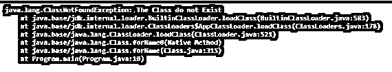

# Java ClassNotFoundException

> 原文：<https://www.educba.com/java-classnotfoundexception/>


## Java ClassNotFoundException 简介

顾名思义，当 Java 虚拟机(JVM)试图加载一个特定的类时，ClassNotFoundException 就会在 Java 中发生。在你指定的类的路径中找不到请求的类，意味着你指定的类的路径被破坏了，这个问题在 Java 的世界里真的很常见。因此，ClassNotFoundException 在 Java 中也很常见。这个问题对于 Java 初学者来说是非常困惑的，ClassNotFoundException 必须被 catch 或者抛出给调用者 ClassNotFoundException 是一个检查过的异常。

**Java 中 ClassNotFoundException 的语法如下:**

<small>网页开发、编程语言、软件测试&其他</small>

```
java.lang.ClassNotFoundException:Class_name at location
```

### 在 Java 中使用 ClassNotFoundException

*   当应用程序试图加载类时，类加载器无法在指定的类路径中找到该类，即 Java 中出现 ClassNotFoundExceptionoccurs。
*   利用 Class.forName 和 ClassLoader.loadClass 加载类，同时将类的字符串名称作为参数传递，而在指定的类路径中找不到该参数，这是 java . lang . classnotfoundexception 在 Java 中出现的常见原因之一。
*   Java 中的 ClassNotFoundException 必须被 catch 或抛出给调用者，因为它是一个检查过的异常。
*   该类是使用类加载器间接加载的。因此，Java 中的 ClassNotFoundException 在运行时发生。Java 编译器无法知道一个类在运行时是否出现在指定类的路径中。
*   尝试使用 Class.forName 加载 JDBC 驱动程序，并且不在类的路径中添加 jar 文件，这是 Java 中 ClassNotFoundExceptionin 的一个常见示例。
*   考虑以下用 Java 演示 ClassNotFoundException 的程序:

```
//a class called program is defined
public class Program
{
//main method is called
public static void main(String args[])
{
//class not found exception is defined using try and catch block
try
{
// the forname method in class class looks for the mentioned class
Class.forName("The Class do not Exist");
}
catch (ClassNotFoundException e)
{
e.printStackTrace();
}
}
}
```

上述程序的输出如下面的快照所示:




在上面的程序中，定义了一个名为 program 的类。然后调用 main 方法。然后使用 try 和 catch 块定义类未找到异常。没有类加载器试图查找的类不是 exist.java 类，并且类中的方法查找提到的类，但未能找到；因此抛出了 ClassNotFoundException。程序的输出如上面的快照所示。

### 构造器

Java 中有几个用于 ClassNotFoundException 的构造函数。它们是:

*   **ClassNotFoundException():**构造一个新的 ClassNotFoundException，它包括堆栈的当前踪迹。

*   **ClassNotFoundException(String):**构造一个新的 ClassNotFoundException，它包括当前堆栈的踪迹和详细的消息，指定。

*   **ClassNotFoundException(IntPtr，JniHandleOwnership):** 在创建 JNI 对象的过程中，在管理它们的表示时，使用这个构造函数，运行时调用它。

*   **ClassNotFoundException(String，Throwable):** 构造一个新的 ClassNotFoundException，它包括堆栈的当前跟踪，以及指定的详细消息和试图加载类时发生的异常。

### Java ClassNotFoundException 的示例

下面举几个例子:

#### 示例#1

演示 ClassNotFoundException 的 Java 程序:

**代码:**

```
//a class called exceptiondemo is defined
public class Exceptiondemo
{
//a string variable is defined
private static final String DRIVE_CLASS = "com.mysql.jdbc.Driver";
//main method is called including the exception
public static void main(String[]  args) throws Exception
{
System.out.println("MySQL JDBC driver loading attempt");
//the forname method in class class looks for the mentioned class
Class.forName(DRIVE_CLASS);
}
}
```

上述程序的输出如下面的快照所示:


在上面的程序中，定义了一个名为 Exception demo 的类。然后调用 main 方法。然后定义一个字符串变量，JDBC 驱动程序路径被分配给该变量。然后调用 main 方法，抛出异常。类别载入器正在尝试寻找指定类别的 JDBC 驱动程式路径，而类别中的 forname 方法会寻找提到的类别，但却找不到。因此抛出了 ClassNotFoundException。程序的输出如上面的快照所示。

#### 实施例 2

演示 ClassNotFoundException(String)的 Java 程序

**代码:**

```
//a class called check is defined
public class Check
{
//main method is called
public static void main(String args[])
{
//class not found exception is defined using try catch block
try
{
//the forname method in class class looks for the mentioned class
Class.forName("Demonstrating class not found exception");
}
catch(ClassNotFoundException e)
{
//the string specified along with the class not found exception is displayed.
System.out.println("There is no class as specified in the path " + e);
}
}
}
```

上述程序的输出如下面的快照所示:


在上面的程序中，定义了一个名为 check 的类。然后调用 main 方法。然后调用 main 方法。然后通过使用 try 和 catch 块来定义类未找到异常。然后 class 中的 forename 方法寻找提到的类，它没能找到；因此，将引发 ClassNotFoundException，并显示指定为详细消息的字符串以及未找到类异常。程序的输出如上面的快照所示。

### 如何避免 ClassNotFoundException？

避免 ClassNotFoundException 的步骤:

*   必须找出导致 jar 文件出现问题的类的文件。
*   我们应该检查类或类路径的路径是否包含这个 jar。如果 jar 不在类的类路径或路径中，则必须将该类添加到类路径或类路径中。
*   如果类存在于类或类路径路径中，那么很可能会覆盖类的类路径或路径，或者应用程序正在使用 jar 文件或用于启动的脚本中指定的路径。为了解决这个问题，我们需要找到应用程序正在使用的类的确切路径。

### 结论

在本教程中，我们通过定义理解了 Java 中的类未找到异常的概念，Java 中的类未找到异常的语法，Java 中的类未找到异常的工作，以及它们的构造函数，通过例子和它们的输出。

### 推荐文章

这是一个 Java ClassNotFoundException 的指南。在这里，我们讨论 Java 中的 ClassNotFoundException 的工作方式以及编程示例。您也可以看看以下文章，了解更多信息–

1.  [终于在 Java 中](https://www.educba.com/finally-in-java/)
2.  [Java min()](https://www.educba.com/java-min/)
3.  [Java 中的 copy()](https://www.educba.com/copy-in-java/)
4.  [爪哇的 EJB](https://www.educba.com/ejb-in-java/)


