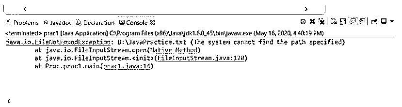
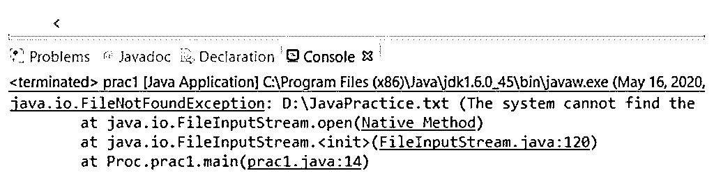
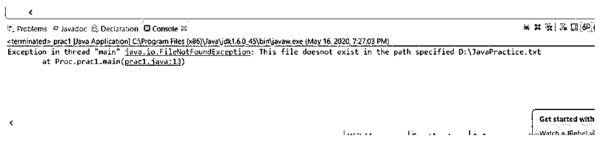

# Java 文件未发现异常

> 原文：<https://www.educba.com/java-filenotfoundexception/>


## Java FileNotFoundException 简介

Java FileNotFoundException 是在 Java 中使用文件 API 时经常发生的一种异常，其中在 FileInputStream、FileOutputStream 和 RandomAccessFile 类的构造函数中为文件指定的用于读取或写入目的的路径不存在或由于现有锁定或其他技术问题而不可访问。这是一个已检查的异常，是 IOException 的直接子类，已在 JDK 1.0 中引入。此外，它还包含两种类型的构造函数，可以调用其中一种构造函数返回异常并显示空消息，而另一种构造函数在异常发生时打印指定的消息。

**语法:**

<small>网页开发、编程语言、软件测试&其他</small>

```
public class FileNotFoundExceptionextends IOException
```

*   **public:** 关键字 public 是指给定的类可以从项目中的任何类访问，需要继承才能抛出异常。

该类是 IOException 的直接子类，因此继承了该类的所有方法和变量。

### FileNotFoundException 如何在 Java 中工作？

FileNotFoundException 是一个已检查的异常，当指定用于访问的文件路径不存在或不可访问时，会出现该异常。对于 checked 异常，意味着 java 编译器在编译时检查这个异常是否已经被处理；否则，会发生编译时错误。让我们看看在编译时使用 try-catch 块或在其定义中使用 throws 关键字处理异常的情况下，如何在运行时抛出异常。

**举例:**

```
File fileObj = new File("C:/JavaPractice.txt")
```

假设我们用一个文件的路径实例化一个文件类对象，而这个文件并不存在。在这种情况下，当编译器尝试读取或写入文件并发现这种情况时，它会引发异常并创建 FileNotFoundExceptionclass 的一个实例。如果没有指定需要调用哪个构造函数，则抛出没有错误消息的构造函数。

因此，应用程序会因以下错误而失败:




### Java FileNotFoundException 的构造函数

FileNotFoundException 是 IOException 的一个子类，对于跟踪文件路径中指定的文件是否存在甚至是否可访问非常有用。因此，要使用它，需要实例化它，它是一个公共类；它可以从项目中的任何地方实例化。为了创建类的实例，有两种类型的构造函数。

下面给出了两种类型的构造函数:

#### 1.没有错误消息的构造函数

这种类型的构造函数用于创建 FileNotFoundException 类的实例，在该实例中，它返回 null 作为其错误详细信息。

**语法:**

```
public FileNotFoundException()
```

**举例:**

```
FileNotFoundExceptionexcepObj = new FileNotFoundException()
```

#### 2.带有错误信息的构造函数

这种类型的构造函数用于创建 FileNotFoundException 类的实例，在该实例中，它返回指定的字符串作为其错误详细信息。

**语法:**

```
public FileNotFoundException(String s)
```

**举例:**

```
FileNotFoundExceptionexcepObj = new FileNotFoundException("This is a FileNotFoundException")
```

使用 Throwable.getMessage()方法可以很容易地检索到指定的错误消息，因为这是 FileNotFoundException 类的超类之一。

### Java FileNotFoundException 的示例

下面是提到的例子:

#### 示例#1

这里我们可以看到如果一个文件不可访问，JVM 是如何抛出异常的。在这种情况下，输出中显示的错误消息是 JVM 默认指定的。

**代码:**

```
//package Proc;
import java.io.Console;
import java.io.File;
import java.io.FileInputStream;
import java.io.FileNotFoundException;
import java.io.IOException;
import java.io.PrintWriter;
public class prac1 {
public static void main(String[] args) {
File fileObj = new File("D:/JavaPractice.txt");
FileInputStream fISObj = null;
try{
fISObj = new FileInputStream(fileObj);
while (fISObj.read()!=-1){
System.out.println(fISObj.read());
}
}catch (FileNotFoundException e){
e.printStackTrace();
}catch (IOException e){
e.printStackTrace();
}
}
}
```

**输出:**




#### 实施例 2

在这个例子中，当文件不存在于给定的路径中时，我们将使用带有指定错误信息的构造函数来显示错误。我们使用了 throw 关键字来抛出异常。

**代码:**

```
//package Proc;
import java.io.Console;
import java.io.File;
import java.io.FileInputStream;
import java.io.FileNotFoundException;
import java.io.IOException;
import java.io.PrintWriter;
public class prac1 {
public static void main(String[] args) throws FileNotFoundException,IOException{
File fileObj = new File("D:/JavaPractice.txt");
if(!fileObj.exists()){
throw new FileNotFoundException("This file doesnot exist in the path specified "+fileObj.toString());
}
else {
System.out.println("Welcome, we got into file "+fileObj.toString());
}
}
}
```

**输出:**




### 如何避免 FileNotFoundException？

在应用程序中获取 FileNotFoundException 会使应用程序效率低下。避免这种异常的第一步是检查指定的文件是否存在于指定的路径中，但在实时应用程序中仍然可能出现文件丢失或其他进程锁定文件以读取或写入的情况。

#### 案例 1:文件丢失

为了避免这种情况，可以使用 java.io.File.exists()方法来检查试图读取的文件是否存在于指定的路径中。使用这个，我们必须确定我们的代码是否能够处理 FileNotFoundException 异常。

#### 情况 2:文件不可访问

为了避免这种情况，我们需要注意我们试图读取的文件是否被其他用户锁定。为此，我们可以使用 java.io. File 类的 canRead()或 canWrite()方法来判断指定的文件是否可用于读写目的。

使用这两种预防措施，可以很容易地避免 file 类的实例试图打开一个可能导致检查异常的文件。这提高了包含从指定路径访问文件的程序的应用程序的效率。

### 结论

FileNotFoundException 是一种检查异常，一旦试图访问不存在或由于某种锁定而无法访问的文件，就会发生这种异常。因为它是一个被检查的异常，java 编译器确保它在编译时已经被处理。但是，如果需要避免这种情况，可以使用 File 类中的 exist()、canRead()或 canWrite()方法。

### 推荐文章

这是一个 Java FileNotFoundException 的指南。这里我们将讨论 FileNotFoundException 如何在 Java 中工作，以及构造函数和编程示例。您也可以看看以下文章，了解更多信息–

1.  [终于在 Java 中](https://www.educba.com/finally-in-java/)
2.  [Java 目录](https://www.educba.com/java-directories/)
3.  [Java 中的异常处理](https://www.educba.com/exception-handling-in-java/)
4.  [Java 中的 JSON](https://www.educba.com/json-in-java/)


