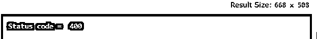
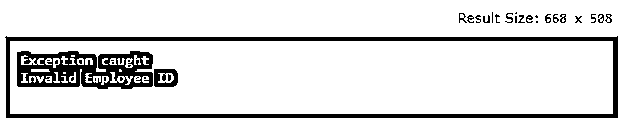
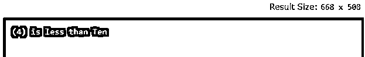
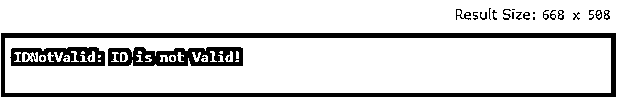

# Java 用户定义的异常

> 原文：<https://www.educba.com/java-user-defined-exception/>


## Java 用户定义异常简介

Java 用户定义异常是一个自定义异常，它使用关键字“throw”抛出异常。这是通过扩展一个类“Exception”来实现的。异常是程序执行过程中出现的问题。在面向对象的编程语言中，Java 提供了处理这种异常的强大机制。Java 允许创建自己的异常类，提供自己的异常类实现。这种异常称为用户定义的异常或自定义异常。让我们深入挖掘一下，看看用户定义的异常是如何在 Java 中创建的，它的语法，如果有的话，以及它是如何通过解决一些例子来实现的。

**语法:**

<small>网页开发、编程语言、软件测试&其他</small>

对于 Java 用户定义的异常，我们没有任何特定的语法；我们将看到如何创建一个用户定义的异常。

下面的代码将有助于创建用户定义的异常类，

```
class SampleException{
public static void main(String args[]){
try{
throw new UserException(<value>); // used to create new exception and throw
}
catch(Exception e){
System.out.println(e);
}
}
}
class UserException extends Exception{
// code for exception class
}
```

这里，在创建异常类的同时，需要从 java 扩展。lang .异常。

异常是指在运行时导致程序执行过程中突然终止的事件。

### 例子

让我们讨论 Java 用户定义异常的例子。

#### 示例 1:简单的程序

```
class SampleException{
public static void main(String args[]){
try{
throw new UserException(400);
}
catch(UserException e){
System.out.println(e) ;
}
}
}
class UserException extends Exception{
int num1;
UserException(int num2) {
num1=num2;
}
public String toString(){
return ("Status code = "+num1) ;
}
}
```

**输出:**

关键字“throw”用于创建一个新的异常，并将其抛出到 catch 块。




#### 示例 2:对于无效的 id

```
class EmployeeException extends Exception
{
public EmployeeException(String s)
{
super(s);
}
}
class SampleEmp
{
void empIDCheck(int EmpID) throws EmployeeException{
if(EmpID<=0 || EmpID>999){
throw new EmployeeException("Invalid Employee ID");
}
}
public static void main(String args[])
{
SampleEmp emp = new SampleEmp();
try
{
emp.empIDCheck(0);
}
catch (EmployeeException e)
{
System.out.println("Exception caught");
System.out.println(e.getMessage());
}
}
}
```

**输出:**




如果我们在这里不使用 throw 类，它将给出一个编译错误，如“方法中未处理的异常”。

#### 示例#3:对于小于定义值的值

```
class SampleException extends Exception
{
private int e;
SampleException(int num1)
{
e = num1;
}
public String toString()
{
return "(" + e +") is less than Ten";
}
}
class Demo1
{
static void sum(int num,int num1) throws SampleException
{
if(num1<10)
{
throw new SampleException(num1);
}
else
{
System.out.println(num+num1);
}
}
public static void main(String[] args)
{
try
{
sum(-5, 4);
}
catch(SampleException e1)
{
System.out.println(e1);
}
}
}
```

**输出:**




#### 示例 4:检查 ID 有效性

```
class IDNotValid extends Exception
{
public IDNotValid(String s) {
super(s);
}
}
class Demo
{
static void find(int array[], int id) throws IDNotValid
{
boolean stdFlag = false;
for (int i = 0; i < array.length; i++) {
if(id == array[i])
stdFlag = true;
}
if(!stdFlag)
{
throw new IDNotValid("ID is not Valid!");
}
else
{
System.out.println("ID is Valid!");
}
}
public static void main(String[] args)
{
try
{
find(new int[]{101, 102, 103, 104, 105, 106, }, 108);
}
catch(IDNotValid e)
{
System.out.println(e);
}
}
}
```

**输出:**




这里我们生成自己的异常实现。

使用这些用户定义的异常是有好处的；它允许用户抛出一个用户想要的异常。用户还可以重用任何现有的应用程序；任何捕获异常的代码都处理实际异常的可能性，而不是由代码抛出，而是由其他第三方代码抛出。用户可以将错误处理代码与常规代码分开，对错误类型进行分组和区分。
有一些规则也用来创建异常类。

*   **构造函数:**在自定义异常类中创建任何构造函数时，这不是强制性的。在自定义异常类中提供参数化的构造函数是一个很好的做法。
*   **命名约定:**所有异常类由 JDK 端提供；因此，自定义异常应该遵循命名约定。
*   **扩展异常类:**如果用户正在创建自定义异常类，那么用户必须扩展异常类。

至此，我们将结束“Java 用户异常类”这一主题。几乎所有发生在 Java 编程中的 Java 通用异常都被提供了。我们已经看到了用户定义异常类的创建，也看到了一些用户定义异常的例子。用户不需要在类中实现任何东西；不需要任何方法，也可以覆盖 toString()函数来显示定制的消息。

### 推荐文章

这是一个 Java 用户定义异常的指南。在这里我们讨论的介绍，语法，如何创建一个用户定义的异常？代码实现示例。您也可以看看以下文章，了解更多信息–

1.  [Java 集合类型](https://www.educba.com/java-collection-types/)
2.  [Java 集合排序](https://www.educba.com/java-collection-sort/)
3.  [Java 中的 Servlet](https://www.educba.com/servlet-in-java/)
4.  [跳过列表 Java](https://www.educba.com/skip-list-java/)


