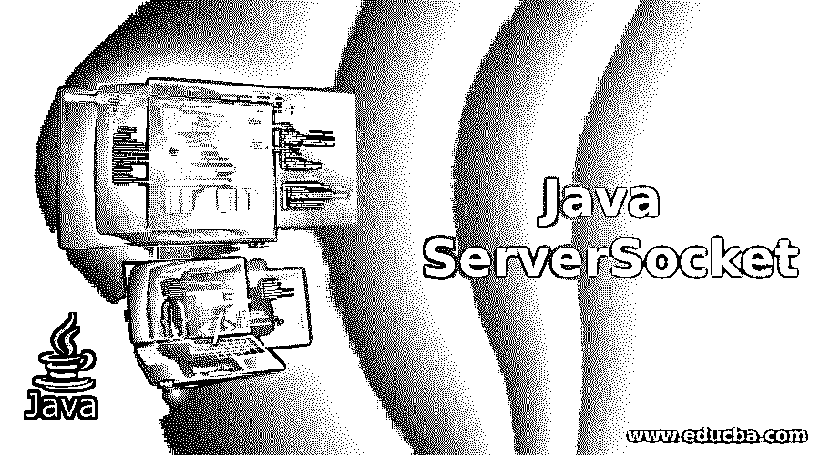
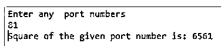
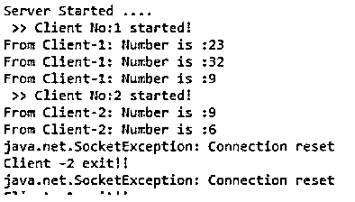
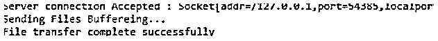

# Java 服务器套接字

> 原文：<https://www.educba.com/java-serversocket/>




## **到** Java ServerSocket 简介

下面的文章提供了 Java ServerSocket 的概要。在 web 技术中，为了安全的目的，我们分别使用前端和后端代码来创建 web 应用程序。web 应用程序包含用于接收客户端请求并发送给客户端特定请求的响应的服务器。在 java 技术中，在 socket 程序的帮助下，当我们将在多台 PC 的帮助下发送多个请求时，我们可以实现这些任务，这些请求必须与 tcp 和 udp 之类的协议相连接。我们可以像 ServerSocket 类一样编写服务器代码，连接指定的端口，发送给数据。

**语法:**

<small>网页开发、编程语言、软件测试&其他</small>

serversocket 类用于客户端和服务器传输过程。

**服务器类别:**

```
java packages import(import java.io.*,import java.net.*)
class serverclassname
{
public static void main(String[] args)
{
try
{
--some logic—
}
catch()
{
}
}
}
```

**客户端类别:**

```
Java packages import(import java.io.*,import java.net.*)
class clientclassname
{
public static void main(String[] args)
{
try
{
--some logic—
}
catch()
{
}
}
}
```

### 如何使用 Java ServerSocket？

*   Java 服务器套接字连接将使用这两种类型的协议来发送和接收数据。
*   TCP(传输控制协议)和 udp(用户数据报协议)将使用 sockets 类来传输数据。
*   当我们在 socket 类中使用 udp 时，我们还会看到这两种协议之间的一些差异，这意味着少了一个连接，并且没有用于存储有关客户端和服务器传输的日志数据的会话，但是在 tcp 中，它是面向连接的，因此客户端和服务器在日志文件夹中有会话存储。
*   套接字程序将用于运行不同 jre 的 web 应用程序之间的通信。
*   serversocket 类主要是面向连接的套接字程序。
*   当我们在 socket 的帮助下连接应用程序时，我们需要获得服务器的 IP 地址和端口号等信息，这些信息必须以特定的方式与应用程序连接，以便数据传输不会被解释。
*   基本上，客户端和服务器之间的套接字类是单向数据传输。客户端将向服务器发送请求消息，服务器读取客户端消息，并向客户端发送响应，否则它将像浏览器一样在客户端屏幕上显示数据。
*   所以我们将使用两种类型的 java net 类，分别是 socket 和 serversocket 类；socket 类负责客户端与服务器的通信，serversocket 类用于服务器端应用程序，它将对来自客户端的请求进行身份验证，直到客户端机器与 socket 类连接成功。连接成功后，它将返回服务器端应用程序中的 socket 类实例。

### Java 服务器套接字示例

下面是一些例子:

#### 示例#1

**代码:客户端示例**

```
import java.io.IOException;  
import java.io.PrintStream;  
import java.net.Socket;  
import java.net.UnknownHostException;  
import java.util.Scanner;  

public class clientSample {  

    public static void main(String arg[]) throws UnknownHostException,IOException  
    {  
    int n,n1;  
    String s;  
    Scanner sc=new Scanner(System.in);  
    Socket s1=new Socket("127.0.0.1",1408);  
    Scanner sc1=new Scanner(s1.getInputStream());  
    System.out.println("Enter any  port numbers");  
    n=sc.nextInt();  
    PrintStream p=new PrintStream(s1.getOutputStream());  
    p.println(n);  
    n1=sc1.nextInt();  
    System.out.println("Square of the given port number is: "+n1);  
    }  
}
```

**输出:**




**代码:服务器示例**

```
import java.io.IOException;  
import java.io.PrintStream;  
import java.net.ServerSocket;  
import java.net.Socket;  
import java.net.UnknownHostException;  
import java.util.Scanner;  

public class ServerSample {  
    public static void main(String[] args)throws IOException {  
        int n,n1;  
        String s;  
        ServerSocket s1=new ServerSocket(1408);  
        Socket s2=s1.accept();  
        Scanner sc=new Scanner(s2.getInputStream());  
        s=s2.toString();  
        n =sc.nextInt();  
        n1=n*n;  
        PrintStream p=new PrintStream(s2.getOutputStream());  
        p.println(n1);  
        System.out.println("Server started and working.. ");  

    }  
} 
```

**输出:**


#### 实施例 2

**代码:客户端示例**

```
import java.net.*;
import java.io.*;
public class clientSample {
  public static void main(String[] args) throws Exception {
  try{
    Socket s=new Socket("127.0.0.1",8888);
    DataInputStream d=new DataInputStream(s.getInputStream());
    DataOutputStream out=new DataOutputStream(s.getOutputStream());
    BufferedReader br=new BufferedReader(new InputStreamReader(System.in));
    String client="",server="";
    while(!client.equals("")){
      System.out.println("Enter the number :");
      client=br.readLine();
      out.writeUTF(client);
      out.flush();
      server=d.readUTF();
      System.out.println(server);
    }
    out.close();
    out.close();
    s.close();
  }catch(Exception e){
    System.out.println(e);
  }
  }
}
```

**代码:服务器客户端**

```
import java.io.DataInputStream;
import java.io.DataOutputStream;
import java.net.Socket;

class ServerClients extends Thread {
  Socket sockets;
  int clients;
  int squre;
  ServerClients(Socket s,int count){
    sockets = s;
    clients=count;
  }
  public void run(){
    try{
      DataInputStream inStream = new DataInputStream(sockets.getInputStream());
      DataOutputStream outStream = new DataOutputStream(sockets.getOutputStream());
      String client="", server="";
      while(!client.equals("")){
        client=inStream.readUTF();
        System.out.println("From Client side-" +clients+ ": Number of client is :"+client);
        squre = Integer.parseInt(client) * Integer.parseInt(client);
        server="From Server to Client request-" + clients + " Square of the client " + client + " is " +squre;
        outStream.writeUTF(server);
        outStream.flush();
      }
      inStream.close();
      outStream.close();
      sockets.close();
    }catch(Exception ex){
      System.out.println(ex);
    }finally{
      System.out.println("Client -" + clients + " exit!! ");
    }
  }
}
```

**代码:服务器示例**

```
import java.net.*;
import java.io.*;
public class ServerSample {
  public static void main(String[] args) throws Exception {
    try{
      ServerSocket s=new ServerSocket(8888);
      int count=0;
      System.out.println("Server is Started ....");
      while(true){
        count++;
        Socket socket=s.accept();  
        System.out.println(" >> " + "ClientNo:" + count + " started!");
        ServerClients sc = new ServerClients(socket,count); 
        sc.start();
      }
    }catch(Exception e){
      System.out.println(e);
    }
  }
}
```

**输出:**




#### 实施例 3

**代码:客户端程序**

```
import java.net.*;
import java.io.*; 
public class ClientMain 
{
 public static void main (String[] args ) throws IOException {
 int size=1022388; int bytess; int c = 0; 
 Socket sockets = new Socket("localhost",12345); 
 byte [] bytes = new byte [size]; 
 InputStream in = sockets.getInputStream(); 
 FileOutputStream out = new FileOutputStream("F:\\copy.doc"); 
 BufferedOutputStream b = new BufferedOutputStream(out); 
 bytess= in.read(bytes,0,bytes.length); 
 c = bytess;
 do { 
 bytess = in.read(bytes, c, (bytes.length-c)); 
 if(bytess >= 0) c += bytess;
 }
 while(bytess > -1); 
 b.write(bytes, 0 , c); 
 b.flush();
 b.close();
 sockets.close(); 
 } }
```

**代码:服务器程序**

```
import java.net.*; 
import java.io.*; 
public class Main
 { 
 public static void main (String [] args ) throws IOException 
 { ServerSocket serverSockets = new ServerSocket(12345);
 Socket sockets = serverSockets.accept(); 
 System.out.println("Server connection Accepted : " + sockets);
 File f = new File ("F:\\Sample.docx");
 byte [] bytes = new byte [(int)f.length()]; 
 FileInputStream input = new FileInputStream(f);
 BufferedInputStream b = new BufferedInputStream(input); 
 b.read(bytes,0,bytes.length); 
 OutputStream output = sockets.getOutputStream(); 
 System.out.println("Sending Files...");
 output.write(bytes,0,bytes.length);
 output.flush(); sockets.close(); 
 System.out.println("File transfer complete");
 } } 
```

**输出:**




### 结论

在 java 编程技术中，该包称为 java . net。*因为 Java 的每个版本可能会改变包中的类。服务器套接字连接是文件传输、上传的基本网络功能，即使我们借助套接字连接从一个客户端向另一个客户端发送电子邮件

### 推荐文章

这是一个 Java ServerSocket 的指南。这里我们讨论介绍，如何使用 Java ServerSocket，以及相应的例子。您也可以看看以下文章，了解更多信息–

1.  [Java 中的套接字编程](https://www.educba.com/socket-programming-in-java/)
2.  [Java 迭代图](https://www.educba.com/java-iterate-map/)
3.  [Java 中的 FileWriter](https://www.educba.com/filewriter-in-java/)
4.  [Java DatagramSocket](https://www.educba.com/java-datagramsocket/)


