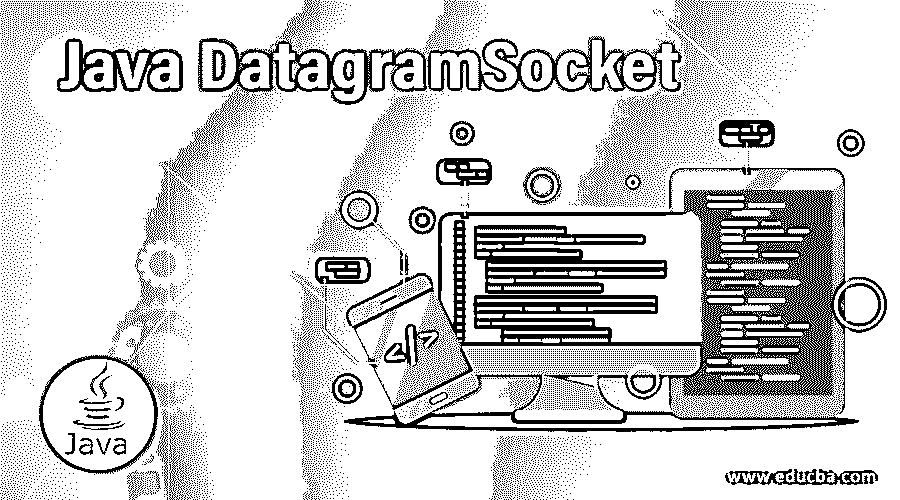
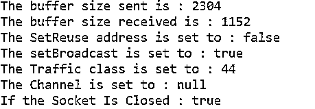

# Java DatagramSocket

> 原文：<https://www.educba.com/java-datagramsocket/>




## Java DatagramSocket 简介

Java DatagramSocket 类代表一种无连接的网络套接字，用于发送数据报的数据包和接收数据报的数据包；对于任何数据包的传送，数据报套接字是服务的发送和接收点，使用数据报套接字发送或接收的每个数据包都被单独寻址，然后被路由到目的地，如果在两台机器之间传输多个数据包，数据包的路由可能不同，它们可以按任何顺序到达，在新构造的允许传输广播图的数据报套接字中启用了 SO_BROADCAST 选项。

**语法**

<small>网页开发、编程语言、软件测试&其他</small>

java DatagramSocket 的语法如下:

```
DatagramSocket variable_name = new DatagramSocket();
```

### Java 中 DatagramSocket 是如何工作的？

*   通过使用 DatagramSocket 类进行通信链接以及发送和接收数据包，在客户端程序端和服务器程序端创建数据报套接字。
*   可以选择 DatagramSocket()构造函数在客户端程序端创建数据报套接字，选择 DatagramSocket(int port)构造函数在服务器端程序端创建数据报套接字。
*   如果构造函数无法创建数据报套接字，或者数据报套接字无法绑定到端口，则两个构造函数都会引发 SocketException 对象。
*   一旦程序创建了数据报套接字对象，程序就分别调用 send(DatagramPacket dgp)来发送数据报数据包，调用 receive(DatagramPacket dgp)来接收数据报数据包。

考虑使用 DatagramSocket 类发送和接收数据报数据包的以下程序:

**代码:**

```
//Java program to send datagram packets using DatagramSocket class
import java.net.*;
public class Sender
{
public static void main(String[] args) throws Exception
{
DatagramSocket datasoc = new DatagramSocket();
String strn = "Welcome to DatagramSocket class";
InetAddress ipaddr = InetAddress.getByName("127.0.0.1");                
DatagramPacket dpac = new DatagramPacket(strn.getBytes(), strn.length(), ipaddr, 3000);
datasoc.send(dpac);
datasoc.close();
}
}
//Java program to receive datagram packets using DatagramSocket class
import java.net.*;
public class Receiver
{
public static void main(String[] args) throws Exception
{
DatagramSocket datasoc = new DatagramSocket(3000);
byte[] buff = new byte[1024];
DatagramPacket dpac = new DatagramPacket(buff, 1024);
datasoc.receive(dpac);
String strn = new String(dpac.getData(), 0, dpac.getLength());
System.out.println(strn);
datasoc.close();
}
}
```

**输出:**


**解释:**在上面的程序中，创建了两组程序:使用 DatagramSocket 类发送数据包，一组使用 DatagramSocket 类接收数据包。在使用 DatagramSocket 类发送数据包的程序中，创建了一个 DatagramSocket 类的实例。然后将字符串赋给变量 strn。然后将互联网 IP 地址分配给一个变量。然后，创建数据报数据包，并使用 DatagramSocket 类的 send 方法将数据包发送到目的 IP 地址。

在使用 DatagramSocket 类接收数据包的程序中，创建了一个 DatagramSocket 类的实例。然后创建 byte 类的实例。然后，创建数据报数据包，并使用 DatagramSocket 类的 receive 方法将数据包接收到源 IP 地址。

### 构造器

DatagramSocket 类有几个构造函数。它们是:

*   **DatagramSocket():** 使用 DatagramSocket()构造函数构造数据报套接字，并将其绑定到本地主机上的可用端口。
*   **DatagramSocket(int):** 使用 DatagramSocket()构造函数构造数据报套接字，并将其绑定到本地主机上的指定端口。
*   **DatagramSocket(int，InetAddress):** 使用 DatagramSocket()构造函数创建数据报套接字，并将其绑定到指定的本地互联网地址。

### 实现 Java DatagramSocket 的示例

下面是提到的例子:

#### 例子

演示 DatagramScoket 类的各种方法的用法。

**代码:**

```
import java.io.IOException;
import java.net.DatagramSocket;
public class program
{
public static void main(String[] args) throws IOException
{
//Datagram Socket class Constructor is called
DatagramSocket sock = new DatagramSocket(1235);
// The method setSendBufferSize() method of datagram socket class is called
sock.setSendBufferSize(20);
// The method getSendBufferSize() method of datagram socket class is called
System.out.println("The buffer size sent is : " + sock.getSendBufferSize());
// The method setReceiveBufferSize() method of datagram socket class is called
sock.setReceiveBufferSize(20);
// The method getReceiveBufferSize() method of datagram socket class is called
System.out.println("The buffer size received is : " +
sock.getReceiveBufferSize());
// The method setReuseAddress() method of datagram socket class is called
sock.setReuseAddress(false);
// The method getReuseAddress() method of datagram socket class is called
System.out.println("The SetReuse address is set to : " +
sock.getReuseAddress());
// The method setBroadcast() method of datagram socket class is called
sock.setBroadcast(true);
// The method getBroadcast() method of datagram socket class is called
System.out.println("The setBroadcast is set to : " +
sock.getBroadcast());
// The method setTrafficClass() method of datagram socket class is called
sock.setTrafficClass(45);
// The method getTrafficClass() method of datagram socket class is called
System.out.println("The Traffic class is set to : " +
sock.getTrafficClass());
// The method getChannel() method of datagram socket class is called
System.out.println("The Channel is set to : " +
((sock.getChannel()!=null)?sock.getChannel():"null"));
// The method setSocketImplFactory() method of datagram socket class is called
sock.setDatagramSocketImplFactory(null);
// The method close() method of datagram socket class is called
sock.close();
// The method isClosed() method of datagram socket class is called
System.out.println("If the Socket Is Closed : " + sock.isClosed());
}
}
```

**输出:**




**说明:**在上面的程序中，定义了一个名为 program 的类。然后创建数据报套接字类的一个实例。调用数据报套接字类的 setSendBufferSize()方法，该方法发送缓冲区大小。然后调用数据报套接字类的方法 getSendBufferSize()方法，该方法接收缓冲区大小。

然后调用数据报套接字类的方法 setReceiveBufferSize()方法，然后调用数据报套接字类的方法 getReceiveBufferSize()方法，用于发送和接收缓冲区大小。然后调用数据报套接字类的方法 setReuseAddress()方法，再调用数据报套接字类的方法 getReuseAddress()方法发送和接收重用的地址。

然后调用数据报套接字类的方法 setBroadcast()方法，再调用数据报套接字类的方法 getBroadcast()方法设置并获取广播。然后调用数据报套接字类的方法 setTrafficClass()方法，再调用数据报套接字类的方法 getTrafficClass()方法来设置和获取流量类。

然后调用数据报套接字类的方法 getChannel()方法，返回 true 或 false。然后调用数据报套接字类的方法 close()方法关闭套接字。然后调用数据报套接字类的方法 isClosed()来检查套接字是否关闭，如果套接字关闭则返回 true，否则返回 false。

### 结论

在本教程中，我们通过定义理解了 Java 中 DatagramSocket 类的概念，Java 中 DatagramSocket 类的语法，通过示例及其输出理解了 Java 中 DatagramSocket 类的工作原理。

### 推荐文章

这是一个 Java DatagramSocket 的指南。这里我们讨论 DatagramSocket 的介绍以及构造函数、语法、工作原理和相应的例子。您也可以浏览我们的其他相关文章，了解更多信息——

1.  [Java 服务器套接字](https://www.educba.com/java-serversocket/)
2.  [Java 中的 copy()](https://www.educba.com/copy-in-java/)
3.  [Java 中的可比](https://www.educba.com/comparable-in-java/)
4.  [终于在 Java 中](https://www.educba.com/finally-in-java/)


