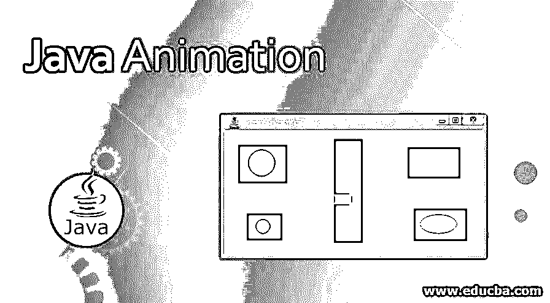
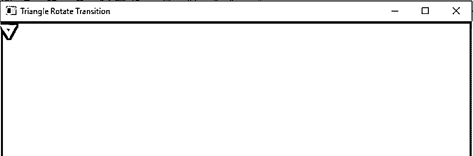
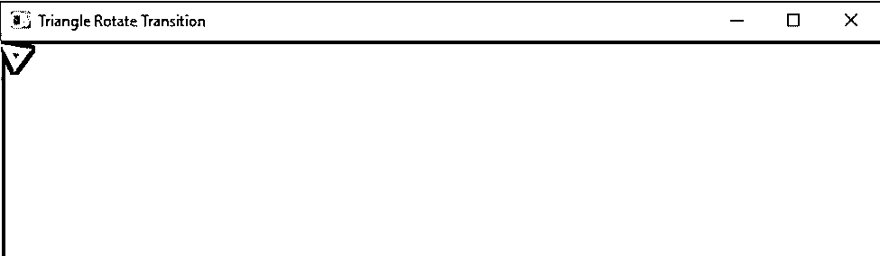
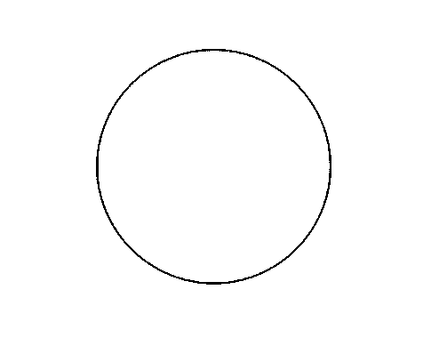
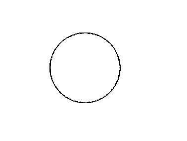
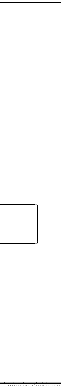
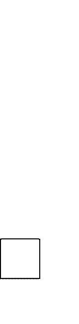
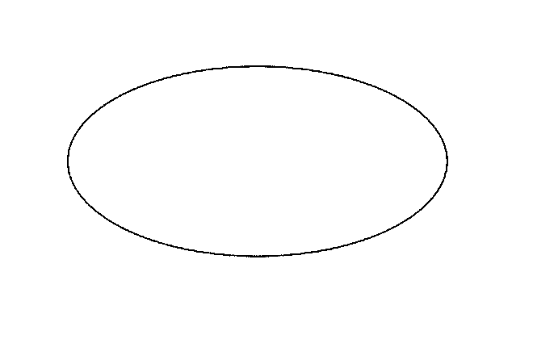

# Java 动画

> 原文：<https://www.educba.com/java-animation/>




## Java 动画简介

Java 中的动画需要两个基本步骤，创建一个动画帧，然后让 Java 给帧上色。Java 动画可以通过 Applets、AWT、Swing、 [JavaFX](https://www.educba.com/what-is-javafx/) 来完成。小程序动画是为浏览器兼容的应用程序，而 [AWT，Swing，](https://www.educba.com/awt-vs-swing/)和 JavaFX 是独立的应用程序。实际上，大多数应用程序都是独立的。所以，我们将用 JavaFX 来处理我们的动画。

**为什么是 JavaFX 为什么不是 AWT 和 Swing？**

<small>网页开发、编程语言、软件测试&其他</small>

[AWT](https://www.educba.com/what-is-awt-in-java/) 有重量级组件，Swing 是没有现代 UI 的。所以，我们考虑了 JavaFX 动画。它是轻量级和先进的现代 UI 组件，使我们的开发更容易。

**Java FX 中的动画类型:**

1.  旋转过渡
2.  规模过渡
3.  翻译过渡
4.  渐变过渡
5.  填充过渡
6.  笔画过渡
7.  顺序转换
8.  平行过渡
9.  暂停过渡
10.  路径转换

### JavaFX 动画在 Java 中是如何工作的？

JavaFX 动画包是一个包含所有动画类的动画。所以，当我们应用动画时，我们必须导入它们。将动画应用于我们的课堂；我们必须扩展动画类。这个动画类包含了所有需要的动画包。

#### 1.旋转过渡

该动画提供了旋转功能。包装是动画。旋转转移

**语法:**

```
RotateTransition rotate = new RotateTransition();  //creating object for Rotate Transition
rotate.play();  //applying rotation by using play() method
```

#### 2.规模过渡

该动画在所有三个方向 X、Y 和 z 上移动对象。该包是动画。比例转换

**语法:**

```
ScaleTransition rotate = new ScaleTransition();  //creating object for scale transition
rotate.play();  //applying rotation by using play() method
```

#### 3.翻译过渡

该动画以固定的时间间隔将对象从一个位置移动到另一个位置。包装是动画。翻译

**语法:**

```
TranslateTransition rotate = new TranslateTransition();  //creating object for Translate transition
rotate.play();  //applying rotation by using play() method
```

#### 4.渐变过渡

该动画通过指定不透明度值使对象变暗。包装是动画。渐变过渡

**语法:**

```
FadeTransition rotate = new FadeTransition();  //creating object for fade transition
rotate.play();  //applying rotation by using play() method
```

#### 5.填充过渡

该动画通过指定时间间隔，使对象一个接一个地填充两种颜色。包装是动画。填充过渡

**语法:**

```
FillTransition rotate = new FillTransition();  //creating object for fill transition
rotate.play();  //applying rotation by using play() method
```

### 例子

让我们看看下面给出的 java 动画的例子:

#### 示例 1–旋转过渡

**代码:**

```
package com.rotate.transition;
import javafx.animation.RotateTransition;
import javafx.application.Application;
import javafx.scene.Group;
import javafx.scene.Scene;
import javafx.scene.paint.Color;
import javafx.scene.shape.Polygon;
import javafx.scene.transform.Rotate;
import javafx.stage.Stage;
import javafx.util.Duration;
public class RotateTransitionAnimation extends Application {
@Override
public void start(Stage outStage) throws Exception {
Polygon traingle = new Polygon();// Creating triangle
Double[] doubleValues=new Double[] { 5.0, 5.0, 20.0, 10.0, 10.0, 20.0 };
traingle.getPoints().addAll(doubleValues);
traingle.setFill(Color.LIMEGREEN);
traingle.setStroke(Color.HOTPINK);
traingle.setStrokeWidth(5);
RotateTransition rotateTransition = new RotateTransition();// Creating object for Rotate Transition class
rotateTransition.setAxis(Rotate.Z_AXIS);// Set Axis rotation in Z axis
rotateTransition.setByAngle(360);// Set angle rotation 360 degrees
rotateTransition.setCycleCount(500);// Set cycle count rotation 500
rotateTransition.setDuration(Duration.millis(1000));// Set time duration for change the object
rotateTransition.setAutoReverse(true);//auto reverse activation
rotateTransition.setNode(traingle);//applying rotate transition on triangle
rotateTransition.play();// applying rotation by play method
Group root = new Group(); //creating group for adding elements
root.getChildren().add(traingle); //adding triangle to group
Scene scene = new Scene(root, 700, 500, Color.BLACK);//creating scene
outStage.setScene(scene);//adding scene to stage for display window
outStage.setTitle("Triangle Rotate Transition");
outStage.show();
}
public static void main(String[] args) {
launch(args);//launch method calls start() method internally
}
}
```

**输出:**







这样，三角形就旋转了。

#### 示例 2–规模过渡

**代码:**

```
package com.scale.transition;
import javafx.scene.Group;
import javafx.stage.Stage;
import javafx.util.Duration;
import javafx.scene.Scene;
import javafx.scene.paint.Color;
import javafx.scene.shape.Circle;
import javafx.animation.ScaleTransition;
import javafx.application.Application;
public class ScaleTransitionAnimation extends Application {
@Override
public void start(Stage stage) {
Circle circle = new Circle(); // Creating Circle
circle.setCenterX(280.0f);// position in X direction
circle.setCenterY(125.0f);// position in Y direction
circle.setRadius(40.0f);// circle radius
circle.setFill(Color.AQUAMARINE);// circle color
circle.setStrokeWidth(21);// stroke width of circle
ScaleTransition scaleTransition = new ScaleTransition();// creating
// object for
// scale
// transition
scaleTransition.setDuration(Duration.millis(2000));// set time duration
scaleTransition.setNode(circle);// applying rotate transition node on
// circle
scaleTransition.setByY(1.5);// Y direction movement
scaleTransition.setByX(1.5);// X direction movement
scaleTransition.setCycleCount(55);// Set cycle count rotation 55
scaleTransition.setAutoReverse(true);// auto reverse activation
scaleTransition.play();// applying rotate transition on circle
Group root = new Group(); // creating group for adding elements
root.getChildren().add(circle); // adding triangle to group
Scene scene = new Scene(root, 600, 500, Color. AZURE);// creating scene
stage.setScene(scene);// adding scene to stage for display window
stage.setTitle("Circle Scale Transition");
stage.show();
}
public static void main(String args[]) {
launch(args);
}
}
```

**输出:**







这样，圆就成了规模。

#### 示例 3–翻译过渡

**代码:**

```
package com.translate.transition;
import javafx.stage.Stage;
import javafx.util.Duration;
import javafx.scene.Scene;
import javafx.scene.paint.Color;
import javafx.scene.shape.Rectangle;
import javafx.animation.TranslateTransition;
import javafx.application.Application;
import javafx.scene.Group;
public class TranslateTransitionAnimation extends Application {
@Override
public void start(Stage outStage) throws Exception {
Rectangle square = new Rectangle(50, 50); // Creating square
square.setFill(Color.AQUA); // square border color
square.setStroke(Color.BLUEVIOLET);// square area color
TranslateTransition translateTranstion = new TranslateTransition();// creating object for Translate transition
translateTranstion.setByY(350);// movement in Y direction
translateTranstion.setDuration(Duration.millis(1500));// time duration
translateTranstion.setCycleCount(450);// Set cycle count rotation 450
translateTranstion.setAutoReverse(true);// auto reverse activation
translateTranstion.setNode(square);// applying rotate transition node on square
translateTranstion.play();// applying rotate transition on circle
Group root = new Group(); // creating group for adding elements
root.getChildren().add(square); // adding square to group
Scene scene = new Scene(root, 600, 500, Color.CHOCOLATE);// creating scene
outStage.setScene(scene);// adding scene to stage for display window
outStage.setTitle("Square Translate Transition");
outStage.show();
}
public static void main(String[] args) {
launch(args);
}
}
```

**输出:**







这就是如何广场规模过渡动作。

#### 示例 4–渐变过渡

**代码:**

```
package com.fade.transition;
import javafx.animation.FadeTransition;
import javafx.application.Application;
import javafx.scene.Group;
import javafx.scene.Scene;
import javafx.scene.paint.Color;
import javafx.scene.shape.Ellipse;
import javafx.scene.shape.Rectangle;
import javafx.stage.Stage;
import javafx.util.Duration;
public class FadeTransitionAnimation extends Application {
@Override
public void start(Stage outStage) throws Exception {
Ellipse ellipse = new Ellipse();  // Creating Ellipse object
ellipse.setCenterX(300.0f); //setting ellipse center distance in X direction
ellipse.setCenterY(150.0f); //setting ellipse center distance in Y direction
ellipse.setRadiusX(150.0f); //setting radius in X direction
ellipse.setRadiusY(75.0f);//setting radius in y direction
ellipse.setFill(Color.AQUA); // ellipse border color
ellipse.setStroke(Color.BLUEVIOLET);// ellipse area color
FadeTransition fadeTransition = new FadeTransition();// creating Fade transition object
fadeTransition.setDuration(Duration.millis(5000));// time duration
fadeTransition.setFromValue(10);//setting opacity value for fading
fadeTransition.setToValue(0.1);
fadeTransition.setCycleCount(900);// Set cycle count rotation 900
fadeTransition.setAutoReverse(true);// auto reverse activation
fadeTransition.setNode(ellipse);// applying fade transition node on ellipse
fadeTransition.play();// applying fade transition on ellipse
Group root = new Group(); // creating group for adding elements
root.getChildren().add(ellipse); // adding ellipse to group
Scene scene = new Scene(root, 600, 500, Color.CHOCOLATE);// creating scene
outStage.setScene(scene);// adding scene to stage for display window
outStage.setTitle("Ellipse Fade Transition");
outStage.show();
}
public static void main(String[] args) {
launch(args);
}
}
```

**输出:**





这样，淡入淡出过渡就发生了。

### 推荐文章

这是一个 Java 动画指南。在这里，我们讨论 javaFX 动画的基本概念和如何在 Java 中工作，以及不同的例子和它的代码实现。您也可以阅读以下文章，了解更多信息——

1.  [Java 流过滤器](https://www.educba.com/java-stream-filter/)
2.  [Java 瞬态](https://www.educba.com/java-transient/)
3.  [Java 线程优先级](https://www.educba.com/java-thread-priority/)
4.  [Java bytearray output stream](https://www.educba.com/java-bytearrayoutputstream/)


