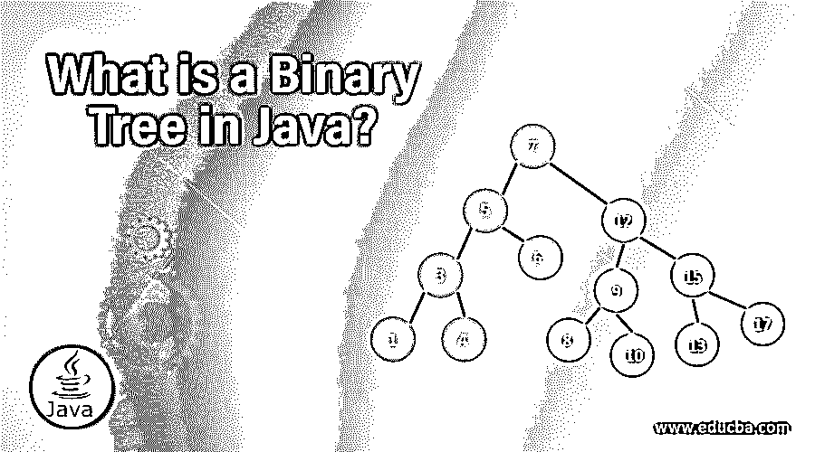

# Java 中的二叉树是什么？

> 原文：<https://www.educba.com/what-is-a-binary-tree-in-java/>

## Java 中的二叉树介绍

Java 中的二叉树是一种著名的数据结构类型，其中数据或对象以非线性分层结构排列，每个项目被称为“节点”,而所有节点都连接到称为根节点的起始点。数据或对象的放置使得每个左侧节点的值低于或等于根节点，并且每个右侧节点的值高于或等于根节点。任何给定的二叉树应该至少有一个根节点，并且在分层树的每一层中，父节点最多可以有两个子节点。

### 理解 Java 中的二叉树

BST(二叉查找树)是一种众所周知的数据结构，需要它来按顺序保留各个部分。每个二叉查找树都是一棵二叉树，其中左侧子节点的值低于或等于父节点，而右侧子节点的值大于或等于父节点。

<small>网页开发、编程语言、软件测试&其他</small>

Java 中的二叉树是如何让工作变得如此简单的？

Java 中的二叉树使得工作变得如此简单，因为它们被用来执行二分搜索法树和二进制堆，从而在排序算法和有效搜索中获得应用。

### Java 中二叉树可以做什么？

对于带有子节点的 Java 二叉树，节点是父节点，可能包含对其父节点的引用。在二叉树的外部，通常有一个根节点引用作为每个节点的祖先，以防它存在。每个节点都是一个信息结构，可以从根节点开始，依次引用左子节点或右子节点。二叉树不能有任何节点，或者它可能由指定为空树的根节点组成。在每个二叉树中，最大父节点可以有大约两个子节点。

### 优势

考虑到它是一个二叉树，它可以只有零个子节点，或者一个子节点，或者两个子节点。二叉查找树的特点是它能够减少基本过程的时间复杂性，如删除、搜索和添加，包括查找、插入和删除。每一个操作，如删除，查找和插入可以由二叉查找树执行的时间。速度提高的基础是由于每个节点的二叉查找树的唯一属性，左侧子节点中的信息小于或等于所述节点中的信息，而右侧子节点中的信息大于或等于所述节点中的信息。

### Java 中为什么要用二叉树？

当信息的线性表示不够时，树数据的结构是有益的，就像构建家谱一样。在 Java 框架集合下，Java 有两个内置的类别:TreeMap 和 TreeSet，用于满足程序员以上述形式指定数据组件的需求。

### 范围

如前所述，Java 框架集合由树执行的两种变体组成；其中一个是 TreeSet，另一个是 TreeMap。以上三类都有一个迷人的特点，就是一个装备为套，一个装备为图。Map 和 Set 的接口是通过 AbstractMap 和 AbstractSet 等抽象类别来执行的。

### 二叉树是如何工作的？

它在组件编译时强制实施的属性是建立在抽象模型的分析集上的。Map 的属性强制组件的编译应该有一个键赋值对。每个键都只有 1 个值，这意味着它拒绝重复的键。每个值都有一个可以复制的不同键。TreeSet 和 TreeMap 是二进制树的两个类别，除了以二进制树模式在内部组织其数据结构之外，它们符合从它们的特定接口获得的特定标准。

### Java 中为什么需要二叉树？

有许多类别的二叉树是独一无二的，因为它执行起来简单而有效。二叉树的局限性在于，它允许在一个父节点下至少有两个子节点，因为它们相应地被称为右侧子节点或左侧子节点。从右侧孩子开始的二叉树被称为右子树，从左侧孩子开始的二叉树被称为左子树。这通常适用于每个二叉树，因为一个二叉树有几个执行方案。这些方案有明确的建立和维护标准，这直接影响到数据组件规范的访问，这些规范通常在大 o 的概念中进行估计。

### 职业成长

软件和 [SaaS 解决方案可以](https://www.educba.com/what-is-software-as-a-service-saas/)用二叉树的实现来创建，以方便每个位置的企业修改和引导未来的技术。程序员可以通过学习这种二叉树来推进他们的职业生涯，并探索创造更多利用率的范围。

### 结论

TreeMap 和 TreeSet 通常是 JavaAPI 库中二叉树数据结构的最清晰的执行。作为数据法则，该结构在高级用户的使用上没有任何区别。然而，树结构比线性或非树结构的对等物[(如 HashMap](https://www.educba.com/hashmap-in-java/) 和 HashSet)更复杂和低效，因为它有几个规则来保持平衡的树结构的标准。

### 推荐文章

这是 Java 中二叉树的指南。这里我们讨论 java 中二叉树的优势、范围和职业发展。您也可以阅读以下文章，了解更多信息——

1.  [什么是 XML？](https://www.educba.com/what-is-xml/)
2.  [什么是自举？](https://www.educba.com/what-is-bootstrap/)
3.  什么是蜂巢？
4.  什么是 Ansible？

