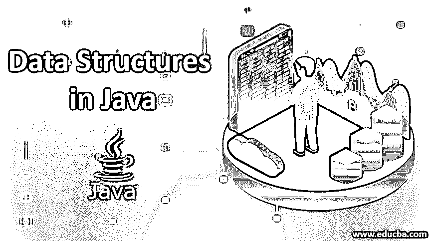
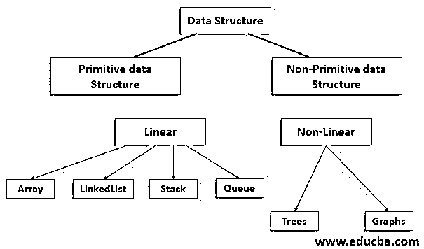

# Java 中的数据结构

> 原文：<https://www.educba.com/data-structures-in-java/>

## Java 中的数据结构介绍

数据结构可以定义为不同数据元素的集合。[Java 中的数据结构](https://www.educba.com/what-is-data-structure/)是一种在计算机系统中存储和组织数据和信息的方式，以便可以高效地检索和利用存储的数据。因此，使用合适的数据结构对提高应用程序的性能起着至关重要的作用。

### Java 中的数据结构类型

Java API 为两种常见的数据结构提供了内置支持:

<small>网页开发、编程语言、软件测试&其他</small>

#### 1.原始数据结构

这些是基本的数据结构，仅用于基本操作。整数、浮点数、数字、字符串、字符、指针都属于这一类数据结构。

#### 2.非原始数据结构

这些是复杂的数据结构，旨在执行与数据相关的复杂操作。非原始数据结构源自原始数据结构。非原语数据结构可以大致分为两个子类别，线性数据结构和非线性数据结构。数组、链表、栈、队列属于线性数据结构，而树和图属于非线性数据结构。现在我们将详细解释每个数据结构:

#### 3.排列

数组可以定义为同质元素的集合。数组是固定大小的静态数据结构。数组中的每一项都称为一个元素。java 中的数组可以具有 java 编程语言中可用的任何有效数据类型。数组中的所有元素都由相同的变量名标识，但每个元素都有一个唯一的索引，通过该索引可以存储或检索其值。java 中的数组可以是一维的、二维的或多维的。变量名为 arr 且大小为 10 的数组的各个元素如下:arr [0]，arr [1]，arr [2]，arr [3]……………………，arr [9]。

#### 4.链表

链表在内存中维护一个列表，它是被称为节点的元素的集合。这是一个动态数据结构，其大小是不固定的。链表有一个头节点和一个尾节点，链表中的每个可用节点都包含一个指向其相邻节点的指针。应当注意，链表的节点存在于存储器中不连续的位置。

#### 5.堆

它是一种动态数据结构，其中只允许在一端插入新元素和删除现有元素。它遵循后进先出策略(LIFO)。栈可以用大多数编程语言实现，因此它被认为是一种抽象数据类型。

#### 6.长队

这也是一种像 stack 一样的抽象数据类型，可以在大多数编程语言中实现。这是一个动态数据结构，遵循先进先出(FIFO)策略，这意味着首先插入的元素将首先被删除。队列有两个末端，称为前端和后端。在队列中，插入可以在后端完成，删除可以在前端完成。

#### 7.树

树形数据结构是基于父子关系的。这些是由称为节点的元素集合组成的多级数据结构。树数据结构中的节点维护它们之间的层次关系。树的最顶端的节点称为根节点，最底端的节点称为叶节点。树中的每个节点都包含指向相邻节点的指针。除了叶节点之外，树中的每个可用节点可以有多个子节点，而除了根节点之外，每个节点最多可以有一个父节点，根节点是树中所有可用节点的唯一父节点。

#### 8.图表

该数据结构包含基于图形表示的元素。图中的每一个元素都用一个顶点来表示。图形数据结构中的元素通过称为边的链接相互连接。图和树的主要区别是前者的数据结构可以包含一个循环，而后者不能包含一个循环。

### 结构

整个数据结构框架可借助以下流程图进行总结:

### Java 中数据结构的优势

以下是使用数据结构的主要优点:

*   效率
*   复用性
*   抽象
*   处理速度快
*   轻松搜索
*   轻松满足多种需求。

### 结论

从上面的文章中，我们对 java 中的数据结构有了清晰的介绍。使用数据结构使系统中复杂的任务变得简单。此外，我们已经看到了使用数据结构的不同优势。

### 推荐文章

这是 Java 中数据结构的指南。这里我们讨论 Java 中的数据结构类型和它们的框架以及优缺点。您也可以浏览我们推荐的文章，了解更多信息——

1.  [Java 中带方法的迭代器](https://www.educba.com/iterator-in-java/)
2.  [散列函数在 Java 中的应用](https://www.educba.com/hashing-function-in-java/)
3.  [Java 多维数组介绍](https://www.educba.com/multidimensional-array-in-java/)
4.  Java 中的多态性是如何工作的？

