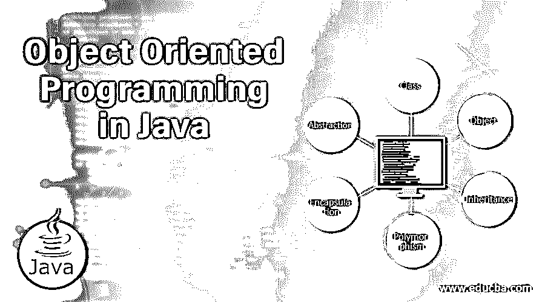

# Java 中的面向对象编程

> 原文：<https://www.educba.com/object-oriented-programming-in-java/>




## Java 面向对象编程简介

Java 是詹姆斯·高斯林设计的面向对象的程序设计。它是一种基于类的通用编程语言，具有并发编程特性。它还具有多线程功能。它是一种静态、安全、强类型的编程语言。它由 Oracle 公司(当时是 Sun 公司)开发和维护。它的文件扩展名是。它最早出现在 1995 年。它旨在开发只需编写一次就可以在任何地方运行的应用程序。它在客户机-服务器类型的应用程序中最受欢迎。它是在 GNU 通用公共许可证和 Java 社区进程下授权的。Java 的最新版本是 10，2018 年 3 月发布。

### Java 中面向对象编程的解释

[Java 编程语言](https://www.educba.com/java-programming-language-features/)基于面向对象的编程方法或范例，它有不同种类的概念，如类、对象、继承、多态、封装和抽象，可描述如下:

<small>网页开发、编程语言、软件测试&其他</small>

*   **类:**这是对象的蓝图，定义了真正功能所在的字段或属性和方法。这些属性和方法被称为成员，在成员声明期间，可以基于[定义的访问修饰符](https://www.educba.com/access-modifiers-in-java/)来访问这些成员。
*   **Object:** 一个对象被称为类的实例，可以通过调用类的构造函数来声明和实例化。对象将具有状态，状态将包含类的属性将保存的数据。
*   **传承:**这是第三步流程。通过减少无用信息并将其转换为重要的信息集，从现有数据中获取有价值的信息，将对数据进行检查、清理、转换和可视化。
*   **多态性:**多态性定义为以不同的可能方式执行单一任务的过程。在 Java 中，多态可以通过两种方式实现，称为[方法重载和方法覆盖](https://www.educba.com/overloading-vs-overriding/)。方法重载也称为编译时多态性，而方法重写也称为运行时多态性。
*   **封装:**这就是封装，意思是将代码隐藏或绑定或包装到 Java 中定义为类的单个单元或模块中。面向对象编程的封装特性可以通过使用 Java 中的类来实现。一个普通的旧 java 对象或 Java Bean 被称为是封装的，因为类的成员是私有的(访问修饰符)，这些成员只能通过使用类中的 getters 和 setters 方法来访问。
*   **抽象:**面向对象的特性抽象可以定义为通过只暴露所需的接口或访问方法来调用实现类方法来隐藏功能实现的过程。抽象可以在 Java 编程语言中通过[使用接口和抽象类](https://www.educba.com/java-interface-vs-abstract-class/)来实现。

### Java 面向对象编程的优势

1.  它有助于开发不同类型的应用程序及其维护，而无需额外的成本。
2.  它有助于通过对设计进行小的更改来轻松实现更改，从而使应用程序更能适应客户要求的较大更改。
3.  代码中的模块化有助于通过轻松修复错误来简化故障排除过程和维护。
4.  代码复用为主。
5.  它为频繁的功能更改提供了更大的灵活性。

### 面向对象编程在 Java 中的应用

面向对象编程在 Java 中有不同的应用，下面是这个概念领域的例子:

#### 1.班级

类别可以定义如下:

```
public class Employee {
private int employeeId;
private String employeeName;
public int getSalary(int basicPay, int da, int hra) {
int salary = basicPay + da + hra;
return salary;
}
}
```

在上面的类中，employeeId、employee name 和 getSalary()方法是该类的成员，而 employeeId 和 employee name 是属性或字段，getSalary()是完成实际工作的方法。

#### 2.目标

可以为上面的 Employee 类创建一个对象，如下所示。

```
Employee employeeObject = new Employee();
```

在上面一行中，使用 new 关键字创建了一个对象，Employee()是用于创建该对象的空参数构造函数。雇员反对对雇员类的引用。

#### 3.多态性

这可以通过方法重写和重载来实现。

```
public int getSalary(int basicPay, int da, int hra) {
int salary = basicPay + da + hra;
return salary;
}
```

在上面的方法中，另一个参数可以添加到 getSalary()方法中，方法是添加到括号中，如下所示:

```
public int getSalary(int basicPay, int da, int hra, int bonus) {
int salary = basicPay + da + hra + bonus;
return salary;
}
```

#### 4.包装

这可以通过以下方式实现:

```
public class Employee {
private int employeeId;
private String employeeName;
public int getEmployeeId() {
return employeeId;
}
public void setEmployeeId(int employeeId) {
this.employeeId = employeeId;
}
public String getEmployeeName() {
return employeeName;
}
public void setEmployeeName(String employeeName) {
this.employeeName = employeeName;
}
}
```

上面的 Employee 类有两个字段(private)和四个方法(getters 和 setters ),它们将用于访问上面的两个私有属性。

#### 5.抽象

这是隐藏实现功能的过程。

在上面的方法 getSalary()中，将工资的所有组成部分相加的内部函数隐藏在方法内部，只有这个函数可以通过使用方法名将值作为方法参数传递来访问。这样，通过将单个薪金组成部分传递给方法，将获得总薪金。

### 结论

在 Web 领域、独立领域和许多其他领域，都有不同的和多个领域的应用程序，适用于 Java 概念的面向对象编程。Java 中面向对象编程的平均利用率或应用程序在大多数企业应用程序中都处于前 5 位，并且几乎在每个企业中都是最受欢迎的技术。有大量的工具可以使用，比如 ide，来使用 Java 中的面向对象编程开发应用程序。由于易于开发和维护，许多公司正在使用基于 Java 的应用程序来满足他们的需求。用 Java 开发的独立应用程序主要被许多公司用作他们的内部工具，它们是基于 Java Swing GUI toolkit 开发的，现在在其最新版本中被称为 Java FX。Java 8 的最新版本通过其流 API 提供了强大的函数式编程特性和并行处理能力。

### 推荐文章:

这是 Java 面向对象编程的指南。这里我们讨论了不同的概念和面向对象编程在 Java 中的应用。您也可以阅读以下文章，了解更多信息——

1.  [哎呀，Java 面试问题](https://www.educba.com/oops-java-interview-questions/)
2.  [Java 测试面试问题](https://www.educba.com/java-testing-interview-questions/)
3.  Java 中的[对象](https://www.educba.com/object-in-java/)
4.  [c#中的重载和重写](https://www.educba.com/overloading-and-overriding-in-c/)


