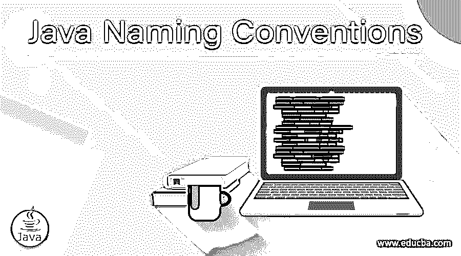
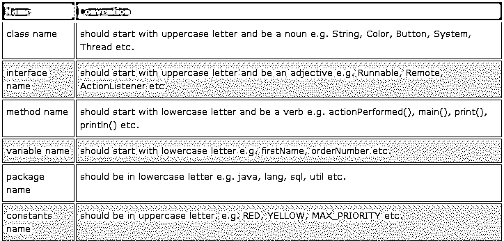

# Java 命名约定

> 原文：<https://www.educba.com/java-naming-conventions/>




## Java 命名约定介绍

在本文中，我们将介绍一些应该遵循的命名约定，特别是在 Java 中为了代码的可维护性和可读性，帮助一个程序员理解和修改另一个程序员编写的代码。我们可以把它看作是一个在给类、变量、方法或接口等命名时可以遵循的准则。并使之成为编写代码时的一个好习惯。我们将在本文中讨论的命名约定是由许多 Java 程序员建议和实践的，并且也得到 Netscape 和 Sun Microsystems 的支持。

### Java 命名约定中的语法

在 Java 编程语言中，camel-case 风格用于编写方法/函数的名称、变量以及类和接口的标题-case 风格。让我们浏览并理解在 Java 编程语言中命名元素/实体时应该遵循的规则:

<small>网页开发、编程语言、软件测试&其他</small>

*   在给类命名时，我们应该记住类名应该是名词，并且以大写字母开头。

**语法:**

```
public class Employee { //code snippet }
```

*   在接口的情况下，它应该是 ab 形容词(描述名词(实现它的类))并以大写字母开头。在某些情况下，一个接口名也可以是一个名词，当它们代表一族类时，例如:Map、List 等。

**语法:**

```
interface Printable { //code snippet }
```

*   方法名应该以一个动词(定义该方法将要实现的动作)开头，并以一个小写字母开头。

**语法:**

```
void printDetails() { //code snippet }
```

*   而对于变量来说，它们应该是有意义的，这表明它存储的是什么类型的信息，是名字、地址、电话号码等等。在编写变量名时，我们需要确保它不以特殊字符开头，如美元($)或下划线字符(_)，并且它的名称不应该有任何空格，以小写字母开头。

**语法:**

```
int eid, sal;string firstName, lastName;
```

*   常量变量的名称应该全部大写(全部大写)，并用下划线(_)分隔；它的名字由不止一个单词组成。

**语法:**

```
static final int MIN_SAL = 20000;
```

*   我们知道 Java 使用所有小写字母来指定包名，我们在命名包时也应该遵循相同的命名约定。

**语法:**

```
package src.employeedetails;
```

*   java 代码中的枚举应该大写，即全部大写字母。

**语法:**

```
enum JobPost { MANAGER, ANALYST, HR, ADMIN, ENGINEER }
```

*   java 中的注释可以是名词、动词或形容词，并且应该遵循标题大小写样式[来命名注释](https://www.educba.com/hibernate-annotations/)。

**语法:**

```
public @interface Documented {}
```

### Java 命名约定的例子

现在，让我们使用上面的代码片段编写一个完整的代码，使它更有意义，并帮助我们理解为什么在用任何编程语言编写应用程序代码时遵循命名约定是重要的:

#### 示例#1

**代码:**

```
package src.employeedetails;
interface Printable {
void printDetails();  }
public class Employee implements Printable {
int eid;
double sal;
String firstName, lastName;
// Default Constructor
Employee() {
eid=0; sal=0.0;
firstName = "Anonymous"; lastName = "Anonymous";
}
// Parameterized Constructor
Employee(int eid, double sal, String firstName, String lastName) {
this.eid = eid; this.sal = sal;
this.firstName = firstName; this.lastName  = lastName;
}
public void printDetails() {
System.out.println("Employee ID:" + eid + "\n" +
"Employee First Name:" + firstName + "\n" +
"Employee Last Name:" + lastName + "\n" +
"Employee Salary:" + sal + "\n" );
}
public static void main(String args[]) {
Employee emp = new Employee(1,22368.50,"Alan","Hope");
emp.printDetails();
}
}
```

**输出:**


#### 实施例 2

**代码:**

```
package src.customerdetails;
interface Printable { void printDetails(); }
public class Customer implements Printable {
int custid;
long mobNo;
String fullName,emailAddr;
// Default Constructor
Customer() {
custid=0; mobNo=0;
fullName = "Anonymous"; emailAddr = "Anonymous@opaq.com";
}
// Parameterized Constructor
Customer(int custid, long mobNo, String fullName, String   emailAddr) {
this.custid = custid; this.mobNo = mobNo;
this.fullName = fullName; this.emailAddr  = emailAddr;
}
public void printDetails() {
System.out.println("Customer ID:" + custid + "\n" +
"Customer Full Name:" + fullName + "\n" +
"Customer Email Address:" + emailAddr + "\n" +
"Customer Mobile Number:" + mobNo + "\n" );
}
public static void main(String args[]) {
Customer cust = new Customer (1,987451036,"Alan Hope","alan123@gmail.com");
cust.printDetails();
}
}
```

**输出 1:**


**输出 2:**




### Java 命名约定的优势

以下是 java 命名约定的一些优点:

*   减少书写混乱或错误的代码。
*   代码可读性的改进。
*   花更少的时间去理解代码做什么。
*   代码可维护性的改进。
*   在整个应用程序中生成一致的代码。

### 结论

下次编写 Java 代码时，确保您定义和实现的类、接口、包、方法和字段的名称符合 Java 命名约定。请记住，在任何编程语言中，以下命名约定都是编写干净一致的代码的第一步，并且可能是每个程序员都应该遵循的第一个最佳实践。

### 推荐文章

这是 Java 命名约定的指南。这里我们讨论定义和实现 Java 命名约定的类、接口、包、方法和字段。您也可以浏览我们的其他相关文章，了解更多信息——

1.  [Java 中的方块](https://www.educba.com/squares-in-java/)
2.  [Java 中的递归](https://www.educba.com/recursion-in-java/)
3.  [Java 中的阶乘](https://www.educba.com/factorial-in-java/)
4.  [Java 编程中的数组](https://www.educba.com/arrays-in-java-programming/)


