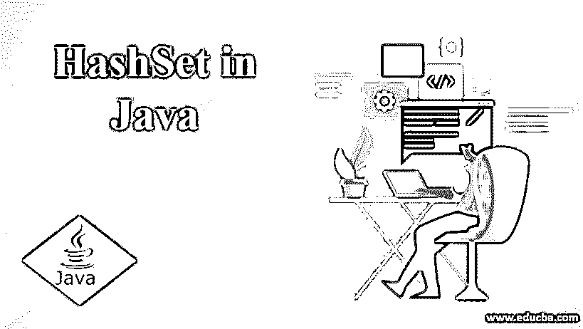
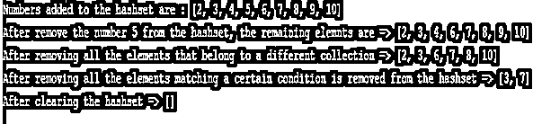

# Java 中的散列

> 原文：<https://www.educba.com/hashset-in-java/>




## Java 中 HashSet 的介绍

[set 接口由](https://www.educba.com/set-interface-in-java/)HashSet 类实现，该类有一个哈希表作为备份，是 HashMap 的一个实例。尽管如此，这个类不能保证元素随时间的顺序。这个 HashSet 类允许 null 元素，为 remove、add 等操作提供时间性能。假设元素通过散列函数分散在桶中。

**语法**

<small>网页开发、编程语言、软件测试&其他</small>

```
public class HashSet<E> extends AbstractSet<E> implements Set<E>, Cloneable, Serializable
```

### Java HashSet 中的构造函数

java HashSet 类由几个构造函数组成。它们是:

*   **HashSet():** 默认的 HashSet 可以使用这个构造函数 HashSet()来构造。
*   **HashSet(int capacity):**HashSet 的容量可以使用这个构造函数 HashSet(int capacity)初始化为给定整数的容量。随着我们继续向 hashset 添加元素，hashset 的容量会自动增长。
*   **HashSet(int capacity，float loadFactor):**HashSet 的容量可以初始化为给定整数的容量，以及使用该构造函数 HashSet(int capacity，float loadFactor)的构造函数中作为参数指定的 load factor 值。
*   **HashSet(收藏<？扩展 E > c):** 集合 c 的元素使用这个构造函数 hashset 初始化为 HashSet(集合<？延伸 E > c)

### 实现 Java HashSet 的方法

java HashSet 类由几个方法组成。它们是:

*   add(E e): 如果一个特定的元素在集合中不存在，那么使用 add(E e)方法将该元素添加到集合中。
*   **clear():** 使用 clear()方法从集合中移除所有元素。
*   **clone()** :使用这个方法 clone()返回 hashset 实例的浅层副本。元素本身不能克隆。
*   **contains(Object o):** 如果集合中存在指定的元素，此方法 contains(Object o)返回 true。
*   **isEmpty():** 如果集合中没有元素，这个方法 isEmpty()返回 true。
*   **iterator():** 集合元素上的迭代器使用这个方法 iterator()返回。
*   **remove(Object o):** 如果一个指定的元素出现在集合中，这个方法 remove(Object o)将删除那个指定的元素。
*   **size():** 使用 size()方法返回集合中元素的计数。
*   **spliterator():** 一个后期绑定和一个快速 spliterator 在元素集合上使用 spliterator()方法创建。

### 用 Java 实现 HashSet 的例子

下面是用 Java 实现 HashSet 的例子:

#### 示例#1

创建一个 hashset，并向创建的新集合中添加新元素。

**代码:**

```
import java.util.HashSet;
import java.util.Set;
//A class Example is created
public class Example {
public static void main(String[] args) {
// A hashset is created
Set<String> months = new HashSet<>();
// New elements are added to the hashset
months.add("January");
months.add("Febraury");
months.add("March");
months.add("April");
months.add("May");
months.add("June");
months.add("July");
months.add("August");
months.add("September");
months.add("October");
months.add("November");
months.add("December");
System.out.println(months);
}
}
```

**输出:**


#### 实施例 2

一个集合，演示了 Hashset(collection c)构造函数的用法。

**代码:**

```
import java.util.ArrayList;
import java.util.HashSet;
import java.util.List;
import java.util.Set;
//A class Example is created
public class Example {
public static void main(String[] args)
{
// A hashset is created
List<Integer> Divby4 = new ArrayList<>();
Divby4.add(4);
Divby4.add(8);
Divby4.add(12);
Divby4.add(16);
Divby4.add(20);
List<Integer> Divby2 = new ArrayList<>();
Divby2.add(2);
Divby2.add(4);
Divby2.add(6);
Divby2.add(8);
Divby2.add(10);
// A hashset is created from another collection Divby4
Set<Integer> Divby4Or2 = new HashSet<>(Divby4);
// Adding the elements of divby2 to the existing hashset
Divby4Or2.addAll(Divby2);
System.out.println(Divby4Or2);
}
}
```

**输出:**


#### 实施例 3

这个 Java 程序演示了对 hashset 的操作，比如检查 hashset 是否为空，检查 hashset 中元素的数量，检查 hashset 中是否存在元素。

**代码:**

```
import java.util.HashSet;
import java.util.Set;
//A class Example is created
public class Example {
public static void main(String[] args)
{
// A hashset is created
Set<String> rivers = new HashSet<>();
// performing isempty operation on the set to check if it is empty
System.out.println("Are there no elements in rivers set? : " + rivers.isEmpty());
rivers.add("Kaveri");
rivers.add("Ganga");
rivers.add("Yamuna");
rivers.add("Godavari");
// Checking the size of the hashset
System.out.println("The count of rivers in the hashset are " + rivers.size());
// checking if an element is present in the hashset
String Name = "Ganga";
if(rivers.contains(Name)) {
System.out.println(Name + " is present in the rivers hashset.");
} else {
System.out.println(Name + " is not present in the rivers hashset.");
}
}
}
```

**输出:**


#### 实施例 4

Java 程序从一个 hashset 中删除一个元素，删除属于不同集合的所有元素，从 hashset 中删除那些满足特定条件的元素，并从 hashset 中删除所有元素。

**代码:**

```
import java.util.ArrayList;
import java.util.HashSet;
import java.util.List;
import java.util.Set;
//A class Example is created
public class Example {
public static void main(String[] args)
{
// A hashset is created
Set<Integer> num = new HashSet<>();
num.add(2);
num.add(3);
num.add(4);
num.add(5);
num.add(6);
num.add(7);
num.add(8);
num.add(9);
num.add(10);
System.out.println("Numbers added to the hashset are : " + num);
// An element from the hashset is removed. False is returned if that element doesnt     exists in the hashset
boolean Remove = num.remove(5);
System.out.println("After remove the number 5 from the hashset, the remaining elemnts are => " + num);
// all the elements that belong to a different collection are removed from the hashset
List<Integer> Squares = new ArrayList<>();
Squares.add(4);
Squares.add(9);
num.removeAll(Squares);
System.out.println("After removing all the elements that belong to a different collection => " + num);
// Elements matching a certain condition is removed from the hashset
num.removeIf(num1 -> num1 % 2 == 0);
System.out.println("After removing all the elements matching a certain condition is removed from the hashset => " + num);
// Clearing the hashset
num.clear();
System.out.println("After clearing the hashset => " + num);
}
}
```

**输出:**




### 结论

在本教程中，我们理解了 hashset 定义中的 hashset 概念、创建 hashset 的语法、hashset 中的构造函数、hashset 中的方法，以及创建 hashset、向新创建的 hashset 添加元素、从现有 hashset 中删除元素、检查 Hashset 中的元素的编程示例。

### 推荐文章

这是 Java 中 HashSet 的指南。在这里，我们讨论语法，几个构造函数，方法，以及用正确的代码和输出实现的例子。您也可以浏览我们的其他相关文章，了解更多信息——

1.  [Java Swing 中的定时器](https://www.educba.com/timer-in-java-swing/)
2.  [要浮动的 Java 字符串](https://www.educba.com/java-string-to-float/)
3.  [Java 集合类](https://www.educba.com/java-collections-class/)
4.  [Java 中的内存类型](https://www.educba.com/types-of-memory-in-java/)


