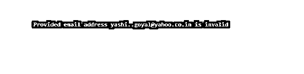
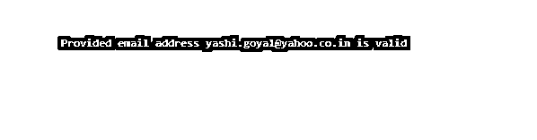

# Java 电子邮件验证

> 原文：<https://www.educba.com/java-email-validation/>


## Java 电子邮件验证的定义

Java 电子邮件验证用于检查用户输入的电子邮件地址的准确性和质量。在 Java 中，电子邮件验证是在正则表达式的帮助下完成的。为了限制用户从不必要的电子邮件地址填充数据库，并防止应用程序仅被合法用户使用，电子邮件地址起着重要的作用。几乎所有的网站和应用程序都使用用户的电子邮件地址来注册，并使用他们的算法进行验证。因此，在设计注册页面或执行任何需要电子邮件地址的任务之前，在继续下一步之前验证这些电子邮件地址是很重要的。

### 邮件验证在 Java 中是如何工作的？

让我们了解用 Java 验证电子邮件的一步一步的过程，以及它在代码中的实现:

<small>网页开发、编程语言、软件测试&其他</small>

1.在 Java 中，我们借助正则表达式来验证电子邮件地址。
2。正则表达式不是一种语言，但它为字符串定义了一种模式，通过这种模式，我们可以搜索、比较、编辑或操作文本。它不会因语言而异(尽管在某些语言中它们略有不同)。
3。在 java 中，Regex 类存在于名为 Java 的 Java 库中。util.regex
4。在 Java 中，有一个名为‘Pattern’的类，它的对象是正则表达式的编译版本。为了创建模式对象，我们使用它的方法“compile”(它是公共静态的)，并在其中传递正则表达式。
5。“Matcher”是一个 java regex 引擎对象，它将输入字符串与上面创建的模式类的对象进行匹配。方法“matcher”将输入字符串(需要检查的电子邮件)作为参数。
6。使用“matches”方法将输入字符串与正则表达式进行比较，并根据输入字符串是否与提到的正则表达式匹配的决定返回布尔结果。
7。结果存储在一个布尔变量中，基于此，相应的消息在控制台上打印给用户。

根据应用程序的要求，我们可以在电子邮件的验证代码中实施尽可能多的限制，但任何用户的电子邮件地址中应存在的一般限制如下所示:

*   对电子邮件地址中“@”部分的限制。
*   对点的限制(。)出现在电子邮件地址中，无论是前导、尾随还是连续。
*   对电子邮件地址用户名部分的限制
*   电子邮件地址顶级域名的字符数限制。

### Java 电子邮件验证示例

在本文中，我们将一步一步地实现所有上述验证限制，以便让您更好地理解代码。

#### 1.正则表达式验证中间带有“@”的电子邮件

电子邮件地址中应该有一个“@”符号

```
import java.util.regex.*;
import java.util.*;
public class Main{
public static boolean isValid(String email)
{
String regex = "^(.+)@(.+)$";
Pattern pattern = Pattern.compile(regex);
if (email == null)
return false;
return pattern.matcher(email).matches();
}
public static void main(String args[]){
String email = "yashi..goyal@yahoo.com";
boolean result = isValid(email);
if (result == true)
System.out.println("Provided email address "+ email+ " is valid \n");
else
System.out.println("Provided email address "+ email+ " is invalid \n");
}
}
```

**输出:**


对于下面的线

```
address = 'yashi..goyalyahoo.com'
```

**输出:**


#### 2.添加对电子邮件地址用户名部分的限制

*   允许使用所有大写字母[A- Z]。
*   所有的小字母[a- z]都是允许的。
*   所有数字[0- 9]都是允许的。
*   电子邮件地址可以包含点(。)、下划线(_)、破折号(–)。
*   不允许使用其他特殊字符。

```
import java.util.regex.*;
import java.util.*;
public class Main{
public static boolean isValid(String email)
{
String regex = "^[A-Za-z0-9+_.-]+@(.+)$";
Pattern pattern = Pattern.compile(regex);
if (email == null)
return false;
return pattern.matcher(email).matches();
}
public static void main(String args[]){
String email = "yashi + goyal@yahoo.com";
boolean result = isValid(email);
if (result == true)
System.out.println("Provided email address "+ email+ " is valid \n");
else
System.out.println("Provided email address "+ email+ " is invalid \n");
}
}
```

**输出:**


对于下面的线

```
address = 'yashi-goyal@yahoo.com'
```

**输出:**


#### 3.从点开始限制电子邮件，无论是前导、连续还是结尾

*   不止一个点(。)可以出现在电子邮件地址中
*   局部和域部分都不允许有连续的点。
*   电子邮件不允许以点开头或结尾。

```
import java.util.regex.*;
import java.util.*;
public class Main{
public static boolean isValid(String email)
{
String regex = "^[a-zA-Z0-9_!#$%&'*+/=?`{|}~^-]+(?:\\.[a-zA-Z0-9_!#$%&'*+/=?`{|}~^-]+)*@[a-zA-Z0-9-]+(?:\\.[a-zA-Z0-9-]+)*$";
Pattern pattern = Pattern.compile(regex);
if (email == null)
return false;
return pattern.matcher(email).matches();
}
public static void main(String args[]){
String email = "yashi..goyal@yahoo.co.in";
boolean result = isValid(email);
if (result == true)
System.out.println("Provided email address "+ email+ " is valid \n");
else
System.out.println("Provided email address "+ email+ " is invalid \n");
}
}
```

**输出:**




对于下面的线

```
address = 'yashigoyal@yahoo.co.in'
```

**输出:**


#### 4.对域名中字符数的限制

*   域名中至少应该有一个点。
*   在域名中，在点之后，只有字母会继续。
*   域名的长度应该在 2- 6 个字母之间。

```
import java.util.regex.*;
import java.util.*;
public class Main{
public static boolean isValid(String email)
{
String regex = "^[\\w!#$%&'*+/=?`{|}~^-]+(?:\\.[\\w!#$%&'*+/=?`{|}~^-]+)*@(?:[a-zA-Z0-9-]+\\.)+[\\a-zA-Z]{2,6}";
Pattern pattern = Pattern.compile(regex);
if (email == null)
return false;
return pattern.matcher(email).matches();
}
public static void main(String args[]){
String email = "yashi.goyal@yahoo.c";
boolean result = isValid(email);
if (result == true)
System.out.println("Provided email address "+ email+ " is valid \n");
else
System.out.println("Provided email address "+ email+ " is invalid \n");
}
}
```

**输出:**


对于下面的线

```
address = 'yashi.goyal@yahoo.co.in'
```

**输出:**




### 结论

上面的描述清楚地解释了什么是电子邮件验证，以及它如何在 Java 程序中工作。电子邮件验证被广泛使用，因为它可以是每个用户登录网站的登录 id 或唯一用户名。因此，对于程序员来说，在使用它在正确的代码流中进行进一步处理之前，学会验证它是非常重要的。

### 推荐文章

这是一个 Java 电子邮件验证指南。这里我们讨论定义，电子邮件验证在 Java 中是如何工作的？代码实现示例。您也可以看看以下文章，了解更多信息–

1.  [Java 集合类型](https://www.educba.com/java-collection-types/)
2.  [Java 集合排序](https://www.educba.com/java-collection-sort/)
3.  [Java 中的 Servlet](https://www.educba.com/servlet-in-java/)
4.  [跳过列表 Java](https://www.educba.com/skip-list-java/)


