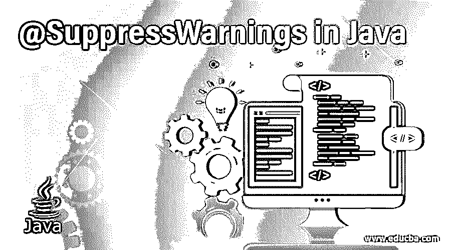
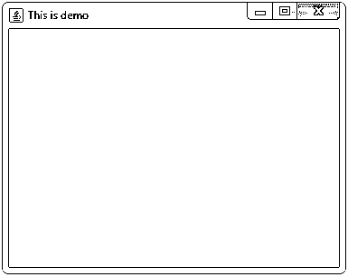
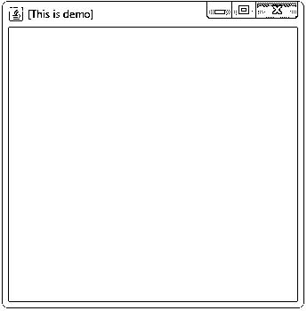

# Java 中的@SuppressWarnings

> 原文：<https://www.educba.com/suppresswarnings-in-java/>




## Java 中的@SuppressWarnings 简介

Java 中的@SuppressWarnings 是一个注释，用于通知编译器抑制程序某一部分的指定警告。@SuppressWarnings 是一个内置的注释，就像表示元数据的标记一样，它提供了额外的信息。有时警告是好的，但有时它们是不合适的和令人讨厌的，那么程序员有时可以通知编译器抑制这样的警告。请注意，@SuppressWarnings 中指定的编译器警告会抑制程序的某个部分；例如，如果一个方法被注释为抑制指定的警告，则编译器只抑制该方法中的指定警告，但是如果一个类被注释为抑制指定的警告，则编译器抑制该类中的方法中的指定警告。

### 句法

java 中@SuppressWarnings 注释的语法–

<small>网页开发、编程语言、软件测试&其他</small>

```
@SuppressWarnings( "warningOption" )
```

**参数**

*   **warning option:**warning option 是一个字符串参数，它指定了我们希望编译器抑制或忽略的特定警告。

java 中的@SuppressWarnings 支持要抑制的不同类型的警告列表。Eclips 和 Netbean IDEs 支持的不仅仅是标准的 javac 编译器警告选项。@SuppressWarnings 支持警告选项列表为 unchecked、deprecation、serial、overrides、cast、divzero、empty、fallthrough、path、finally 和 all。

### @SuppressWarnings 如何在 java 中工作并举例说明？

工作和例子如下所述:

#### 示例#1

接下来，我们编写 java 代码来更清楚地理解@SuppressWarnings 注释，在下面的示例中，我们使用@SuppressWarnings 来取消未检查的警告，如下所示

**代码:**

```
//package demo;
import java.util.ArrayList;
import java.util.List;
public class Main {
@SuppressWarnings("unchecked")
// also can be write as @SuppressWarnings(value = "unchecked")
public static void main( String[] arg) {
List fruits = new ArrayList();
// this causes unchecked warning
fruits.add("Apple");
System.out.println( fruits);
}
}
```

**输出:**


**说明:**和上面的代码一样，@SuppressWarnings 注释被注释到 main()方法中作为@SuppressWarnings("unchecked ")，要隐藏的警告是未检查的警告现在 main()方法内的所有代码也被应用。所以现在编译器不会对这一行发出警告“fruits . add(" Apple ")”；因为它使用的是原始类型集合。与代码中一样，它使用@SuppressWarnings 批注来不修复该警告。在上面的代码中，如果我们不使用@SuppressWarnings 注释，那么在“fruits.add("Apple ")”行

#### 实施例 2

接下来，我们编写 java 代码，通过下面的示例更清楚地理解@SuppressWarnings 批注，在这个示例中，我们使用@SuppressWarnings 来抑制 deprecationwarning，如下所示

**代码:**

```
//package demo;
import javax.swing.JFrame;
public class Demo {
@SuppressWarnings("deprecation")
// also can be write as @SuppressWarnings(value = "deprecation")
public static void main( String[] arg) {
JFrame dlog = new JFrame();
dlog.setTitle("This is demo");
// this generate the deprecated warning as it is a deprecated method
// JDK version 1.7 replace it by setVisible() method
dlog.show();
dlog.setSize(500, 500);
// so use the new version method
dlog.setVisible(true);
}
}
```

**输出:**




**说明:**和上面的代码一样，@SuppressWarnings 注释被注释到 main()方法中作为@SuppressWarnings("deprecation ")，要被抑制的警告是 deprecation warning。所以现在编译器不会发出关于这一行“dlog.show()”的警告因为该方法在 swing API 中被 setVisible()方法弃用。与代码中一样，它使用@SuppressWarnings 批注来不修复该警告。

#### 实施例 3

接下来，我们编写 java 代码来理解@SuppressWarnings 批注，其中我们使用@SuppressWarnings 来在类级别取消不推荐使用的警告，如下所示

**代码:**

```
//package demo;
import javax.swing.JFrame;
@SuppressWarnings("deprecation")
public class Demo {
// also can be write as @SuppressWarnings(value = "deprecation")
public static void main( String[] arg) {
JFrame dlog = new JFrame();
dlog.setTitle("This is demo");
// this generate the deprecated warning as it is a deprecated method
// JDK version 1.7 replace it by setVisible() method
dlog.show();
dlog.setSize(500, 500);
// so use the new version method
dlog.setVisible(true);
}
public void anotherMethod()
{
JFrame dlog = new JFrame();
dlog.setTitle("This is demo");
dlog.show();
}
}
```

**输出:**


**解释:**在上面的代码中，@SuppressWarnings 注释被注释为@SuppressWarnings("deprecation ")，这意味着现在该类中的所有方法也被应用了要禁止的警告，并且现在编译器将不会在两个方法行" dlog.show()"中发出警告.

如果我们在上面的代码中的 main()方法级别使用@SuppressWarnings 注释，警告消息将显示在 anotherMethod()方法中，正如我们在下图中清楚看到的那样。

#### 实施例 4

接下来，我们编写 java 代码来理解@SuppressWarnings 批注，其中我们使用@SuppressWarnings 来取消多个警告，如下所示

**代码:**

```
//package demo;
import java.util.ArrayList;
import java.util.List;
import javax.swing.JFrame;
public class Demo {
@SuppressWarnings({"unchecked","deprecation"})
// also can be write as @SuppressWarnings(value={"unchecked","deprecation"})
public static void main( String[] arg) {
JFrame dlog = new JFrame();
List title = new ArrayList();       // this causes unchecked warning
title.add("This is demo");
dlog.setTitle(title.toString());
// this generate the deprecated warning as it is a deprecated method
// JDK version 1.7 replace it by setVisible() method
dlog.show();
dlog.setSize(500, 500);
// so use the new version method
dlog.setVisible(true);
}
}
```

**输出:**




**说明:**和上面的代码一样，@SuppressWarnings 注释被注释到 main()方法中作为@SuppressWarnings({"unchecked "，" deprecation"})，以抑制或忽略多个警告" unchecked "和" deprecation "，这意味着编译器不会发出与" unchecked "和" deprecation "相关的警告。

### 结论

@ SuppressWarningsis 是 Java 中的一个注释，它通知编译器忽略注释程序的某个部分的指定警告。

### 推荐文章

这是 Java 中@SuppressWarnings 的指南。这里我们用适当的语法、参数和例子来介绍 java 中的@SuppressWarnings。您也可以浏览我们的其他相关文章，了解更多信息——

1.  [Java 中的聚合](https://www.educba.com/aggregation-in-java/)
2.  [Java 中的可比](https://www.educba.com/comparable-in-java/)
3.  [JavaScript 数组过滤器](https://www.educba.com/javascript-array-filter/)
4.  [JavaScript 表单事件](https://www.educba.com/javascript-form-events/)


