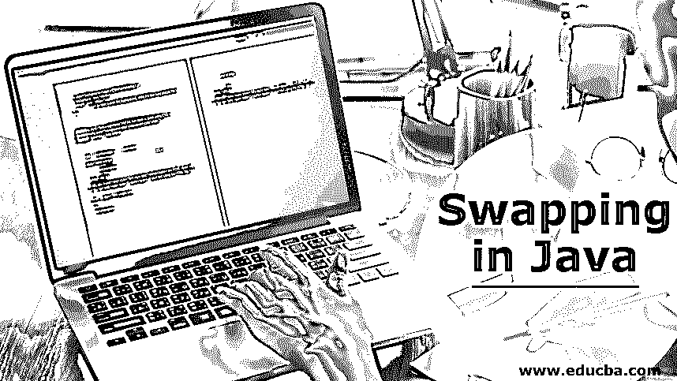
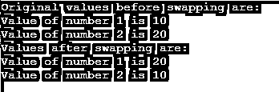
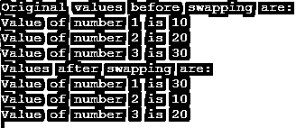
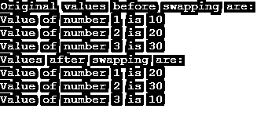

# 在 Java 中交换

> 原文：<https://www.educba.com/swapping-in-java/>




## Java 中交换的介绍

众所周知，Java 是软件开发最流行的语言之一。理解它的一些常用概念是非常重要的，甚至可以帮助程序员在解决大型问题时使用它们。交换是程序中经常使用的概念之一。交换意味着变量值的互换。它是用内存中的数据完成的。交换可以在一个临时变量的帮助下完成，也可以不使用临时变量。大多数排序和搜索算法使用交换变量值。在这个主题中，我们将学习 Java 中的交换。

### Java 中两个数的交换

让我们借助一些例子来看一看。

<small>网页开发、编程语言、软件测试&其他</small>

#### 案例 1:使用临时变量交换数字

**代码:**

```
public class Swap2Numbers
{
public static void main(String[] args)
{
int num1=10;
int num2 =20;
// Printing values of numbers before swapping in order to see the change
System.out.println("Original values before swapping are:");
System.out.println("Value of number 1 is " +num1); System.out.println("Value of number 2 is " +num2);
// Value of num1, i.e. 10 is assigned to temp variable int temp = num1;
// Value of num2, i.e. 20 is assigned to num1 variable num1 = num2;
// Value of temp variable, i.e. 10 (assigned by num1) is assigned to num2
int temp = num1; num1 = num2;
num2 = temp;
// Printing values of numbers after swapping in order to see the change
System.out.println("Values after swapping are:");
System.out.println("Value of number 1 is " +num1);
System.out.println("Value of number 2 is " +num2);
}
}
```

**输出:**


**说明:**

在上面的程序中，我们有两个名为 num1 和 num2 的变量，它们的值分别为 10 和 20。名为 temp 的临时变量用于变量 num1 和 num2 的相同数据类型。交换分 3 步进行:

1.  “num1”的值(即 10)被赋给临时变量“temp”，因此现在“temp”的值为 10。
2.  “num2”的值(即 20)被分配给“num1”变量，即现在“num1”变量的值是 20。
3.  步骤 1 中分配的“temp”变量的值(即 10)现在被分配给“num2”变量，即“num 2”变量的值现在变为 10。

最后，变量的值被交换或互换，交换的值被打印在控制台上。

#### 案例 2:不使用临时变量交换两个数

**代码:**

```
public class SwapNumbers
{
public static void main(String[] args)
{
int num1=10;
int num2 =20;
// Printing values of numbers before swapping in order to see the change
System.out.println("Original values before swapping are:");
System.out.println("Value of number 1 is " +num1); System.out.println("Value of number 2 is " +num2);
num1 = num1- num2; num2 = num1+ num2; num1 = num2- num1;
// Printing values of numbers after swapping in order to see the change
System.out.println("Values after swapping are:");
System.out.println("Value of number 1 is " +num1);
System.out.println("Value of number 2 is " +num2);
}
} 
```

**输出:**




**说明:**

在上面的例子中，按照简单的数学方法交换数字，这是通过 3 个步骤完成的:

1.  num1- num2 的值(即 10- 20 = -10)存储在“num1”变量中。现在 num1= -10。
2.  存储在“num2”变量中的 num1+ num2 的值(即-10+20 = 10)。现在 num2= 10。
3.  num2- num1 的值(即 10-(-10))= 20)存储在“num1”变量中。现在，num1=20。

### Java 中三个数的交换

让我们借助一些例子来研究三个数的交换

#### 案例 1:不使用临时变量交换 3 个数字

**代码:**

```
public class Swap3Numbers
{
public static void main(String[] args)
{
int num1= 10; int num2= 20; int num3= 30;
// Printing values of numbers before swapping in order to see the change
System.out.println("Original values before swapping are:");
System.out.println("Value of number 1 is " +num1);
System.out.println("Value of number 2 is " +num2); System.out.println("Value of number 3 is " +num3);
num1 = num1+ num2+ num3; num2 = num1- (num2+ num3); num3 = num1- (num2+ num3); num1 = num1- (num2+ num3);
// Printing values of numbers after swapping in order to see the change
System.out.println("Values after swapping are:");
System.out.println("Value of number 1 is " +num1);
System.out.println("Value of number 2 is " +num2);
System.out.println("Value of number 3 is " +num3);
}
}
```

**输出:**




**说明:**

在上面的例子中，遵循简单的数学来交换 3 个变量的值。它包括下面提到的 4 个步骤:

1.  num1+ num2+ num3 的值(即 10 + 20 + 30 = 60)被分配给变量“num1”。所以 num1 = 60。
2.  num1- (num2+ num3)(即 60-(20+30)= 10)的值被分配给变量“num2”。所以 num2= 10。
3.  num1- (num2+ num3)(即 60-(10+30)= 20)的值被分配给变量“num3”。所以 num3= 20。
4.  num1- (num2+ num3)(即 60-(10+20)= 30)的值被分配给变量“num1”。所以 num1= 30。

3 个变量的交换值打印在控制台上。

#### 案例 2:使用临时变量交换 3 个数字

**代码:**

```
public class Swap3Numbers
{
public static void main( String[] args)
{
int num1=10; int num2 =20; int num3 =30;
// Printing values of numbers before swapping in order to see the change
System.out.println("Original values before swapping are:");
System.out.println("Value of number 1 is " +num1);
System.out.println("Value of number 2 is " +num2); System.out.println("Value of number 3 is " +num3);
int temp = num1; num1 = num2; num2= num3;
num3= temp;
// Printing values of numbers after swapping in order to see the change
System.out.println("Values after swapping are:");
System.out.println("Value of number 1 is " +num1);
System.out.println("Value of number 2 is " +num2); System.out.println("Value of number 3 is " +num3);
}
}
```

**输出:**




**说明:**

在上面的程序中，3 个数字的交换在 4 个简单的步骤中执行，并且使用了临时变量“temp ”:

1.  num1 的值(即 10)被分配给 temp 变量。现在 temp 的值是 10。
2.  num2 变量的值(即 20)赋给了 num1，所以 num1 的值现在是 20。
3.  如果 num3 变量(即 30)被赋给 num2 变量，则 num2 的值为 30。
4.  temp 变量的值(即 10)被赋给 num3 变量，因此 num3 现在的值为 10。
    3 个数字的值被交换并打印在控制台上。

### 结论

如上所述，交换是以上述两种方式进行的。然而，Java 中的交换也可以通过引用调用来完成，引用调用使用数字的地址来赋值。

### 推荐文章

这是一个 Java 交换的指南。这里我们讨论在使用和不使用临时变量的情况下，Java 中两个数和三个数的交换。您也可以看看以下文章，了解更多信息–

1.  [Java 中的 card layout](https://www.educba.com/cardlayout-in-java/)
2.  [换入 Python](https://www.educba.com/swapping-in-python/)
3.  [在 C++中交换](https://www.educba.com/swapping-in-c-plus-plus/)
4.  [换入 PHP](https://www.educba.com/swapping-in-php/)


