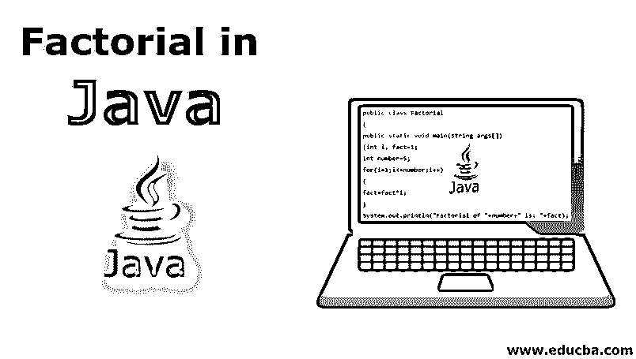
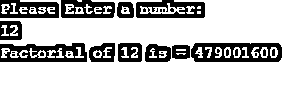

# Java 中的阶乘

> 原文：<https://www.educba.com/factorial-in-java/>




## Java 中的阶乘简介

在本文中，我们将学习用 Java 编程语言编写用于阶乘计算的代码的各种方法。作为一种易于使用的面向对象语言，Java 是一种平台无关的简单编程语言。Java 的编译器和解释器是以安全性为主要方面开发的。Java 有各种各样的应用。

阶乘，符号化为“！”(感叹号)，是将一个数与所有较小的数相乘的数学运算。例如，如果数字是 5，阶乘的输出将是 5！= 5*4*3*2*1 = 120.

<small>网页开发、编程语言、软件测试&其他</small>

### 如何执行一个 Java 程序？

1.完成您的代码，并将其另存为(文件名)。Java 语言（一种计算机语言，尤用于创建网站）

2.打开终端并运行以下 java 命令。

*   形容词（adjective 的缩写）javac(文件名)。Java 语言（一种计算机语言，尤用于创建网站）

3.上述命令将生成一个类文件。

4.现在，执行类文件。

*   形容词（adjective 的缩写）java(文件名)

### 使用各种方法的阶乘示例

以下是使用不同方法的不同示例:

#### 示例 1–使用基本方法

接下来，我们将为阶乘计算编写一个简单的 Java 程序。

```
public class Factorial
{
public static void main(String args[])
{int i, fact=1;
int number=5;
for(i=1;i<=number;i++)
{
fact=fact*i;
}
System.out.println("Factorial of "+number+" is: "+fact);
}
}
```

用任意文件名保存上面的代码。java 扩展。

**代码解释:**

它以两个变量开始，“I”和“fact”，值为 1，然后是“number”，值为 5，这是我们用来计算阶乘的数字。我进入 For 循环，不断增加 I 的值，直到匹配到一个数字，即 5。递增时，每次事实值增加时，它都会被相乘，并被赋予一个新值。

**输出**:


#### 示例 2–使用用户输入

另一种常用的方法是，我们要求[提供一个用户输入的](https://www.educba.com/java-user-input/)数来进行计算，而不是预先定义。

关于基于用户输入的计算，请参考以下代码:

```
import java.util.Scanner;
class Facto{
public static void main(String args[]) {
int q, a, fact = 1;
System.out.println("Please Enter a number:");
Scanner in = new Scanner(System.in);
q = in.nextInt();
if ( q < 0 )
System.out.println("Please enter a number greater than 0:");
else {
for ( a = 1 ; a <= q ; a++ )
fact = fact*a;
System.out.println("Factorial of "+q+" is = "+fact);
}
}
}
```

像我们对前面的例子所做的那样保存上面的代码。

**代码解释:**

前面的例子和上面的例子的主要区别是用户输入；休息也一样。代码将要求计算一个数字，然后如果用户输入的数字是负数，即“-”号，它将提示“请输入一个大于 0 的数字:”这是显而易见的，因为负数不能计算阶乘。现在，它将接受一个正数并继续计算阶乘，然后打印输出，如下图所示。

**输出**:




#### 示例 3–使用递归方法

递归是编程世界中最有用的工具之一。递归基本上意味着重用函数。也就是说，我们不需要定义额外的变量，这意味着我们只有两个或者更少的变量。

实现递归的一个主要原因是减少代码长度和优雅地降低程序的时间复杂度。递归方法有其优点，但也有一些缺点，从长远来看，这些缺点可能会产生重大影响。

##### 不足之处

递归的缺点:

*   基本上，调试递归代码并跟踪任何出错的步骤是相当困难的。
*   除此之外，递归使用更多的内存，因为它使用堆栈来完成任务，并不断用新的递归调用增加堆栈。
*   而且，如果没有明智地实现，递归会降低函数的速度。
*   StackOverflowException:递归方法经常会因为过度使用 stack 而抛出这个异常。

请参考以下代码:

```
public class FactorialExample2 {
static int factorial(int n){
if (n == 1)
return 1;
else
return(n * factorial(n-1));
}
public static void main(String[] args) {
System.out.println("Factorial of 5 is: "+factorial(5));
}
}
```

像我们之前做的那样保存并编译程序。

**代码解释:**

上面的代码从单个 int 变量开始，检查它是否等于 1；如果是，它返回 1，因为 1 的阶乘是 1。如果不等于 1，它继续执行递归函数。例如，我们的 int 值是 5，所以它会像“5 * factorial(5-1)”一样，factorial 在这里被第二次调用，这是另一个调用。然后它再次返回一个较新的 int 值，即 4，“4 * factorial(4-1)”，现在这将是对递归方法的第三次调用。现在，新的 int 值是 3，这意味着“3 * factorial(3-1)”，现在将是第四次调用，值将是 2，这意味着“2 * factorial(2-1)”。在下一次递归调用中，int 值将为 1，这将在此处终止函数。每次调用时，其值都保存在堆栈中，这是一种 LIFO 方法。因此，对于最终输出，结果将是“5*4*3*2*1 = 120”

与其他方法相比，递归很难理解和实现，但是如果理解和实现得当，它是一个很好的工具。

**输出**:


强烈建议只在编写迭代代码非常复杂的情况下使用递归。

既然我们已经学习了在 Java 中实现阶乘计算的各种方法[，让我们探索一个内置函数，它在一行代码中完成同样的工作。](https://www.educba.com/factorial-program-in-javascript/)

#### 示例 4–使用内置函数

***) IntMath**

理解了对一个值进行算术运算的需要，编写了一些特定于某些值类型的函数，我们将看到整型值的工作。

IntMath 是一个对整数值进行算术计算的类。IntMath 类提供了一系列的算术运算，包括阶乘。

**语法**:

```
factorial (int n)
```

### 结论–Java 中的阶乘

我们从介绍 java 和如何运行 java 程序开始。然后我们学习了阶乘计算和各种方法，包括递归，来完成它。

快结束时，我们学习了 IntMath 一个主要关注算术运算的 Java 函数。Java 是一种广泛使用的编程语言；它有许多特点；在本文中，我们学习了 Java 中的阶乘计算，这是一个很小的方面。

### 推荐文章

这是 Java 中阶乘的指南。这里我们讨论如何执行 java 程序及其方法。你也可以看看下面的文章来了解更多-

1.  [Java 中的线程生命周期](https://www.educba.com/thread-life-cycle-in-java/)
2.  [Java 中的变量](https://www.educba.com/variables-in-java/)
3.  [Java 注释](https://www.educba.com/java-annotations/)
4.  [c#中的阶乘](https://www.educba.com/factorial-in-c-sharp/)


