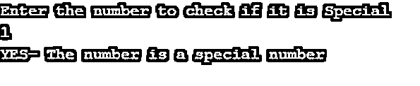
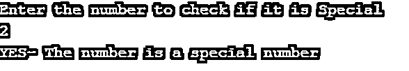
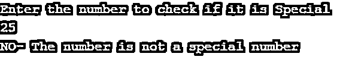
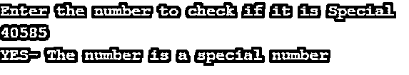
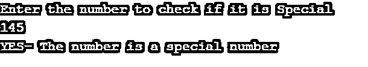

# Java 中的特殊数字

> 原文：<https://www.educba.com/special-number-in-java/>


## Java 中的特殊数字介绍

Java 中的特殊数字是那些数字的阶乘之和等于数字本身的数字。它可以是一个 N 位数。程序首先要把数字分解成相应的位数，并计算它们的阶乘。一旦完成，就应该加上各个计算阶乘的总和。如果总和与原始数字匹配，则该数字被称为特殊数字。当程序运行时，使用模数概念和 Math.fact()计算数字及其阶乘，math . fact()计算每个数字的阶乘。在这篇文章中，我们将检查到 4 位数的数字是不是特殊数字。

从数学上来说，我们必须展示一个数的各个数字的阶乘之和是如何与原始数相匹配的。数字的一个例子是 145。

<small>网页开发、编程语言、软件测试&其他</small>

145= 1! +4! +5!

在这篇文章中，我们还将看到他们的工作和其他这样的特殊数字，可以是 2 或 3 位数。Java 有许多平台可以运行这个程序。在本文中，我们将检查程序在 BlueJ 平台上的工作情况。有四个我们已知的特殊数字。1，2，145 和 40585。

### Java 中特殊数字的例子

在这个程序中，我们将输入一个数字，并检查这个数字是否特殊。我们间接地检查数字的阶乘和是否等于原始数字。

#### 示例#1

**代码:**

```
//Java program to check if a number
// is a special number
import java.util.*;
import java.io.*;
class Special
{
// function to calculate the factorial
// of any number  using while loop
static int factorial(int n)
{
int fact = 1;
while (n != 0) {
fact = fact * n;
n--;
}
return fact;
}
// function to Check if number is Special
static boolean isSpecial(int n)
{
int sum = 0;
int t = n;
while (t != 0) {
// calculate factorial of last digit
// of temp and add it to sum
sum += factorial(t % 10);
// replace value of t by t/10
t = t / 10;
}
// Check if number is  Special
return (sum == n);
}
// Driver code
public static void main(String[] args)throws IOException
{
BufferedReader br= new BufferedReader(new InputStreamReader(System.in));
System.out.println("Enter the number to check if it is Special");
int n = Integer.parseInt(br.readLine());
if (isSpecial(n))
System.out.println("YES- The number is a special number");
else
System.out.println("NO- The number is not a special number");
}
}
```

现在，我们将检查数字 145 和另一个数字 40585。使用这段代码，我们将检查数字 145、1 和 2。在另一个程序中，我们将看到数字 40585，并对可以安装在程序中的循环使用不同的方法。现在我们将看到上面显示的程序的不同输出。输出是为数字 1、2、25 和 145 产生的。

**输出:**










#### 实施例 2

在这个编码示例中，我们将看到如何使用 for- loop 来完成程序。前面的程序使用 while 循环来计算数字的阶乘。我们将在下面的代码示例中看到如何使用 for 循环计算阶乘。

**代码:**

```
//Java program to check if a number
// is a special number
import java.util.*;
import java.io.*;
class Special
{
// function to calculate the factorial
// of any number using for loop
static int factorial(int n)
{
int fact = 1;
for (int i=1;i<=n;i++)
{
fact = fact * i;
;
}
return fact;
}
// function to Check if number is Special
static boolean isSpecial(int n)
{
int sum = 0;
int t = n;
while (t != 0) {
// calculate factorial of last digit
// of temp and add it to sum
sum += factorial(t % 10);
// replace value of t by t/10
t = t / 10;
}
// Check if number is  Special
return (sum == n);
}
// Driver code
public static void main(String[] args)throws IOException
{
BufferedReader br= new BufferedReader(new InputStreamReader(System.in));
System.out.println("Enter the number to check if it is Special");
int n = Integer.parseInt(br.readLine());
if (isSpecial(n))
System.out.println("YES- The number is a special number");
else
System.out.println("NO- The number is not a special number");
}
}
```

在这个数 145 和 40585 中，两个特殊数都满足成为一的先决条件。因此，我们发现这些数字都是输出中显示的特殊数字。

**输出:**







文章中的代码非常有用，在 BlueJ 平台上，人们可以很容易地使用它们来查看打印的语句。由于阶乘概念的出现，我们可以有一个与数字阶乘相关的概念。其中 N>5 的前 N 项的阶乘和的最后一位数字总是 3，因为在那之后的最后一位数字总是 0。此外，每当我们考虑数字的阶乘时，它们通常不用于小数或分数的情况。因此，在阶乘程序中，我们只能使用正整数来表示我们的数字。如果一个分数进入程序，那么程序将终止。我们也可以通过计算来计算某个大阶乘中 10 的个数。我们将在另一篇文章中看到这一点。

### 结论

在这篇文章中，我们主要看到了四个数:特殊数或一般的 Krishnamurthy 数。因此，我们看到了数字的基本结构和行为与阶乘的关系。我们检查数字 1、2、4 和 40585 是具有相同特征的特殊数字。

### 推荐文章

这是一个 Java 中特殊数字的指南。这里我们讨论一个特殊数字的引入，以及不同的例子和它的代码实现。您也可以看看以下文章，了解更多信息–

1.  [Java 中的快乐数字](https://www.educba.com/happy-numbers-in-java/)
2.  Java 中的[接口](https://www.educba.com/interface-in-java/)
3.  [Java 中的强数字](https://www.educba.com/strong-number-in-java/)
4.  [Java 中的质数](https://www.educba.com/prime-numbers-in-java/)


