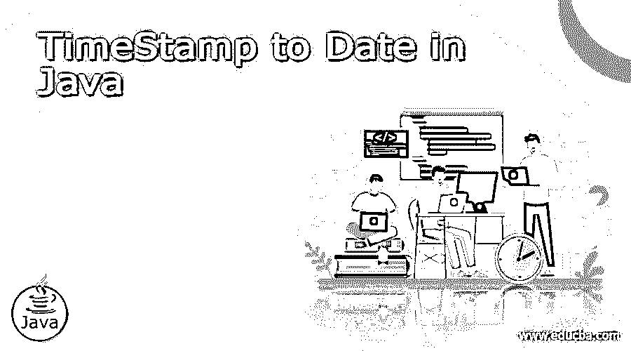
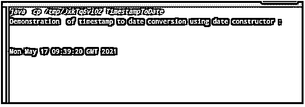
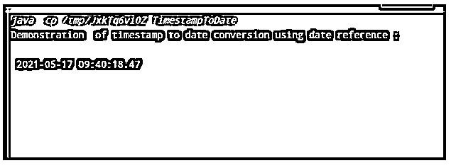
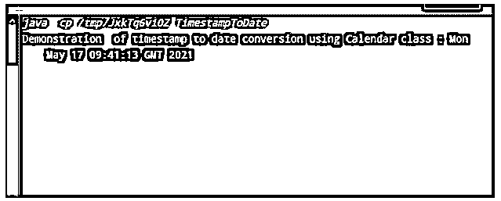

# Java 中迄今为止的时间戳

> 原文：<https://www.educba.com/timestamp-to-date-in-java/>




## Java 中的时间戳简介

在 java 中，时间戳被定义为每当任何事件发生时提供格式化或编码数据的序列，例如显示日期和时间，其中该时间戳类可以使用 Java.util 库转换为 Java 中的 date 类，在 Java 中处理时间戳时需要导入该库。通常，使用 Java.util 类的 date 类将时间戳转换为日期，用于显示包含日期和时间值的 SQL 时间戳，并且有多种方法将时间戳转换为日期，其中可以通过使用属于 java.util 库的 java.util.Date 来获得该时间戳。

### Java 中时间戳的语法

在 java 中有 3 种不同的方法将时间戳转换成日期。让我们分别看看这些不同方法的语法。

<small>网页开发、编程语言、软件测试&其他</small>

*   **使用构造函数:**将时间戳转换为日期的一种方法是使用 java.util.Date 类的构造函数。让我们看看这个构造函数的语法:

```
Date ( long l)
```

*   **使用日期引用:**其中有时间戳类，它扩展了日期类，其中时间戳类的实例被分配给日期。因此，该描述的语法如下所示:

```
Timestamp t = new Timestamp();
Date d = t;
```

*   使用 calendar 类:从 Calendar 类中的时间戳中获取日期也将提供日期。因此，这可以在语法中表示为:

```
Timestamp t = new Timestamp();
Calendar c = Calendar.getInstance();
Calendar.getTime();
```

### Java 中如何把时间戳转换成日期？

在 java 中，时间戳被定义为使用时间戳类显示的时间和日期格式，这是使用 java.util 类使用日期和日历类完成的，而 java.sql 包使用 java 中的时间戳类在 Java 程序中实现时间戳。时间戳到日期的转换将导致以毫秒显示日期和时间，这通常是人类可读的格式。因此，时间戳到日期转换的确切工作是使用 3 种不同的方式完成的，并且是通过使用 java.util 或 java.sql 包的时间戳类完成的。

#### 1.使用构造函数

在 Java 中，java.util 包提供了 java.util.Date 类，我们将使用该类的构造函数将时间戳转换为日期。这种转换方法的工作原理是，首先从 Date 类构造函数获取长值作为参数，然后生成时间戳对象，该对象将使用 getTime()方法转换长值

##### 例子

```
import java.sql.Timestamp;
import java.util.Date;
public class TimestampToDate
{
public static void main(String args[])
{
Timestamp t = new Timestamp(System.currentTimeMillis());
Date d = new Date(t.getTime());
System.out.println(" Demonstration  of timestamp to date conversion using date constructor : ");
System.out.println(" \n ");
System.out.println( d );
}
}
```

**输出:**




在上面的示例中，我们可以看到，我们首先导入了 java.sql、时间戳包和 java.util.Date 包。为了使用日期构造函数，我们需要 Date 类，为了使用时间戳，我们使用时间戳类。因此，首先我们定义并声明一个属于 Timestamp 类的变量“t ”,我们使用“new”来定义它，并传递 currentTimeMills()函数来显示时间戳，该时间戳随后被转换为日期。然后，我们声明日期类“d”的日期变量，它是使用“new”定义的，在这里，我们传递 getTime()函数来将上面的时间戳转换为日期格式。然后使用 println，我们将显示从获得的时间戳转换的日期。上述程序的输出如上图截图所示。

#### 2.使用日期参考

这是在 Java 中将时间戳转换为日期的另一种方法，再次使用 java.util.date 包的 date 类。在这个方法中，它只是扩展了 date 类，在这个类中，时间戳实例被直接分配给 date，因此 date 对象以时间戳中较早的日期格式输出。让我们看看下面的例子，用 java 演示这种方法:

##### 例子

```
import java.sql.Timestamp;
import java.util.Date;
public class TimestampToDate
{
public static void main(String args[])
{
Timestamp t = new Timestamp(System.currentTimeMillis());
Date d = t;
System.out.println(" Demonstration  of timestamp to date conversion using date reference : ");
System.out.println(" \n ");
System.out.println( d );
}
}
```

**输出:**




在上面的例子中，我们可以看到它与前面的例子相似，但上面的程序和这个程序的唯一区别是，它没有在这里定义 date 类，而是将时间戳实例“t”直接分配给日期对象“d”，这里我们没有使用 getTime()函数，因为我们直接将日期对象分配给时间戳实例，因此这里的输出看起来与时间戳相似，但它是日期格式，时间也包括毫秒。这一点从上面的截图就可以看出来。

#### 3.使用日历类

另一种在 java 中将时间戳转换为日期的方法是使用 calendar 类，这种方法很少被开发人员使用。我们可以通过 java.util.Calendar 包获得 Calendar 类，其中我们使用这个 calendar 类，同时我们必须使用 getInstance()函数来获得时间戳实例，使用 getTime()来获得日期和时间，这将从时间戳转换而来。让我们看下面一个例子:

##### 例子

```
import java.sql.Timestamp;
import java.util.Date;
import java.util.Calendar;
public class TimestampToDate
{
public static void main(String args[])
{
Timestamp t = new Timestamp(System.currentTimeMillis());
Calendar calendar = Calendar.getInstance();
calendar.setTimeInMillis(t.getTime());
System.out.println(" Demonstration  of timestamp to date conversion using Calendar class : ");
System.out.println(" \n ");
System.out.println(calendar.getTime());
}
}
```

**输出:**




在上面的例子中，我们可以看到我们也从 java.util.Calendar 包中导入了 Calendar 类，这个例子类似于我们使用 date 类的第一个例子。在本例中，我们通过使用 getInstance()函数定义了 calendar 实例，该函数稍后将采用时间戳格式。通过使用 getTime()，时间戳实例被转换为 date 对象，其结果如上面屏幕截图中的输出所示。

### 结论

在本文中，我们得出结论，java 中的时间戳到日期的转换非常简单。在 Java 中，有一个 java.util 包，它提供了不同的类，用不同的类以不同的方式支持这种转换。这取决于用户根据用户的要求使用哪种方法，以及根据需要准确显示结果的时间精度。

### 推荐文章

这是一个到目前为止 Java 中时间戳的指南。在这里，我们还讨论了 java 中的介绍以及如何将时间戳转换为日期，并给出了一些例子。您也可以看看以下文章，了解更多信息–

1.  [JavaFX 度](https://www.educba.com/javafx-gradle/)
2.  [Java 中的桶排序](https://www.educba.com/bucket-sort-in-java/)
3.  [Java 中的 Shell 排序](https://www.educba.com/shell-sort-in-java/)
4.  [在 Java 中排序字符串数组](https://www.educba.com/sort-string-array-in-java/)


