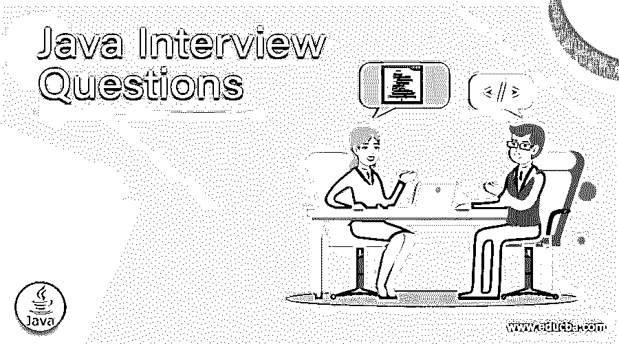
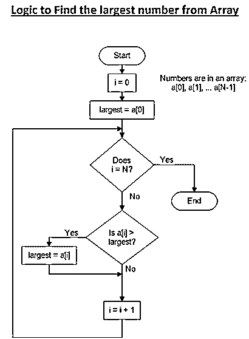

# Java 面试问题

> 原文：<https://www.educba.com/java-interview-questions/>

## 面向新生申请人的 Java 面试问题介绍

如果你想找一份与 Java 相关的工作，那么你需要为大一新生准备 [Java 面试问题](https://www.educba.com/java-interview-question-on-multithreading/)。虽然每个面试都是不同的，工作范围也是不同的，但我们可以帮助你解决 Java 面试中的常见问题和答案，这将帮助你迈出这一步，并在 Java 面试中取得成功。

### 第 1 部分——Java 面试问题(基础)

这第一部分包括基本的面试问题和答案。

<small>网页开发、编程语言、软件测试&其他</small>

#### 1.Java 中字符串缓冲区和字符串生成器的区别

**答案:**
这是面试官最喜欢问的问题之一；然而，经常被候选人悲惨地回答。

为了更好地理解，这里列出了字符串缓冲区和字符串生成器之间的一些显著差异。

1.StringBuilder 是 StringBuffer 类的非同步版本。StringBuilder
中的方法，例如 append()方法的所有重载版本都不同步。
2。StringBuilder 比 StringBuffer 工作得更快，因为没有与同步方法相关的获取和释放锁的开销。
3。StringBuffer 被认为是线程安全的，而 StringBuilder 不是，因为如果需要这样的同步，最好使用 StringBuffer 类。StringBuilder 类实例不能在多个线程之间共享
4。StringBuffer 是旧类；它从第一次发布就在 JDK 合并，而 StringBuilder 是一个相对较新的类
5。关于 StringBuffer 和 StringBuilder 最重要的事实是，当使用+操作符完成字符串连接时，Java 在内部将调用转换为相应的 StringBuilder append()方法类。例如“一”+“二”+“三”将被转换为新的 StringBuilder()。追加(“一”)。追加(“两个”)。追加(“三”)。

#### 2.Java 程序，寻找一个整数数组中最大和最小的数

**答案:**
一个简单的 5 指针来回答这个问题

*   创建一个名为 MaximumMinimumArrayDemo.java 的 Java 源文件，并复制代码以在您喜欢的 IDE 中编译和执行
*   创建一个名为 maximum and small(int[]numbers)的方法来打印传递给程序的 int 数组的最大和最小数目。
*   使用两个变量 maximum 和 minimum 来存储数组中的最大值和最小值。最初，最大值用一个整数初始化。MIN_VALUE 和 minimum 用整数初始化。MAX_VALUE。
*   对于循环的所有迭代，从最大到最小比较当前数，并相应地更新它们。
*   如果一个数大于最大的，就不能小于最小的，也就是说不需要检查第一个条件是否成立；这就是为什么我们使用了 if-else 代码块，其中 else 部分仅在第一个条件不为真时执行。

下面给出了在 Java 中从数组中寻找最大元素的逻辑。

而不是用整数给变量赋值。MAX_VALUE，我们已经指定了数组中的第一个元素。

#### 3.C++ & Java 有什么区别？

**答案:**
C++和 Java 只是在句法比较上相似。差异如下:

*   Java 是多线程的
*   Java 没有指针
*   Java 有自动内存管理(垃圾收集)
*   Java 是独立于平台的
*   Java 内置了对注释文档的支持
*   Java 没有运算符重载

Java 不提供多重继承

*   Java 中没有[析构函数](https://www.educba.com/destructor-in-java/)

### 第 2 部分——Java 面试问题(高级)

现在让我们来看看高级面试问题。

#### 4.抽象类和接口的区别？

**答案:**

*   **多重继承:**一个抽象类只能继承一个抽象类；但是，一个类可以在接口中实现几个接口。这证明接口支持多重继承，而抽象类不支持。
*   **实现:**抽象类可以提供默认代码，因为它包含不完整和完整的成员，而接口不能提供任何代码，因为它包含不完整的成员。
*   **字段:**我们可以在抽象类中定义字段和约束，而在接口中不能定义字段。
*   **速度:**与接口相比，抽象类更快，因为后者需要更多的时间来找到对应类的方法。
*   **用法:**当我们想要在父子关系中共享公共功能时，抽象类就出现了，而接口则用于定义和实施多态、解耦和标准化

#### 5.Java 中 private、protected、public 和包修饰符或关键字的区别

**答案:**
Java 中私有 vs 公有 vs 受保护 vs 包

[Java 有四个访问修饰符](https://www.educba.com/access-modifiers-in-java/)，即；私有、受保护、[、公共](https://www.educba.com/public-vs-private-accounting/)和包级别

如果没有识别访问修饰符，包级访问被认为是 Java 提供的默认访问级别

这些访问修饰符的作用是限制它所应用的类、方法或变量的可访问性

下面描述了每个访问修饰符的功能以及它们之间的不同之处

**Java 中的私有关键字**

*   java 中的 private 修饰符可以应用于 Java 中的成员字段、方法或者[嵌套类。](https://www.educba.com/nested-class-in-java/)
*   不能在顶级类上使用 private 修饰符。
*   私有变量、方法和类只能在声明它们的类上访问。
*   私有 Java API 提供的最高形式的封装，应该尽可能地使用。

默认情况下，将变量声明为 private 是 Java 中的最佳编码实践。私有方法只能从声明它的类中调用

**Java 中的包或默认访问级别**

*   package 是一个关键字，用于在 Java 中声明一个包；包是 Java 中的类所属的目录。
*   Package 或 default 访问级别是仅次于 private 的第二高限制性访问修饰符，任何声明为 package-private 的变量、方法或类都只能在它所属的包上访问。

默认修饰符的好处是，如果没有类级别的访问修饰符，顶级类也可以是包私有的。

**Java 中受保护的关键字**

private 和 [protected 关键字](https://www.educba.com/protected-keyword-in-java/)的区别在于，protected 方法、变量或嵌套类可以在类内部、包内部以及包外部的子类中访问。
如果你声明了一个变量 protected means，任何人只要扩展了你的类就可以使用它。顶级类也不能被保护。

**Java 中的公共关键字**

public 是 [Java 编程语言](https://www.educba.com/java-programming-language-features/)中限制最少的访问修饰符，默认声明字段、方法或类为 public 是不好的做法，因为一旦你将其公开，就很难对类的内部结构进行任何更改，因为这会影响使用它的所有客户端。

将类或实例变量公共化也违背了封装原则，一点都不好，对维护影响也很坏。

### 推荐文章

这是一个 Java 面试问题和答案的列表指南，以便候选人可以轻松地解决这些 Java 面试问题。您也可以阅读以下文章，了解更多信息——

1.  [Java 开发者面试问题](https://www.educba.com/java-developer-interview-questions/)
2.  [Java 多线程面试问题](https://www.educba.com/java-multi-threading-interview-questions/)
3.  [J2EE 面试问题](https://www.educba.com/j2ee-interview-questions/)
4.  [Java 字符串面试问题](https://www.educba.com/java-string-interview-question/)

