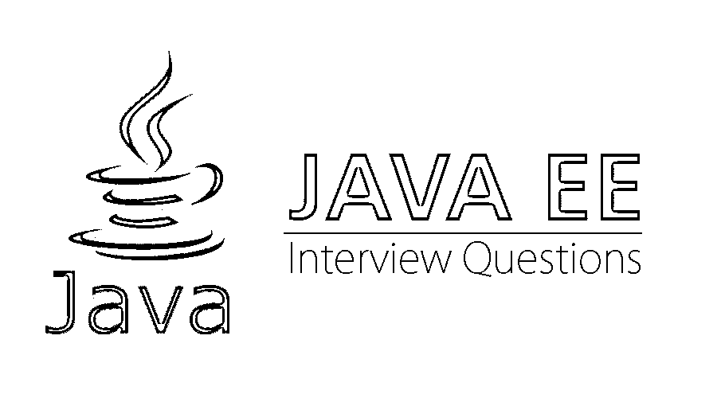

# Java EE 面试问题

> 原文：<https://www.educba.com/java-ee-interview-questions/>

## Java EE 面试问答介绍

Java 企业版是开发基于企业软件的应用程序的标准。Sun Microsystems 和 IBM 最初计划让 Java EE 在瘦客户机分层环境中进行更简单的应用程序开发。Java EE 通过生成同步的、可重用的组件来减少编程需求，同时允许该层自动处理编程的许多方面。

虽然 Java EE 应用托管在服务器端，但 Java EE 客户端的常见例子有 I device、[标准的基于 web 的应用](https://www.educba.com/web-services-interview-questions/)、智能手机、RESTful web 服务、WebSocket 甚至运行在 [Docker 容器](https://www.educba.com/docker-vs-vms/)中的微服务。

<small>网页开发、编程语言、软件测试&其他</small>

**API 规格:**

*   [Java API](https://javaee.github.io/javaee-spec/javadocs/)
*   [JSF Facelets 标签库](https://javaee.github.io/glassfish/doc/5.0/vdldoc/)
*   [JSF JSP 标签库](https://javaee.github.io/glassfish/doc/5.0/vdldocs/jsp/)
*   [标准 HTML 渲染套件](https://javaee.github.io/glassfish/doc/5.0/renderkitdocs/)
*   [JSF JavaScript 文档](https://javaee.github.io/glassfish/doc/5.0/jsdocs/index.html)

所以如果你找的是和 Java EE 相关的工作，你需要准备 2022 年的 Java EE 面试题。虽然每个 Java EE 面试都是不同的，工作范围也是不同的，但我们可以帮助你解决 Java EE 面试中的常见问题和答案，这将帮助你在面试中取得成功。

下面是 2022 年 Java EE 面试中面试时被问到最多的问题；这些问题分为两部分:

### 第 1 部分–Java EE 面试问题(基础)

第一部分涵盖了基本的 Java EE 面试问题和答案

#### Q1)相比 J2EE 对 Java EE 的改进？

**答:**
Java EE 使用约定代替配置，也用注释替换 XML 文件。组件被定义为 POJO。此外，为了简化[，引入了 EJB 的依赖注入](https://www.educba.com/ejb-interview-questions/)，这也赋予了 POJO 企业特性。持久层完全被 Java 持久性 API 所取代。这是面试中最常见的 Java EE 面试问题。

#### Q2)核心 Java，Java EE，Java ME 的区别？

**答:**
**Java SE(核心 Java):** [Java SE 用于](https://www.educba.com/what-is-java-se/)开发一个独立的应用，只在系统中运行的系统软件。在 Java SE 中，你可以学到 Java 的基础知识，比如继承、多态、字符串等。

**Java EE(高级 Java):** Java EE 用于开发 [Web 应用](https://www.educba.com/how-to-build-web-applications-using-mongodb/)，在 Web 浏览器的辅助下运行。在 Java EE 中，您可以了解高级主题，如 Servlet、[、Java Server Pages(JSP)](https://www.educba.com/jsp-vs-php/) 、Enterprise Java Beans(EJB)等。

**Java ME(用 Java 进行移动开发):**手机上运行的应用程序是用 Java ME 设计的。

#### Q3)Java 企业版的主要特性？

**答案:**

*   **可用性:**[Java EE](https://www.educba.com/java-ee-interview-questions/)系统可以在任何给定的时间点启动并准备就绪。有些时候，用户的要求可能过高。如果一个系统无法承受给定的负载，系统将会停机，公司的业务绩效几乎不会受到影响。应该支持 24×7 服务；因此，企业系统的可用性至关重要。
*   **可扩展性:**处理和运营业务的方式正在发生变化。企业系统必须具有灵活的结构设计，能够应对组织中经常发生的快速变化。这些系统是高度可扩展的，以适应组织中发生的新变化。
*   **性能:**为了改善业务工作流程、数据控制，以及客户响应能力、客户管理，所有组织和企业通常会进行大量投资；企业系统中的支出增加，并最终成为总业务成本的重要部分。
*   安全性:安全性是企业系统中最重要的需求之一。系统必须得到保护，以确保系统的持续可用性和数据保密性。
*   **可管理性:**很大一部分企业系统不成功是因为它们的复杂性提高了，这导致了系统不容易控制和管理的说法。在这种情况下，企业系统管理(ESM)专家包括监督系统和 concert 的运行，以跟踪问题的根源，然后确定并修复基础层的问题。
*   **数据完整性:**企业系统的主要设计考虑之一是数据完整性。数据完整性意味着系统中的数据不应丢失或损坏。
*   **互操作性:**互操作性是企业系统(或任何通用 IT 系统)使用另一个系统的信息和功能的能力。描述两个系统之间的数据交换。

让我们转到下一个 Java EE 面试问题和答案

#### Q4)Java EE 的核心技术？

**答:**
大约有 30 个 Java APIs 被列为 Java EE 核心技术，随着 Java EE 8 的最终发布，这个数字将接近 50 个。这些 Java EE 核心技术属于下面列出的文件类别:

*   **HTTP 客户端技术**:对于基于 HTTP 的客户端，包含了用于 Java EE 的 Web [套接字编程](https://www.educba.com/socket-programming-in-python/)、 [JSF](https://www.educba.com/jsf-interview-questions/) 和 Servlet APIs、用于 [JSON](https://www.educba.com/json-interview-questions/) 处理的 API 和 JSP 标准标签库(JSTL)。
*   **资源和数据库访问技术:**对于外部和后端系统交互，Java EE 包括 JavaMail，一个 Java 消息服务(JMS)API，一个标准的连接器架构和一个用于执行两阶段提交的 Java 事务 API (JTA)。
*   REST 和 web 服务技术:为了帮助开发和部署基于 REST、SOAP、XML 和 JSON 的 web 服务，包含了用于 RESTful Web 服务的 Java API([JAX-RS](https://www.educba.com/jax-rs/))和基于 XML 的 Web 服务(JAX-WS)，以及用于 XML 消息传递和 XML 注册中心(JAXR)的 API。
*   **Java EE 安全和容器管理:**Java EE 容器的安全和管理的实现，Java 授权契约可供开发者访问，Java 认证服务提供者接口供容器使用。

#### Q5)列出 Java EE 应用的组件？

**答案:**

*   **客户端层组件:**在客户端机器上执行。
*   **Web 层组件:**驻留在 Java EE 服务器上并在其上执行。
*   **业务层组件:**运行在 Java EE 服务器上。
*   **企业信息系统软件(EIS 软件):**运行在 EIS 服务器上。

### 第 2 部分–Java EE 面试问题(高级)

现在让我们来看看高级 Java EE 面试问题。

#### Q6)什么是 Java EE 客户端类型？

**答案:**

*   小应用程序
*   应用程序客户端
*   通过 Java Web Start 技术启用客户端。
*   基于移动信息设备配置文件(MIDP)技术的无线客户端。

#### Q7)您考虑导入和导出 XML 内容的策略吗？

**答案:**

按照模式，JAXB 用于将对象序列化和反序列化为 XML。在没有模式的情况下，会出现两种情况。

*   考虑 XML 内容:SAX 用于推荐对整个文档进行串行访问，或者使用 DOM 进行随机访问。
*   如果只考虑 XML 内容的一部分，那么可以使用[XPath](https://www.educba.com/what-is-xpath/)，或者在文档中建立了每个所需部分之后必须立即执行操作的情况下使用 StAX。

让我们转到下一个 Java EE 面试问题和答案

#### Q8)您能列出关系模型和对象模型之间的一些区别吗？

**答案:**

可以在对象模型和关系模型之间建立关系。然而，其中存在几个差异

| **关系模型** | **对象模型** |
| 外键与目标主键具有相同的类型 | 它们将点归属于整个相关对象 |
| 需要一个中间实体来生成 N-N 关系 | 这里可以很容易地产生 N-N 关系 |
| 不支持继承、接口和多态。 | 支持继承、接口、多态 |

#### Q9)举例说明无状态会话 Bean、状态完整会话 Bean 和单独会话 Bean 的用法？

**答案:**

*   无状态会话 Beans:当不需要在业务事务之间保存对象的状态时，使用无状态会话 bean。所有事务都拥有自己的实例，组件的实例可以从对象池中检索。对大型案件不是强制性的；为了保持数据库的一致性，相当多的操作是在事务内部执行的。
*   **状态完整会话 Beans:**当需要在业务事务之间保存对象的状态时，使用这些 bean。组件的每个实例都有自己的对象。不同的事务定制这些对象，它们在达到预定义的不活动时间后剩余。它们允许集中缓存数据，例如用于分页和引用数据的长记录集，以减少数据库的 IO 操作量。
*   **单例会话 bean:** 存在于应用程序的生命周期中，每个应用程序实例化一次。例如，这种类型的组件可用于在应用程序启动时对其进行初始化，并在应用程序间共享特定的对象。

#### Q10)什么是 Spring 框架，并讨论它的好处？

**答案:**

为了降低企业应用程序的整体复杂性，使用了开源的 Spring 框架。这是 Java EE 面试中问得最多的面试问题。任何 spring 框架的主要好处包括

*   可以更有效地管理中间层对象。
*   属性可以快速初始化。
*   注入依赖使得应用程序测试变得更加容易。
*   容器是轻量级的，组件定义清晰。

### 推荐文章

这是 Java EE 面试问题和答案列表的指南。这里我们列出了 10 个最佳面试问题，这样求职者就可以轻松地通过面试。您也可以阅读以下文章，了解更多信息——

1.  [哎呀，Java 面试问题](https://www.educba.com/oops-java-interview-questions/)
2.  [Javascript 面试问题](https://www.educba.com/javascript-interview-questions/)
3.  [JS 面试问题](https://www.educba.com/js-interview-questions/)
4.  [Java 测试面试问题](https://www.educba.com/java-testing-interview-questions/)

