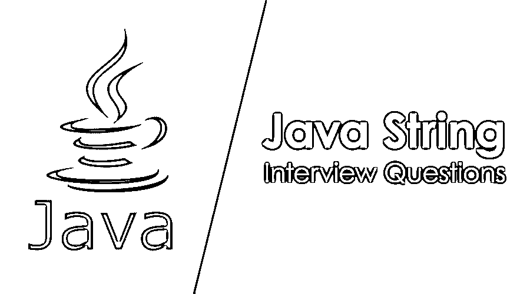

# Java 字符串面试问题

> 原文：<https://www.educba.com/java-string-interview-question/>




## Java 字符串面试问答介绍

在核心 java 中，字符串是理解基本 Java 编程起点的关键类之一。string 类在 java.lang 包中有很好的定义。它是一个[不可变的类](https://www.educba.com/immutable-class-in-java/)，所以开发者可以直接使用它，而不需要每次都创建一个实例。

如果是找 Java 字符串相关的工作，需要准备 2022 年 Java 字符串面试题。根据不同的职位描述，每次面试都是不同的。在这里，我们准备了重要的 Java 字符串面试问题和答案，将帮助您在面试中取得成功。

<small>网页开发、编程语言、软件测试&其他</small>

在本文中，我们将介绍 10 个最重要和最常见的 Java 字符串面试问题。这些问题分为以下两部分:

### 第 1 部分——Java 字符串面试问题(基础)

第一部分涵盖了基本的 Java 字符串访问问题和答案

#### Q1。详细解释 Java 编程语言中的类字符串，开发者如何使用它。我们应该将 Java 编程语言中的字符串视为一种数据类型吗？如果有，请详细说明？

**答案:**

string 是 Java 中的关键类之一，它基本上存在于 java.lang 包中。它根本不像 Java int 或 long 其他变量那样被定义为原始数据类型。它主要在一个表示中保存大量的字符串。字符串对象在 java 编程中非常流行，因为从头到尾几乎使用了所有的编码，它是 Java 核心包中定义的不可变的最终类，JVM 通常创建一个字符串池来存储所有创建的字符串对象。

#### Q2。在 Java 编程语言中，有多种方法可以创建字符串对象；详细解释创建相同的可用方法，并给出一些相关的例子和代码片段？

**答案:**

开发者可以通过几种方式在 Java 编程语言中创建一个字符串对象。方法如下:

*   **使用 new 操作符**:我们可以像创建其他对象一样使用一个简单的 New 操作符来创建一个 string 对象，但是它不会存储在 JVM 的 String 池中。
*   **使用“运算符:** String 对象只需要使用“运算符就可以创建，并在里面提供相应的值。同样的效用，JVM 认为该值存储在字符串池中并相应地返回。
*   **使用其他:**可以从字节数组、字符数组、 [StringBuilder 或 StringBuffer](https://www.educba.com/stringbuffer-vs-stringbuilder/) 中创建一个字符串对象。

```
String str = new String("abcd"); à not store in JVM String pool
String str1 = "abcd"; à store in JVM String pool
```

让我们转到下一个 Java 字符串面试问题

#### Q3。Java 语言中经常使用的一个关键字叫做“回文”。请解释一下当 java 编程中的一个 string 对象引用可以调用为'回文'时，有没有可能写一个 Java 方法来检查同样的情况？如果是，请给出一些代码片段的例子。

**答案:**

一个字符串对象可以被称为“回文”,当这个特定的字符串类的值可以相同时，它将被反转。作为一个例子，我们可以说像“cbc”，这里这个字符串值可以被认为是[回文](https://www.educba.com/palindrome-in-java/)，因为这个值的反向将总是提供相同的结果。

通常有两种流行的方法可以验证字符串中的相同内容，根据访问者的期望，我们可以依赖相同的方法:

*   StringBuilder strBuilder = new StringBuilder(" CBC ")；

strbuilder . reverse()；

*   String str1 = " abc

int lenstr 1 = str 1 . length()；
For(int j = 0；j<len str 1/2；j++){
If(str1.charAt(j)！= str 1 . charat(lenstr 1–j-1)){
返回 false
}
}

返回 true

#### Q4。假设您想从 Java 编程语言中定义的一个字符串对象中删除一些 asci 字符或提供或给定字符；如何在 Java 编程中使用一个方法来做到这一点。请用代码片段解释一下？

**答案:**

以上是面试中问到的基本 Java 字符串面试问题。我们通常用来替换整个字符串的一个关键方法是 replace All 方法。这将有助于开发人员根据项目的要求，用另一个字符串内容替换整个字符串内容。但是替代品的关键特征之一。所有的方法总是接受字符串，因为它是一个特定的参数，所以它非常需要使用一个字符类来创建字符串，并正确地用另一个期望的字符串或空字符串来替换它。请在下面的代码片段中找到一个例子。

```
public String replaceString(String str1, char c1){
Return str1.replaceAll(Character.toString(c1), "……");
}
```

#### Q5。编程语言中一个非常常见的要求是用大写字母或小写字母表示一些属性。在 Java 编程语言中，有没有为字符串对象定义特定方法来用大写或小写表示属性值？请用代码片段解释一下？

**答案:**

在任何情况下，对于字符串对象变量值来说，这都是开发人员需要的非常常见的功能之一。一个开发者可以很容易地习惯于对特定的字符串类使用大写和小写方法来获取整个字符串值。这个方法还有一个可选参数，它是一个 locale 对象。因此，有人可以使用一些特定的地区规则，使字符串值大写或小写。

```
String s = "abc";
String s1 = "ABC"
System.out.println("Upper case of S: "+s.toUpperCase()+", lower case of S1: "+s1.toLowerCase());
```

### 第 2 部分——Java 字符串面试问题(高级)

现在让我们来看看高级 Java 字符串面试问题。

#### Q6。字符串调用子序列有什么方法吗？如果是，请用正确的定义详细解释？

**答案:**

CharSequence 接口是 Java 1.4 中一个非常有用接口。string 类通常实现那个特定的接口。因此，由于上述原因，在 String 类中实现 subsequence 方法是可能的。实际上，它在内部调用了 String 的一个常用方法，称为 substring 方法。

#### Q7。Java 编程中开发人员的另一个非常常见的需求是根据开发需求比较两个对象。在 Java 编程语言中有可能比较两个字符串对象吗？如果是，请解释如何做到这一点？

**答案:**

可以通过以下方法比较两个字符串值:

*   **使用可比较的接口** : [Java String 通常实现](https://www.educba.com/java-string-operators/)可比较的接口，因此可以很容易地使用 compare To 方法来比较两个字符串值。
*   **使用 equals 或 equalsIgnoreCase 方法**:使用直接方法 equals 或 eualsIgnoreCase 可以很容易地比较字符串值。

让我们转到下一个 Java 字符串面试问题

#### Q8。有没有可能将一个字符串对象转换成 char 数据类型，或者将一个 char 数据类型转换成字符串对象？如果是，请解释如何实现？

**答案:**

charAt 方法可用于通过提供索引来获取单个字符，CharAraay 方法将一个字符串值转换为一个字符数组。

```
String str = "abc";
Char c = str.charAt(0);
String str1 = new String("This is a test String");
char[] carray= str1.toCharArray();
for(char c1: carray){
System.out.print(c1);
}
```

#### Q9。Java 编程语言中非常流行的方法之一叫做 switch case。在使用 String 对象进行 java 编程的情况下，是否可以使用 switch case 方法？如果是，请解释这怎么可能？

**答案:**

这是面试中被问到最多的 Java 字符串面试问题。切换大小写是避免在整个代码中编写大量 if-else 逻辑的常用功能之一。它总是有助于适当地维护代码质量。早期的 switch case reference only 只能用于整型或长整型值。但是从 Java 7 版本开始，Java 也允许在 String 对象上使用 switch case。所以到目前为止，字符串值可以用于 switch case 实用程序。

#### Q10:假设计划在 java 编程中执行字符串类的各种排列。请给出一些详细的编程，我们如何能够通过正确使用字符串对象做到这一点？

**答案:**
我们可以通过使用下面的代码来使用它:

```
Set<String> perm = new HashSet<String>();
char initial = str.charAt(0);
String rem = str.substring(1);
Set<String> words = permutationFinder(rem);
for (String strNew : words) {
for (int i = 0;i<=strNew.length();i++){
perm.add(charInsert(strNew, initial, i));
}
}
return perm;
```

### 推荐文章

这是 Java 字符串面试问题和答案列表的指南。这里我们列出了 10 个最佳面试问题，这样求职者就可以轻松地通过面试。您也可以阅读以下文章，了解更多信息——

1.  [UX 设计师面试问题](https://www.educba.com/ux-designer-interview-questions/)
2.  [招聘经理面试问题](https://www.educba.com/hiring-managers-interview-questions/)
3.  [质量控制面试问题](https://www.educba.com/qc-interview-questions/)
4.  [QA 面试问题](https://www.educba.com/qa-interview-question/)


