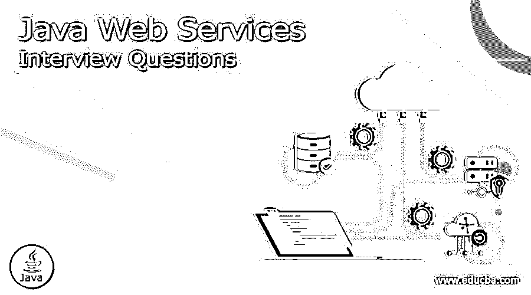

# Java Web 服务面试问题

> 原文：<https://www.educba.com/java-web-services-interview-questions-and-answers/>

## Java Web 服务简介面试问答

Java Web 服务是两个设备或 Web 服务之间的通信方法:通过万维网通信的客户机和服务器应用程序。Java web 服务包括架构、组件如 SOAP(简单对象访问协议)、WSDL (web 服务描述语言)、Web 服务安全和 RESTful web 服务等。

**下面是 Java web services 面试问答:**

<small>网页开发、编程语言、软件测试&其他</small>

所以如果你在找一份与 Java web 服务相关的工作，你需要准备 Java Web 服务面试问题。虽然每个 Java web 服务面试都是不同的，工作范围也是不同的，但我们可以帮助您解决 Java Web 服务面试中的常见问题和答案，这将帮助您迈出这一步，并在面试中取得成功。这些问题分为以下两部分:

### 第 1 部分——Java web 服务面试问题(基础)

第一部分包括基本的面试问题和答案

#### 1.提及 web 服务的主要特性？

**答案:**
下面是功能列表:

*   它可以通过互联网或专用(内部网)网络获得。
*   它被用作标准化的 XML 消息传递系统。
*   它不依赖于任何一种操作系统或编程语言。
*   支持文档交换。
*   同步或异步功能
*   支持远程过程调用(RPC)的能力

#### 2.Web 服务有哪些类型？

**答:**
主要有两种类型的 Web 服务可用。

*   SOAP web 服务。
*   RESTful web 服务。

#### 3.web 服务的组件是什么？

**答案:**
Web 服务组件有:

*   简单对象访问协议
*   **UDDI-** 通用描述、发现和集成
*   **WSDL-** Web 服务描述语言
*   **RDF-** 资源描述框架
*   **XML-** 可扩展标记语言

让我们继续下一个 Java web 服务面试问题。

#### 4.什么是 XML-RPC？XML-RPC 有什么特点？

**回答:**
XML-RPC 只不过是一个基于 XML 的协议。这是一种非常简单的协议，用于通过网络在两台设备之间交换信息。可以和 Perl，Java，Python，C 等一起使用。Dave Winer 在 1998 年创建了 XML-RPC 协议。

*   XML 响应嵌入在 HTTP 响应中。
*   XML 被认为是独立于平台的。
*   XML 有助于两个不同应用程序之间的通信。
*   XML-RPC 使用 HTTP 协议在客户机和服务器设备之间发送信息
*   RPC 是使用简单的 XML 语言执行的。

#### 5.解释 Java API for XML Messaging (JAXM)？

**答案:**

*   JAXM 是基于 SOAP 1.1 的标准，用于从 Java 平台通过互联网发送 XML 文档。
*   通过在 SOAP 之上添加协议的功能，JAXM 可以扩展到与更高级别的消息传递协议一起工作。

### 第 2 部分——Java web 服务面试问题(高级)

现在让我们来看看高级面试问题。

#### 6.什么是 JAX 包？解释一下？

**答案:**
Java API 是针对 XML pack 的；它集成了 SUN 针对不同 web 服务开发的所有编程接口。所有这些接口都是作为一个单一的下载。JAX 包是 JAXB、JAXM、JAX-RPC 和 JAXR 的捆绑包。Jax 包包括支持 SAX 和 DOM 的文档。SOAP，WSDL，XSLT，EBXML，UDDI 标准。使用 Java APIs for XML 开发 Web 服务(JAX 包)对 Sun 最近发布的 JAX 包进行了详尽的介绍。

#### 7.解释一下 Web 服务架构？

**答:**
每个应用程序或框架都需要某种架构来确保应用程序按设计运行。它是运行在不同平台和框架上的两个不同应用程序之间的操作，这两个平台和框架由称为 web 服务的不同标准支持。在这个架构中，我们可以看到 3 个不同的角色。

*   供应者
*   请求
*   经纪人

**Provider:** Provider 将创建 web 服务，并确保无论何时当客户机想要使用它时，它总是对客户机应用程序可用。
**请求者:**请求者是客户端应用；它需要联系一个 web 服务。
**Broker:** Broker 是它提供访问 UDDI 的应用程序。

让我们继续下一个 Java web 服务面试问题。

#### 8.你能解释什么是 UDDI、迪斯科和 WSDL 吗？

**答:**
**UDDI:** 通用描述发现和集成这是一个用于发布和发现公共 web 服务的目录。
**DISCO:** Disco 俗称发现。Discovery 将公共服务组合在一起，并公开 web 服务的模式文档。
**WSDL** : Web 服务描述语言。

#### 9.解释一些有助于测试 web 服务的工具？

**答案:**

*   索普伊
*   REST 客户端
*   jmeter

#### 10.什么是肥皂，并给它一些好处？

**答案:**
SOAP:简单对象访问协议。它是一种基于 XML 的协议，有助于访问 Web 服务。

*   WS 安全性
*   独立于语言
*   独立于平台

### 推荐文章

这是一个 Java Web 服务面试问题和答案的列表指南，以便候选人可以轻松地解决这些面试问题。在这篇文章中，我们研究了常见的 Java Web 服务面试问题，这些问题在面试中经常被问到。您也可以阅读以下文章，了解更多信息——

1.  [Web 服务面试问题](https://www.educba.com/web-services-interview-questions/)
2.  [Windows Server 面试问题](https://www.educba.com/windows-server-interview-questions/)
3.  [Java 面试问题](https://www.educba.com/java-interview-questions/)
4.  [Java 测试面试问题](https://www.educba.com/java-testing-interview-questions/)

