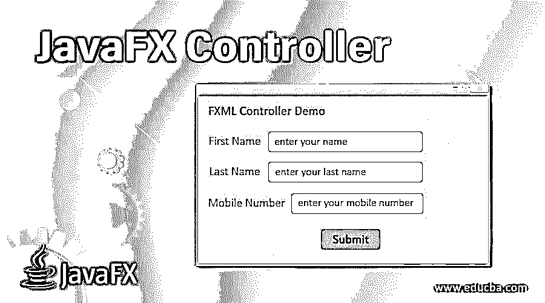
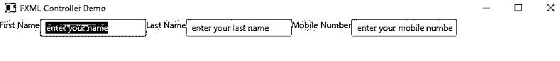
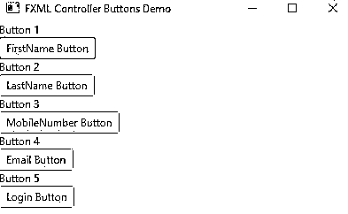
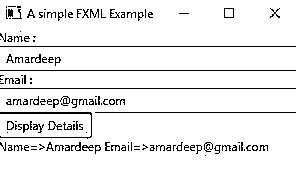

# JavaFX 控制器

> 原文：<https://www.educba.com/javafx-controller/>




## JavaFX 控制器简介

JavaFX 控制器基于 MVC(模型-视图-控制器)工作，JavaFX MVC 可以通过 FXML (EFF-ects 扩展标记语言)实现。FXML 是一种基于 XML 的语言，用于开发 JavaFX 应用程序的图形用户界面，就像 HTML 一样。FXML 可用于构建整个 GUI 应用场景或 GUI 应用场景的一部分。这种 FXML 允许开发人员将用户界面逻辑与业务逻辑分开。如果假设您的 JavaFX 应用程序中有用户[接口，那么即使我们对应用程序做了一些更改，也不需要编译应用程序。如果我们愿意，我们可以在编辑器中编辑 FXML 并重新运行应用程序。](https://www.educba.com/javafx-applications/)

****实时示例:**** 每当用户想要改变独立应用程序的特定部分时，课程部分应用程序。我们知道总是有新的课程上市，所以每次我们都可以重新编译代码。因此，在这种情况下，我们可以在控制器类中使用 FXML。

<small>网页开发、编程语言、软件测试&其他</small>

### 什么是 FXML 控制器？

这里，我们讨论 JavaFX 中的 FXML 控制器并给出解释。

**语法:**

```
<?xml version="1.0" encoding="UTF-8"?>
<?import javafx.scene.layout.HBox?>
<?import javafx.scene.control.Label?>
<HBox>
<children>
<Label text="Hello, Well Come to EDUCBA Online Course"/>
</children>
</HBox>
```

**说明:**

*   你可以观察到所有的组件都像 HTML 一样被指定
*   <hbox>创建水平分量。</hbox>
*   <children>标签指定内部组件将作为子组件添加到上面</children>
*   <label>标签作为子标签添加到 HBox。</label>
*   、导入 HBox 和标签类。

**NOTE:** You can also use plain JavaFX logic to write the controller.

**1。在 FXML 控制器中导入类**

在 FXML 控制器中，我们必须导入如下类:

**语法:**

```
<?import javafx.scene.layout.HBox?>
```

****2。在控制器**中加载 FXML 文件**

在控制器中加载 FXML 文件时，我们必须导入 javafx.fxml.FXMLLoader 包。

****语法:****

```
FXMLLoader fxmlLoader = new FXMLLoader();//creating FXMLLoader object
fxmlLoader.setLocation(new URL("path/fileName.fxml"));//accessing FXML file
```

### FXML 控制器在 JavaFX 中是如何工作的？

我们可以为 FXML 文档设置控制器类。FXML 控制器类可以将 FXML 文件中声明的[图形用户界面](https://www.educba.com/what-is-gui/)组件绑定在一起，它还使控制器对象成为一个中介。**我们可以通过两种方式为 FXML 设置控制器:**

 **#### 1.直接在 FXML 文件中指定

下面是在 FXML 文件中直接指定的语法。

****语法:****

```
<?xml version="1.0" encoding="UTF-8"?>
<?import javafx.scene.layout.HBox?>
<?import javafx.scene.control.Button?>
<HBox xmlns:fx="http://javafx.com/fxml" fx:controller="com.jenkov.javafx.ClassNameOfController" >
<Button text="Press Me"/ onAction="clickMeAction()">
</Button>
</HBox>
```

**说明:**

*   **fx:控制器用来包含控制器类。**
***   用于执行单击动作的动作属性上的按钮。**

 **#### 2.创建单独的 FXML 控制器类

下面是创建单独的 FXML 控制器类的语法，并将其包含在 FXML Loader 实例中以加载 FXML 文件。

**语法:**

```
ClassNameOfController controllerInstance = new ClassNameOfController();
FXMLLoader fxmlLoader= new FXMLLoader();
fxmlLoader.setControllercontrollerInstance(controllerInstance);
```

我们还可以在组件内部的 FXML 文件中包含 CSS 样式和 JavaScript。

**语法:**

```
<style>
-fx-property: value;//CSS
</style>
<fx:script>
//JavaScript logic
</fx:script>
```

 **### JavaFX 控制器示例

在本教程中，为了更好地理解，我们将分别创建所有的 FXML 和控制器类。

#### 示例 1–带有标签和字段的 FXML 控制器

****FXML 代码:****

fxmllabeltextfieldcontroller . fxml

```
<?import javafx.scene.layout.HBox?>
<?import javafx.scene.control.Label?>
<?import javafx.scene.control.TextField?>
<HBox>
<Label text="First Name" />
<TextField text="enter your name" />
<Label text="Last Name" />
<TextField text="enter your last name" />
<Label text="Mobile Number" />
<TextField text="enter your mobile number" />
</HBox>
```

**JavaFX 代码:**

FXMLLabelTextFieldController.java

```
package com.fxml.controller;
import java.io.FileInputStream;
import java.io.IOException;
import javafx.application.Application;
import javafx.fxml.FXMLLoader;
import javafx.scene.Scene;
import javafx.scene.layout.HBox;
import javafx.stage.Stage;
public class FXMLController extends Application {
@Override
public void start(Stage outStage) throws IOException {
// Setting title to screen
outStage.setTitle("FXML Controller Demo");
// Creating FXML Loader instance
FXMLLoader loader = new FXMLLoader();
// FXML path
String fxmlActualPath = "C://Users//paramesh//Desktop//Desktop//Verinon Purpose//FXMLController//src//com//fxml//controller/FXMLController.fxml";
// Setting FXML path
FileInputStream fxmlStream = new FileInputStream(fxmlActualPath);
// Creating VBox to add FXML label and text fields
HBox hBox = (HBox) loader.load(fxmlStream);
// Creating scene
Scene screen = new Scene(hBox);
// Setting screen stage
outStage.setScene(screen);
// Showing the screen
outStage.show();
}
public static void main(String[] args) {
//inside JVM launch method calls start method
Application.launch(args);
}
}
```

**输出:**




****解释:****

*   首先，我们用 HBox、Label 和 TextFields 创建了一个 FXML 文件，并将它们与它们的包一起导入。
*   **接下来，我们创建了一个控制器类并加载了 FXML 文件。然后被处决。**
***   在上面的屏幕上，你会看到输出。**

 **#### 示例 2–带有按钮和标签的 FXML 控制器

****FXML 代码:****

fxmladdingbuttonscontroller . fxml

```
<?import javafx.scene.layout.VBox?>
<?import javafx.scene.control.Label?>
<?import javafx.scene.control.TextField?>
<?import javafx.scene.control.Button?>
<VBox>
<Label text="Button 1" />
<Button text="FirstName Button" />
<Label text="Button 2" />
<Button text="LastName Button" />
<Label text="Button 3" />
<Button text="MobileNumber Button" />
<Label text="Button 4" />
<Button text="Email Button" />
<Label text="Button 5" />
<Button text="Login Button" />
</VBox>
```

**JavaFX 代码:**

FXMLAddingButtonsController.java

```
package com.fxml.controller;
import java.io.FileInputStream;
import java.io.IOException;
import javafx.application.Application;
import javafx.fxml.FXMLLoader;
import javafx.scene.Scene;
import javafx.scene.layout.VBox;
import javafx.stage.Stage;
public class FXMLAddingButtonsController extends Application {
@Override
public void start(Stage outStage) throws IOException {
// Setting title to screen
outStage.setTitle("FXML Controller Button with CSS Styles");
// Creating FXML Loader instance
FXMLLoader loader = new FXMLLoader();
// FXML path
String fxmlActualPath = "C://Users//paramesh//Desktop//Desktop//Verinon Purpose//FXMLController//src//com//fxml//controller/FXMLLabelAddingButtonController.fxml";
// Setting FXML path
FileInputStream fxmlStream = new FileInputStream(fxmlActualPath);
// Creating VBox to add FXML label and text fields
VBox vBox = (VBox) loader.load(fxmlStream);
// Creating scene
Scene screen = new Scene(vBox, 500, 500);
// Setting screen stage
outStage.setScene(screen);
// Showing the screen
outStage.show();
}
public static void main(String[] args) {
// inside JVM launch method calls start method
Application.launch(args);
}
}
```

****输出:****




****解释:****

*   **首先，我们创建了一个包含 VBox 和多个按钮的 FXML 文件，并将它们与它们的包一起导入。**
***   **接下来，我们创建了一个控制器类并加载了 FXML 文件。然后被处决。*****   在上面的屏幕上，你会看到输出。****

 ****#### 示例 3–FXML 控制器按钮动作

****FXML 代码:****

**fxmlbuttonactioncontroller . fxml**

 **```
<?language JavaScript?><!-- including JavaScript library -->
<?import javafx.scene.layout.VBox?>
<?import javafx.scene.control.Label?>
<?import javafx.scene.control.Button?>
<?import javafx.scene.control.TextField?>
<VBox xmlns:fx="http://javafx.com/fxml/1" >
<children>
<Label text="Name :" />
<TextField fx:id="inputText1" text="enter your name"/>
</children>
<children>
<Label text="Email :" />
<TextField fx:id="inputText2" text="enter your email"/>
</children>
<children>
<Button onAction="showDetails()" text="Display Details" />
<Label fx:id="labelOut" />
</children>
<!-- including JavaScript action -->
<fx:script>
function showDetails()
{
labelOut.setText("Name=>"+inputText1.getText()+" Email=>"+inputText2.getText());
}
</fx:script>
</VBox>
```

**JavaFX 代码:**

FXMLButtonActionController.java

```
package com.fxml.controller;
import java.io.FileInputStream;
import java.io.IOException;
import javafx.application.Application;
import javafx.fxml.FXMLLoader;
import javafx.scene.Scene;
import javafx.scene.layout.VBox;
import javafx.stage.Stage;
public class FXMLButtonActionController extends Application {
public static void main(String[] args) {
Application.launch(args);
}
@Override
public void start(Stage stage) throws IOException {
// Create the FXMLLoader
FXMLLoader loader = new FXMLLoader();
// Path to the FXML File
String fxmlDocPath = "C://Users//paramesh//Desktop//Desktop//Verinon Purpose//FXMLController//src//com//fxml//controller/FXMLButtonActionController.fxml";
FileInputStream fxmlStream = new FileInputStream(fxmlDocPath);
// Create the Pane and all Details
VBox root = (VBox) loader.load(fxmlStream);
// Create the Scene
Scene scene = new Scene(root,300,300);
// Set the Scene to the Stage
stage.setScene(scene);
// Set the Title to the Stage
stage.setTitle("A simple FXML Example");
// Display the Stage
stage.show();
}
}
```

**输出:**




****解释:****

*   **首先，我们用 VBox、标签、文本字段和按钮创建了 FXML 文件，并随它们的包一起导入。**
***   **接下来，我们创建了一个控制器类并加载了 FXML 文件。然后被处决。*****   **当我们点击 Display Details 按钮时 JavaFX JavaScript 所采取的动作 showDetails()方法并显示在标签区。*****   在上面的屏幕上，你会看到输出。******

********NOTE:** After creating components in FXML, it is mandatory to include those component packages with <?import> tag.

### 推荐文章

这是 JavaFX 控制器的指南。在这里，我们讨论 FXML 控制器在 JavaFX 中的介绍和工作原理，以及示例和代码实现。您也可以看看以下文章，了解更多信息–

1.  [JavaFX 圈](https://www.educba.com/javafx-circle/)
2.  [JavaFX VBox](https://www.educba.com/javafx-vbox/)
3.  [JavaFX 矩形](https://www.educba.com/javafx-rectangle/)
4.  [JavaFX 警报](https://www.educba.com/javafx-alert/)


********************