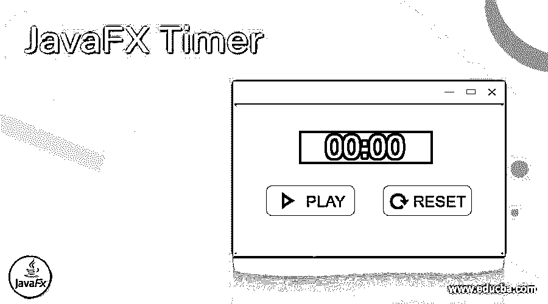
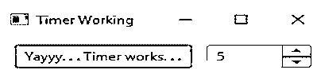
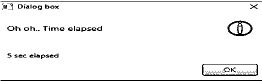
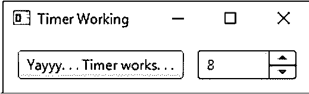
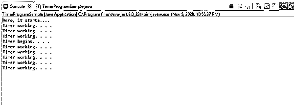

# JavaFX 定时器

> 原文：<https://www.educba.com/javafx-timer/>




## JavaFX 定时器的定义

JavaFX 以其灵活性和易用性著称。其中有几个可用的类，Timer 是一个帮助调度稍后要执行的任务的类。Timer 新对象的创建产生了一个新的线程，它可以在指定的时间后执行程序。这可以帮助开发人员指出计时器是必须重复运行还是只运行一次。JavaFx 中的 Timer 由 java.util.Timer 类表示。让我们在接下来的章节中看到更多关于这个主题的内容。

**语法:**

<small>网页开发、编程语言、软件测试&其他</small>

下面是 JavaFX timer 的语法。

```
Timer timerobj = new Timer();
```

### 如何在 JavaFX 中创建定时器？

类似于 timer 类，TimerTask 类在 Timer 的执行中有一个角色。它是一个抽象类，扩展了 Runnable 接口。但是，它不实现方法 run。此外，可以创建 TimerTask 类的一个子类，该子类可以在计时器在被覆盖的方法运行中触发时覆盖方法运行。为了将这些放在一起，可以将一个子类实例传递给 Timer.schedule，否则，也可以将一个匿名类传递给 Timer.schedule。

### 例子

现在，让我们看看 JavaFX timer 上的一些示例。

#### 例 1:在按钮的帮助下演示计时器的工作

**代码:**

```
//import all the relevant classes
import java.util.Timer;
import java.util.TimerTask;
import javafx.application.Application;
import javafx.application.Platform;
import javafx.geometry.Insets;
import javafx.scene.Scene;
import javafx.scene.control.Alert;
import javafx.scene.control.Button;
import javafx.scene.control.Spinner;
import javafx.scene.layout.HBox;
import javafx.stage.Stage;
//main class
public class TimerProgramSample extends Application
{
//set the delay as 0
int del = 0;
public void start(Stage st) {
UIinitialisation(st);
}
private void UIinitialisation(Stage st) {
//create object for horizantal box
HBox hb = new HBox(12);
//set the padding
hb.setPadding(new Insets(12));
//create object for timer class
Timer tm = new java.util.Timer();
//create object for spinner class
Spinner sp = new Spinner(1, 62, 5);
//set the prefernce width
sp.setPrefWidth(85);
//create button
Button b = new Button("Yayyy. . . Timer works. . .");
//set the action event on clicking the button
b.setOnAction(event -> {
del = (int) sp.getValue();
//schedule the timer
tm.schedule(new subtimer(), del*1000);
});
//get the children of horizontal box
hb.getChildren().addAll(b, sp);
//on close event
st.setOnCloseRequest(event -> {
tm.cancel();
});
//create a scene
Scene sc = new Scene(hb);
//set the title
st.setTitle("Timer Working");
//set the scene
st.setScene(sc);
//display the result
st.show();
}
//subclass that extends the TimerTask
private class subtimer extends TimerTask {
//run method
@Override
public void run() {
//method
Platform.runLater(() -> {
//create object for Alert class
Alert al = new Alert(Alert.AlertType.INFORMATION);
//set the title
al.setTitle("Dialog box");
//set the header text
al.setHeaderText("Oh oh.. Time elapsed");
//create a string
String c;
//check the condition of delay
if (del == 1) {
// display one second is elapsed
c = "1 sec elapsed";
} else
{
c = String.format("%d sec elapsed",
del);
}
al.setContentText(c);
al.showAndWait();
});
}
}
//main method
public static void main(String[] args) {
//launch the app
launch(args);
}
}
```

**输出:**




在这个程序中，所有必需的类都必须被导入。然后，将延迟设置为 0。一旦完成，调用方法 UIinitialisation，因为它包含了我们需要实现的所有功能。在该方法中，为水平框创建一个对象。然后设置水平框的填充。完成后，就可以创建计时器类对象和微调器类对象了。之后，设置首选宽度并创建按钮。众所周知，如果一个按钮被创建，我们必须实现相同的 action 事件。也就是说，必须提到点击按钮时触发的功能。在这里，将检索延迟值，并根据扩展 TimerTask 的子类 sub timer 来调度定时器。调用包含被覆盖的 run 方法的函数。脱离子类后，可以创建一个场景对象，然后设置标题、场景并显示结果。

执行代码时，会出现如上所示的对话框。由于我选择了 5 秒并点击了按钮，每隔 5 秒就会出现一个如下所示的对话框。




一旦我们将该值更改为另一个值，它将显示如下。也就是说，定时器为给定的新值起作用




#### 例 2:演示计时器的工作原理

**代码:**

```
//import all the relevant classes
import java.util.Timer;
import java.util.TimerTask;
//main class
public class TimerProgramSample {
//main method
public static void main(String[] args) {
//notify that timer starts
System.out.println("Here, it starts....");
//create object for timer
Timer tm = new Timer();
//schedule the timer
tm.schedule(new TimerTask(){
//override run method
@Override
public void run() {
//print a message notifying about timer
System.out.println("Timer begins. . . .");
}
}, 5000);
//tIMER that repeats each 20second
Timer tr = new Timer() ;
//schedule the repeating timer
tr.scheduleAtFixedRate(new TimerTask(){
//override run methid
@Override
public void run(){
System.out.println("Timer working. . . .");
}
}, 0, 2000);
}
}
```

**输出:**




在这个程序中，所有必需的类都必须被导入。然后，为计时器创建一个对象并对其进行调度。覆盖 run 方法并打印一条消息通知计时器。完成后，还会设置一个重复计时器。与第一个类似，它也必须是 scheduler 并覆盖 run 方法。执行代码时，结果将如上所示。由于这是一个重复计时器，可以通过单击红色方框来终止计时器。

### 结论

在 JavaFX 中，Timer 是一个帮助调度必须稍后执行的任务的类。JavaFx 中的 Timer 由 java.util.Timer 类表示。本文详细讨论了 JavaFX timer 的不同细节，如工作原理和示例。

### 推荐文章

这是一个 JavaFX 定时器的指南。这里我们讨论一下定义以及如何在 JavaFX？并附有示例。您也可以看看以下文章，了解更多信息–

1.  [JavaFX TabPane](https://www.educba.com/javafx-tabpane/)
2.  [JavaFX 固定窗格](https://www.educba.com/javafx-anchorpane/)
3.  [JavaFX 3D](https://www.educba.com/javafx-3d/)
4.  [JavaFX 阶段](https://www.educba.com/javafx-stage/)


