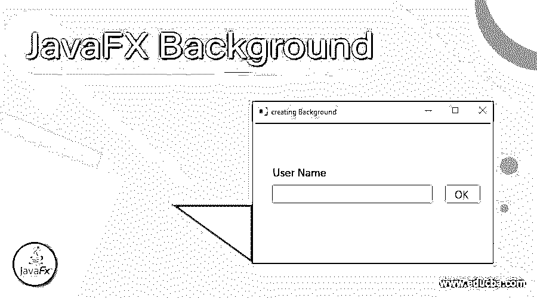
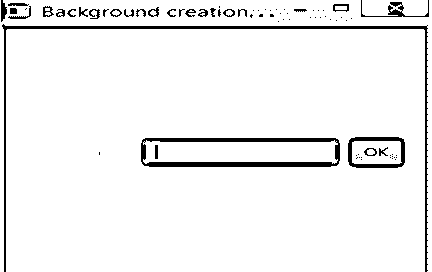
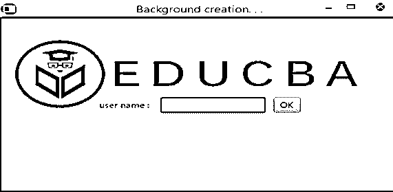
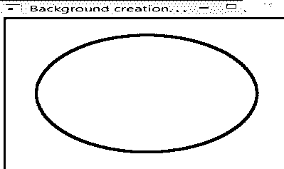

# JavaFX 背景

> 原文：<https://www.educba.com/javafx-background/>




## JavaFX 背景的定义

在 JavaFX 中，Background 是一个帮助设置选定区域背景的类。每个背景由不同的填充或不同的背景图像形成，它们不能为空，但可以为空。由于这个类是不可变的，相同的背景可以在几个区域使用。此外，每个 BackgroundFill 都是按顺序呈现的，后面跟着它所提到的 BackgroundImage。背景集解释了该区域绘图区域的任何扩展，这对于解释每个背景绘图是必不可少的。

**语法:**

<small>网页开发、编程语言、软件测试&其他</small>

```
// Background creation
Background bg = new Background(background_fill);
```

这里 bg 是背景类的对象。

### 构造器

让我们看看 JavaFX 中背景类的构造函数。

*   **背景(BackgroundFill… f):** 一个新的背景对象将被创建，带有所提到的填充。
*   **背景(BackgroundFill[] f，BackgroundImage[] im):** 一个新的背景对象将使用填充和提到的背景图像创建。
*   **背景(BackgroundImage… i):** 将使用提到的背景图像创建一个新的背景对象。
*   **背景(List f，List im):** 将创建一个新的背景对象，其中包含一个填充列表以及一个提到的背景图像列表。

### 方法

下面是 JavaFX 中后台类的常用方法。

*   getFills(): 返回所有背景填充的列表。
*   返回所有背景图像的列表。
*   getOutsets(): 返回所有后台开头的列表。
*   **isEmpty():** 该方法检查背景是否为空，并返回相同的结果。
*   **isfillpentagebased():**该方法检查背景填充是否基于百分比，并返回相同的值。

### JavaFX 背景示例

现在，是时候看看 JavaFX 中后台类的一些示例程序了。

#### 示例#1

**代码:**

```
import javafx.application.Application;
import javafx.scene.Scene;
import javafx.event.ActionEvent;
import javafx.event.EventHandler;
import javafx.scene.canvas.*;
import javafx.scene.web.*;
import javafx.scene.layout.*;
import javafx.scene.image.*;
import java.io.*;
import javafx.geometry.*;
import javafx.scene.Group;
import javafx.scene.control.*;
import javafx.scene.layout.*;
import javafx.stage.Stage;
import javafx.scene.paint.*;
//main class
public class BackgroundClassProgram extends Application {
// application launches here
public void start(Stage st)
{
try {
// set stage title
st.setTitle("Background creation. . .") ;
// label creation
Label lb = new Label("user name : ") ;
// text field creation
TextField tf = new TextField();
// column count has to be set based on the requirement
tf.setPrefColumnCount(10);
// button creation
Button bt = new Button("OK");
// add to hbox the created label lb, text field tf and button bt
HBox hb = new HBox(lb, tf, bt);
// spacing set
hb.setSpacing(10);
// alignment settng for the HBox
hb.setAlignment(Pos.CENTER);
// scene creation
Scene sc = new Scene(hb, 280, 280);
// background fill creation
BackgroundFill bf = new BackgroundFill(Color.RED,
CornerRadii.EMPTY , Insets.EMPTY);
//Background creation
Background bg = new Background(bf);
// set background
hb.setBackground(bg);
// scene setting
st.setScene(sc);
st.show();
}
catch (Exception e) {
System.out.println(e.getMessage());
}
}
// Main Method
public static void main(String args[])
{
// launch the application
launch(args);
}
}
```

**输出:**




在这个程序中，创建了一个按钮、标签和文本字段。作为背景，红色是给定的，在执行代码时，它显示如上。

#### 实施例 2

**代码:**

```
import javafx.application.Application;
import javafx.scene.Scene;
import javafx.event.ActionEvent;
import javafx.event.EventHandler;
import javafx.scene.canvas.*;
import javafx.scene.web.*;
import javafx.scene.layout.*;
import javafx.scene.image.*;
import java.io.*;
import javafx.geometry.*;
import javafx.scene.Group;
import javafx.scene.control.*;
import javafx.scene.layout.*;
import javafx.stage.Stage;
import javafx.scene.paint.*;
//main class
public class BackgroundClassProgram extends Application {
// application launches here
public void start(Stage st)
{
try {
// set stage title
st.setTitle("Background creation. . .") ;
// label creation
Label lb = new Label("user name : ") ;
// text field creation
TextField tf = new TextField();
// column count has to be set based on the requirement
tf.setPrefColumnCount(10);
// button creation
Button bt = new Button("OK");
// add to hbox the created label lb, text field tf and button bt
HBox hb = new HBox(lb, tf, bt);
//spacing set
hb.setSpacing(10);
// alignment setting for the HBox
hb.setAlignment(Pos.CENTER);
// scene creation
Scene sc = new Scene(hb, 280, 280);
// input stream creation
FileInputStream inp = new FileInputStream("d:\\eduCBA-logo1.png");
//image creation
Image im = new Image(inp);
// create a background image
BackgroundImage bi = new BackgroundImage(im,
BackgroundRepeat.NO_REPEAT,
BackgroundRepeat.NO_REPEAT,
BackgroundPosition.DEFAULT,
BackgroundSize.DEFAULT);
// Background creation
Background bg = new Background(bi);
// set background
hb.setBackground(bg);
// scene setting
st.setScene(sc);
st.show();
}
catch (Exception e) {
System.out.println(e.getMessage());
}
}
// Main Method
public static void main(String args[])
{
// launch the application
launch(args);
}
}
```

**输出:**




与上面的程序类似，在执行代码时会显示一个文本字段、标签和一个按钮。这里，还显示了背景图像。

#### 实施例 3

**代码:**

```
import javafx.application.Application;
import javafx.scene.Scene;
import javafx.event.ActionEvent;
import javafx.event.EventHandler;
import javafx.scene.canvas.*;
import javafx.scene.web.*;
import javafx.scene.layout.*;
import javafx.scene.image.*;
import java.io.*;
import javafx.geometry.*;
import javafx.scene.Group;
import javafx.scene.control.*;
import javafx.scene.layout.*;
import javafx.stage.Stage;
import javafx.scene.paint.*;
import javafx.scene.shape.Circle;
//main class
public class BackgroundClassProgram extends Application {
// application launches here
public void start(Stage st)
{
try {
// set stage title
st.setTitle("Background creation. . .") ;
// label creation
Label lb = new Label("user name : ") ;
//Draw a Circle
Circle c = new Circle();
//Set the circle properties
c.setCenterX(310.0f);
c.setCenterY(125.0f);
c.setRadius(110.0f);
/// add circle
HBox hb = new HBox(c);
// set spacing
hb.setSpacing(10);
// hbox alignment setting
hb.setAlignment(Pos.CENTER);
// scene creation
Scene sc = new Scene(hb, 280, 280);
// background fill creation
BackgroundFill bf = new BackgroundFill(Color.RED,
CornerRadii.EMPTY , Insets.EMPTY);
// Background creation
Background bg = new Background(bf);
// set background
hb.setBackground(bg);
// scene setting
st.setScene(sc);
st.show();
}
//catch the exception
catch (Exception ec) {
System.out.println(ec.getMessage());
}
}
// Main Method
public static void main(String args[])
{
// application launches here
launch(args);
}
}
Output:
```




与上面的程序不同，在执行代码时会显示一个红色背景的圆圈。

### 结论

背景是一个帮助设置选定区域背景的类。本文从语法、构造函数、方法和 JavaFX 背景类的例子等不同方面进行了详细的解释。

### 推荐文章

这是一个 JavaFX 背景的指南。这里我们还讨论了定义、构造函数、方法以及不同的例子。您也可以看看以下文章，了解更多信息–

1.  [JavaFX 对话框](https://www.educba.com/javafx-dialog/)
2.  [JavaFX 时间轴](https://www.educba.com/javafx-timeline/)
3.  [JavaFX 定时器](https://www.educba.com/javafx-timer/)
4.  [JavaFX 图像](https://www.educba.com/javafx-image/)


