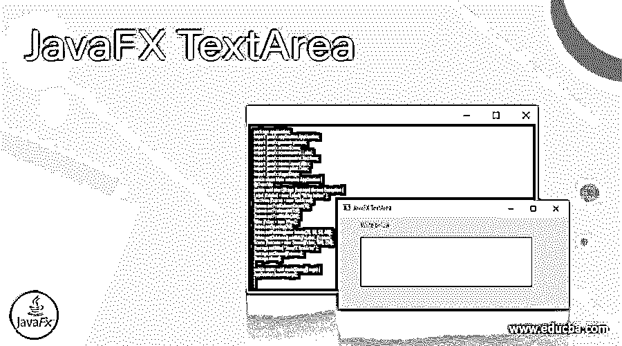
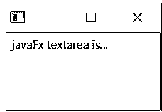
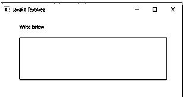
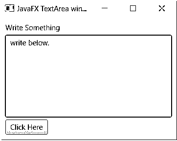
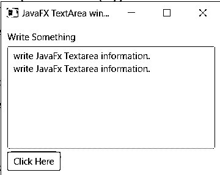
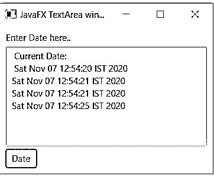

# JavaFX 文本区

> 原文：<https://www.educba.com/javafx-textarea/>




## JavaFX 文本区域的定义

textarea 是 web 应用程序中用于多行信息的输入元素。它提供来自用户的多行输入信息，并存储在应用程序中。它在用户和应用程序之间使用 textarea 对象进行交互，并设置在数据库中。这是一个多行编辑器，通过应用程序中的表单和消息框从用户那里获取多行数据。它的最新版本不允许单行信息出现在文本框中。

**语法:**

<small>网页开发、编程语言、软件测试&其他</small>

*   JavaFX Textarea 需要 Textarea 类和它们的对象。
*   这个对象使用一个布局容器与场景图连接。
*   JavaFX Textarea 语法如下。

```
TextArea jfxTextarea = new TextArea();
VBox jfxbox = new VBox(jfxTextarea);
Scene jfxscene = new Scene(jfxbox);
```

*   JavaFX textarea 使用对象设置文本语法。

```
jfxTextarea.setText("text_here..");
```

*   JavaFX Textarea 使用对象返回文本语法。

```
String textObject = jfxTextarea.getText();
```

### JavaFX TextArea 函数如何工作？

*   在您的计算机设备上下载并安装 JDK 和 java IDE，如 eclipse。
*   在库中添加 JavaFX jar 文件，或者在 java IDE 中安装最新版本的 e(fx) clipse 软件。
*   添加 start 方法是为了用 Stage 对象设置 JavaFX 应用程序。

```
public class MainClass extends Application{
@Override
public void start(Stage jfxStage) throws Exception{
//Add javaFX Textarea methods and constructor
}
}
```

*   在 start 方法中创建 Textarea 对象。
*   Vbox 是一个垂直布局容器，对 textarea 很有用。

```
public void start(Stage jfxStage) throws Exception{
TextArea jfxTextarea = new TextArea();
VBox jfxbox = new VBox(jfxTextarea);
Scene jfxscene = new Scene(jfxbox);
}
```

*   这个对象使用一个布局容器与场景图连接。

```
public void start(Stage jfxStage) throws Exception{
TextArea jfxTextarea = new TextArea();
VBox jfxbox = new VBox(jfxTextarea);
Scene jfxscene = new Scene(jfxbox, 320, 160);
jfxStage.setScene(jfx scene);
jfxStage.show(); }
```

*   它使用 start()和 main 方法来启动应用程序。

```
public class MainClass extends Application{
@Override
public void start(Stage jfxStage) throws Exception{
TextArea jfxTextarea = new TextArea();
VBox jfxbox = new VBox(jfxTextarea);
Scene jfxscene = new Scene(jfxbox, 320, 160);
jfxStage.setScene(jfxscene);
jfxStage.show(); }
}
public static void main(String[] args) {
Application.launch(args);
}
}
```

### 构造器

*   JavaFX 使用 stage 构造函数在桌面应用程序中显示窗口。
*   Stage 构造函数作为一个容器来保存应用程序。
*   理论上的构造函数及其对象创建语法如下。

```
Stage jfxstage = new Stage();
```

*   JavaFX 构造函数及其对象总是通过 start()方法传递。

```
public void start(Stage jfxStage){ implementation code.. }
```

### 方法

*   **start()方法:**start 方法是 JavaFX 应用程序中的初始化方法。start 方法包含并传递所有桌面应用程序对象、方法。它总是带有带有 Stage 构造函数的 start()方法。

```
public void start(Stage jfxStage)
{
Implementation code...
}
```

*   **launch()方法:**launch()方法是使用 JavaFX 为桌面创建应用程序所必需的。在类中创建 main 方法，并使用带有命令行参数的 launch()方法。

```
public static void main(String[] args) {
Application.launch(args);
}
```

### JavaFX TextArea 示例

让我们讨论 JavaFX TextArea 的例子。

#### 示例#1

```
package application;
import javafx.application.Application;
import javafx.scene.Scene;
import javafx.scene.control.TextArea;
import javafx.scene.layout.VBox;
import javafx.stage.Stage;
public class Main extends Application {
@Override
public void start(Stage jfxStage) throws Exception {
TextArea jfxtextArea = new TextArea();
VBox jfxvbox = new VBox(jfxtextArea);
Scene jfxscene = new Scene(jfxvbox, 200, 100);
jfxStage.setScene(jfxscene);
jfxStage.show();
}
public static void main(String[] args) {
Application.launch(args);
}
}
```

**输出:**




**描述:**

*   textarea 创建一个对象并在垂直框容器中连接。
*   Vbox 与场景节点交互，包含 Javafx textarea。

#### 示例 2:标签和填充

**代码:**

```
package application;
import javafx.application.Application;
import javafx.geometry.Insets;
import javafx.scene.Scene;
import javafx.scene.control.Label;
import javafx.scene.control.TextArea;
import javafx.scene.layout.VBox;
import javafx.scene.paint.Color;
import javafx.stage.Stage;
public class Main extends Application {
@Override
public void start(Stage jfxstage) throws Exception {
Label jfxlabel = new Label( "Write below" );
TextArea jfxarea = new TextArea();
jfxarea.setPrefColumnCount(15);
jfxarea.setPrefHeight(120);
jfxarea.setPrefWidth(300);
VBox jfxbox = new VBox();
jfxbox.setSpacing(20);
jfxbox.setPadding(new Insets(20, 50, 50, 60));
jfxbox.getChildren().addAll(jfxlabel, jfxarea);
Scene jfxscene = new Scene(jfxbox, 590, 230);
jfxstage.setTitle( "JavaFX TextArea" );
jfxstage.setScene(jfxscene);
jfxstage.show();
}
public static void main(String[] args) {
Application.launch(args);
}
}
```

**输出:**




**描述:**

*   setPadding()和 setSpacing()方法用于在 textarea 和 container 之间创建所需的空间。
*   setPrefHeight()和 setPrefWidth()方法创建 textarea 所需的高度和宽度。

#### 示例#3:设置并返回信息

**代码:**

```
package application;
import javafx.application.Application;
import javafx.event.ActionEvent;
import javafx.event.EventHandler;
import javafx.geometry.Insets;
import javafx.scene.Scene;
import javafx.scene.control.Button;
import javafx.scene.control.Label;
import javafx.scene.control.TextArea;
import javafx.scene.layout.VBox;
import javafx.stage.Stage;
public class Main extends Application {
@Override
public void start(Stage jfxstage) throws Exception {
VBox jfxvbox = new VBox();
jfxvbox.setPadding(new Insets(10));
jfxvbox.setSpacing(5);
Label jfxlabel = new Label("Write Something");
TextArea jfxtextArea = new TextArea();
jfxtextArea.setText("write below.\n");
Button jfxbutton = new Button("Click Here");
jfxbutton.setOnAction(new EventHandler<ActionEvent>() {
@Override
public void handle(ActionEvent event) {
jfxtextArea.setText("write JavaFx Textarea information.\n");
String jfxtext = jfxtextArea.getText();
jfxtextArea.appendText( jfxtext);
}
});
jfxvbox.getChildren().addAll(jfxlabel, jfxtextArea,jfxbutton);
Scene jfxscene = new Scene(jfxvbox, 360, 250);
jfxstage.setTitle("JavaFX TextArea window");
jfxstage.setScene(jfxscene);
jfxstage.show();
}
public static void main(String[] args) {
Application.launch(args);
}
}
```

*   **设置文本输出:**




*   **返回文本输出:**




#### 例子#4:当前日期

**代码:**

```
package application;
import java.util.Date;
import javafx.application.Application;
import javafx.event.ActionEvent;
import javafx.event.EventHandler;
import javafx.geometry.Insets;
import javafx.scene.Scene;
import javafx.scene.control.Button;
import javafx.scene.control.Label;
import javafx.scene.control.TextArea;
import javafx.scene.layout.VBox;
import javafx.stage.Stage;
public class Main extends Application {
@Override
public void start(Stage jfxstage) throws Exception {
VBox jfxvbox = new VBox();
jfxvbox.setPadding(new Insets(10));
jfxvbox.setSpacing(5);
Label jfxlabel = new Label("Enter Date here..");
TextArea jfxtextArea = new TextArea();
jfxtextArea.setText(" Current Date: \n ");
VBox jfxhbar = new VBox();
Button jfxbutton = new Button("Date");
jfxbutton.setOnAction(new EventHandler<ActionEvent>() {
@Override
public void handle(ActionEvent event) {
jfxtextArea.appendText( new Date().toString());
jfxtextArea.appendText("\n");
}
});
jfxhbar.getChildren().addAll(jfxbutton);
jfxvbox.getChildren().addAll(jfxlabel, jfxtextArea, jfxhbar);
Scene jfxscene = new Scene(jfxvbox, 360, 250);
jfxstage.setTitle("JavaFX TextArea window");
jfxstage.setScene(jfxscene);
jfxstage.show();
}
public static void main(String[] args) {
Application.launch(args);
}
}
```

**输出:**




### 结论

它主要用于应用程序表单中的反馈、消息和地址输入。这对于无限制的字符输入来自用户的信息是有用的。

### 推荐文章

这是 JavaFX TextArea 的指南。这里我们讨论 JavaFX TextArea 函数的定义和工作原理？并附有示例。您也可以看看以下文章，了解更多信息–

1.  [JavaFX 定时器](https://www.educba.com/javafx-timer/)
2.  [JavaFX 图像](https://www.educba.com/javafx-image/)
3.  [JavaFX WebView](https://www.educba.com/javafx-webview/)
4.  [JavaFX TabPane](https://www.educba.com/javafx-tabpane/)


