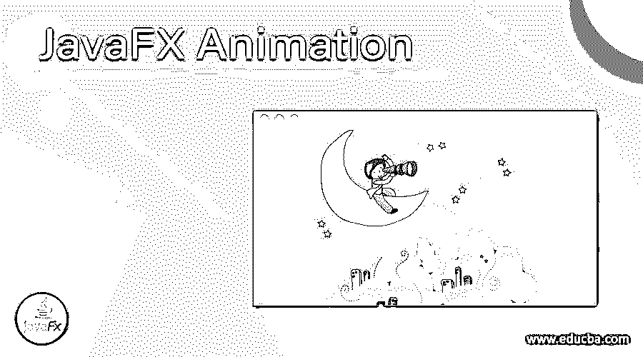
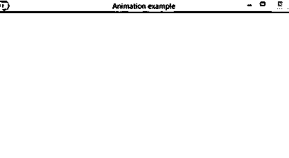
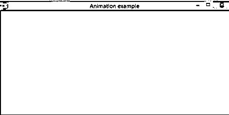

# JavaFX 动画

> 原文：<https://www.educba.com/javafx-animation/>




## JavaFX 动画的定义

在 JavaFX 中，通过按时间改变属性，可以对特定节点进行动画处理。为此，javafx 提供了一个 javafx.animation 包。它由帮助制作节点动画的类组成。对于所有这些类，动画被视为基类。有不同的动画，如填充过渡，缩放过渡，淡入淡出过渡，笔画过渡，旋转过渡，连续过渡等。所有这些都由 javafx.animation 包中单独的类表示。这个动画也被称为过渡。在本文中，我们将在动画中看到更多。

**构造函数**

<small>网页开发、编程语言、软件测试&其他</small>

下面是 JavaFX 中动画的两个构造函数。

*   动画()
*   动画(双倍目标帧率)

### 方法

以下是 JavaFX 中的动画制作方法。

*   **autoReverseProperty():** 该属性定义在交替循环中，动画是否反转方向。
*   **currentRateProperty():** 这是一个只读变量，表示动画播放的当前方向或当前速度。
*   **currentTimeProperty():** 这个属性定义了动画的播放头位置。
*   **cycleCountProperty():** 这个属性定义了动画的循环次数。
*   **cycledurationnproperty():**这是一个 ready only 变量，表示动画必须播放的周期持续时间。
*   **delayProperty():** 这个属性延迟动画。
*   **getCuePoints():** 动画的重要位置使用提示点进行标记。
*   **getcurrent ate():**current ate 属性的值将被检索。
*   **getCurrentTime():** 将检索 CurrentTime 属性的值。
*   **getCycleCount():** 将检索 CycleCount 属性的值。
*   **getCycleDuration():** 将检索 CycleDuration 属性的值。
*   **getDelay():** 将检索延迟属性的值。
*   **getOnFinished():** 将检索 OnFinished 属性的值。
*   **getRate():** 将检索 Rate 属性的值。
*   **getStatus():** 将检索状态属性的值。
*   **getTotalDuration():** 将检索 TotalDuration 属性的值。
*   **isAutoReverse():** 将检索 AutoReverse 属性的值。
*   **jumpTo(Durationtime):** 该方法有助于跳转到动画的特定位置。
*   **jumpTo(StringcuePoint):** 这个方法帮助跳转到动画的预定义位置。
*   **pause():** 这个方法暂停动画。
*   **play():** 这个方法从当前位置按照 rate 表示的方向播放动画。
*   **playFrom(Durationtime):** 这个方法从提到的位置播放动画。
*   **play from(string cuepoint):**该方法从预先定义的位置播放动画。
*   **playFromStart():** 该方法从初始位置开始向前播放动画。
*   **setAutoReverse(boolean v):**autoReverse 属性的值将被设置为 v。
*   **setCycleCount(int v):**cycle count 属性的值将被设置为 v。
*   **setCycleDuration(duration v):**cycleduration property 的值将被设置为 v。
*   **set Delay(duration v):**Delay 属性的值将被设置为 v。
*   **set OnFinished(EventHandler<action event>v):**OnFinished 属性值将被设置为 v
*   **setRate(double v):** Rate 属性的值将被设置为 v。
*   **set status(Statusv):**status property 的值将被设置为 v。
*   **statusProperty():** 动画开始。
*   **stop():** 动画停止，播放头复位到初始位置。
*   **onFinishedProperty():** 这个属性解释了在动画结束时必须执行的动作。
*   **rateProperty():** 这个属性定义了播放动画的方向或速度。
*   **totalDurationProperty():** 这是一个 ready only 变量，表示动画必须播放的周期持续时间，包括重复播放。

### 如何在 JavaFX 中制作动画？

让我们看看动画是如何对一个特定的节点完成的。

*   首先，使用相应的类创建一个所需的节点。
*   完成后，配置属性。

```
Rectangle rt = new Rectangle(136,112,112,112);
r.setFill(Color.YELLOW);
```

*   实例化必须应用的相应过渡类或动画类

```
RotateTransition r = new RotateTransition();
```

*   设置转换属性，如循环计数、持续时间。

```
r.setDuration(Duration.millis(2000));
r.setAxis(Rotate.Y_Axis);
r.setCycleCount(600);
```

*   修复必须应用过渡的目标节点。

```
r.setnode(rt);
```

1.  借助 Play()方法播放过渡

```
r.play();
```

### JavaFX 动画示例

现在，我们将看到一个 JavaFX 动画的示例程序。

#### 示例#1

**代码:**

JavaFX 程序演示动画。

**代码:**

```
import javafx.animation.RotateTransition;
import javafx.application.Application;
import javafx.scene.Group;
import javafx.scene.Scene;
import javafx.scene.paint.Color;
import javafx.scene.shape.Polygon;
import javafx.stage.Stage;
import javafx.util.Duration;
//main class
public class AnimationSamplePorogram extends Application {
@Override
public void start(Stage st) {
//create a hexagon
Polygon hx = new Polygon();
//Add coordinates to the created hexagon
hx.getPoints().addAll(new Double[]{
220.0, 60.0,
420.0, 60.0,
430.0, 160.0,
430.0, 260.0,
230.0, 260.0,
180.0, 160.0,
});
//fill color for the created hexagon
hx.setFill(Color.*YELLOW*);
//rotate transitioncreation
RotateTransition rt = new RotateTransition();
//Set the duration for the rotate transition created
rt.setDuration(Duration.*millis*(2000));
//Set the node for the rotate transition created
rt.setNode(hx);
//Set the angle of the rotate transition created
rt.setByAngle(360);
//Set the cycle count for rotate transition created
rt.setCycleCount(60);
//Set false as the auto reverse value
rt.setAutoReverse(false);
//start playing the animation
rt.play();
//Create a Group object
Group g = new Group(hx);
//Create a scene object
Scene sc = new Scene(g, 600, 300);
//Set title of the Stage st
st.setTitle("Animation example ");
//Add scene to the stage st
st.setScene(sc);
//Display the contents of the stage st
st.show();
}
//main method
public static void main(String args[]){
//launches the application
launch(args);
}
}
```

**输出:**




首先，导入所有必需的包。然后，创建一个六边形，并向创建的六边形添加坐标。之后，为创建的六边形填充颜色。完成后，创建一个旋转过渡，并为创建的旋转过渡设置持续时间。此外，还为创建的旋转过渡设置节点、角度和循环计数。然后，将自动反转值设置为 false，并使用 play()方法开始播放动画。接下来是创建一个组对象和一个场景对象。此外，为创建的舞台设置标题，并向其添加场景。之后，使用 show()方法显示阶段 st 的内容。

在执行代码时，可以看到一个黄色的六边形旋转了 360 度。这种旋转将持续大约 2000 秒。提供的截图是在两个时间拍摄的，用于显示六边形正在旋转。




### 结论

在 JavaFX 中，一个称为 JavaFX 的包。使用由帮助制作节点动画的类组成的动画。这个包提供了不同的动画，比如填充过渡，缩放过渡。在这篇文章中，一个详细的方面，如构造函数，方法，工作，并举例说明了动画包详细。

### 推荐文章

这是 JavaFX 动画指南。这里我们讨论定义，方法，如何在 JavaFX 中创建动画？和代码实现示例。您也可以看看以下文章，了解更多信息–

1.  [JavaFX 动画定时器](https://www.educba.com/javafx-animationtimer/)
2.  [JavaFX 后台](https://www.educba.com/javafx-background/)
3.  [JavaFX 时间轴](https://www.educba.com/javafx-timeline/)
4.  [JavaFX WebView](https://www.educba.com/javafx-webview/)


