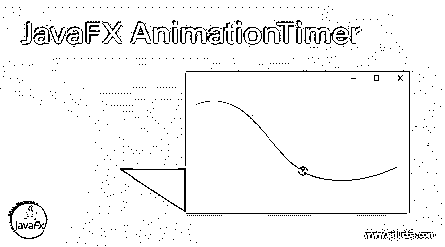
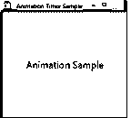
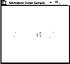
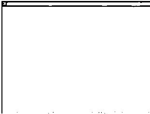

# JavaFX 动画定时器

> 原文：<https://www.educba.com/javafx-animationtimer/>




## JavaFX 动画定时器的定义

在 JavaFX 中，动画被认为是产生运动错觉的一系列快速图像。这不是唯一的运动，而是一个节点背景的变化。JavaFX 中有三种创建动画的工具。它们是动画计时器、过渡和时间轴。在这篇文章中，我们将讨论一个动画定时器。它允许创建一个计时器，在活动时间内每帧调用一次。让我们在下面的章节中看到更多关于动画定时器的内容。

**声明:**

<small>网页开发、编程语言、软件测试&其他</small>

下面是动画定时器的声明。

```
public abstract class AnimationTimer extends Object
```

**构造函数**

JavaFX 动画计时器中只有一个构造函数。

*   **AnimationTimer()**

这个构造函数将帮助创建一个计时器。

**方法**

让我们看看 JavaFX 动画定时器中使用的重要方法。

*   **手柄**

**声明:**

```
public abstract void handle(long now)
```

**解释:**必须被类扩展覆盖的方法。之后，它将在 AnimationTimer 活动期间的所有帧中被调用。

**参数:**

这个方法的参数是**现在是**，这是当前帧的时间戳，以纳秒为单位。在特定帧调用的每个定时器都是一样的。

*   **开始**

**声明:**

```
public void start()
```

**解释:**这是启动动画定时器的方法。启动动画定时器后，每一帧都会调用定时器的方法 handle()。可以使用 stop()停止它。

*   **停止**

**声明:**

```
public void stop()
```

**解释:**这是停止动画定时器的方法。可以使用 start()重新启动它。

### 如何在 JavaFX 中使用动画定时器？

在进入编码部分之前，必须讨论计时器背后的底层技术。那只有你自己清楚了。

动画计时器并不被认为是一个独立的计时器。它像接收器一样工作。每一帧都有一个动画脉冲，由 JavaFX 通过标有相似时间戳的系统发送。像 transition 和 timeline 这样的类扩展了类动画。这有助于暂停动画。此外，它还支持更大数组的动画支持。支持包括查找动画持续时间、值插值、动画期望速率、设置延迟、动画状态、与之关联的属性、动作事件设置、提示点设置、动画移动等。

JavaFX 的主要优势是信息绑定度高。然而，广泛的支持导致运行时性能下降。

我们知道，动画计时器不会自己计时。信息源是动画的脉冲，通过系统链接每一帧。这就是我们提出动画定时器的启动和停止方法的地方。也就是说，时钟应该在计时器上停止。让我们看看一些示例程序的实际情况。

### JavaFX 动画定时器示例

在这一节中，我们将看看动画定时器的示例程序。

#### 程序#1: JavaFX 动画定时器程序，用于淡入淡出文本。

**代码:**

```
//import all the necessary packages
import javafx.animation.AnimationTimer;
import javafx.application.Application;
import javafx.scene.Scene;
import javafx.scene.control.Label;
import javafx.scene.layout.StackPane;
import javafx.scene.text.Font;
import javafx.stage.Stage;
//main class
public class AnimationTimerSample extends Application {
//declare opacity and a label
private double op = 1;
private Label lbel;
@Override
public void start(Stage st) {
UIinit(st);
}
//define the UIinit method
private void UIinit(Stage st) {
//create a <u>stackpane</u>
StackPane sp = new StackPane();
//define the label
lbel = new Label("Animation Sample");
//set the font for label
lbel.setFont(Font.font(24));
//add the label to stack pane
sp.getChildren().add(lbel);
//declare an animation timer
AnimationTimer tm = new TimerMethod();
//start the timer
tm.start();
//create a scene
Scene sc = new Scene(sp, 310, 260);
//set the title for stage
st.setTitle("Animation Timer Sample");
//set the scene
st.setScene(sc);
//display the result
st.show();
}
private class TimerMethod extends AnimationTimer {
//define the handle method
@Override
public void handle(long now) {
//call the method
handlee();
}
//method handlee
private void handlee() {
//set the value of opacity
op -= 0.01;
//set the opacity for label
lbel.opacityProperty().set(op);
//checks the value of opacity
if (op <= 0)
{
//if it is less than zero, stop it
stop();
//print message
System.out.println("Animation stops here");
}
}
}
//main method
public static void main(String[] args) {
launch(args); } }
```

**输出:**







在执行代码时，我们可以看到文本“Animation Sample”显示出来，并随着时间的推移而消失。上面显示的截图是褪色的文字。

#### 程序#2: JavaFX 程序在动画定时器上显示点。

**代码:**

```
import java.util.Random;
import javafx.animation.AnimationTimer;
import javafx.application.Application;
import javafx.scene.Group;
import javafx.scene.Node;
import javafx.scene.Scene;
import javafx.scene.paint.Color;
import javafx.scene.shape.Rectangle;
import javafx.stage.Stage;
//main class
public class AnimationTimerSample extends Application {
//declare count, node, angle and start
private static final int CNT = 3000;
private final Rectangle[] ND = new Rectangle[CNT];
private final double[] ang = new double[CNT];
private final long[] start = new long[CNT];
private final Random rnd = new Random();
@Override
public void start(final Stage st)
{
for (int i=0; i<CNT; i++)
{
ND[i] = new Rectangle(1, 1, Color.RED);
//angle
ang[i] = 3.0 * Math.PI * rnd.nextDouble();
//start
start[i] = rnd.nextInt(2000000000);
}
final Scene sc = new Scene(new Group(ND), 700, 500, Color.YELLOW);
//set the scene
st.setScene(sc);
//display the result
st.show();
//animation timer
new AnimationTimer() {
@Override
//handle method
public void handle(long now) {
//width
final double w = 0.6 * st.getWidth();
//height
final double h = 0.6 * st.getHeight();
//radius
final double r = Math.sqrt(2) * Math.max(w, h);
//loop
for (int i=0; i<CNT; i++)
{
//node
final Node nd = ND[i];
//angle
final double ag = ang[i];
final long tm = (now - start[i]) % 2000000000;
final double dt = tm * r / 2000000000.0;
nd.setTranslateX(Math.cos(ag) * dt + w);
nd.setTranslateY(Math.sin(ag) * dt + h);
}
}
}.start();
}
public static void main(String[] args) {
launch(args);
}
}
```

**输出:**




在执行代码时，可以用动画的方式看到很多点。上面显示的截图也是如此。

### 结论

动画计时器允许创建一个计时器，在活动时间内的每一帧都会调用该计时器。在本文中，动画计时器的另一个方面将被详细讨论。

### 推荐文章

这是 JavaFX AnimationTimer 的指南。这里我们也讨论一下 JavaFX 中的简介，语法，参数，以及如何使用动画定时器？用不同的例子。您也可以看看以下文章，了解更多信息–

1.  [JavaFX 后台](https://www.educba.com/javafx-background/)
2.  [JavaFX 对话框](https://www.educba.com/javafx-dialog/)
3.  [JavaFX 图像](https://www.educba.com/javafx-image/)
4.  [JavaFX WebView](https://www.educba.com/javafx-webview/)


