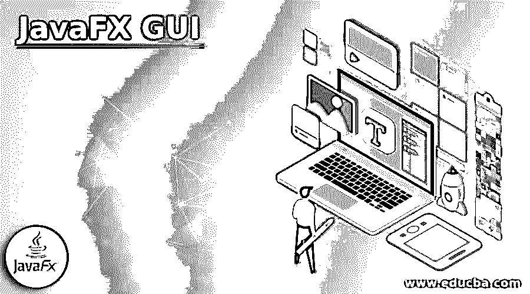
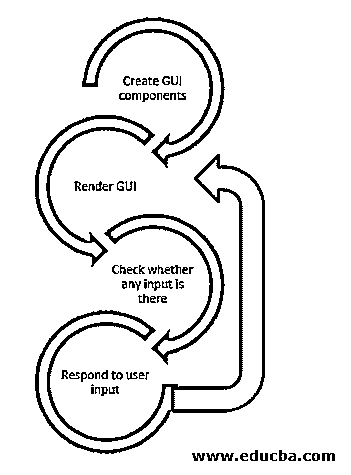
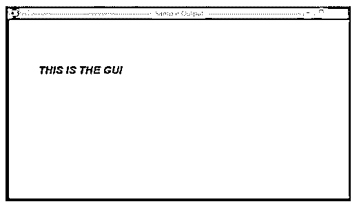

# JavaFX GUI

> 原文：<https://www.educba.com/javafx-gui/>




## JavaFX GUI 简介

在 Java 中，JavaFX 被认为是一个帮助创建桌面应用程序和游戏的图形用户界面(GUI)工具包。通常，程序员使用 Swing 和 AWT kit(高级窗口工具包)库来实现相同的功能。但是，在 JavaFX 出现之后，程序员依赖它来开发具有丰富内容的 GUI。使用它的另一个原因是 Java 仍然是最常见和最强大的编程语言。此外，它支持所有操作系统和设备，如 Linux，iOS，Windows，Mac，Raspberry Pi，Android 和 Chromebook。

### JavaFX GUI 是如何工作的？

让我们看看 GUI 是如何工作的。

<small>网页开发、编程语言、软件测试&其他</small>

下面是相同的流程图。




首先，创建 GUI 组件并呈现图形用户界面。然后，检查是否有任何输入。完成后，响应特定的用户输入。重复这个过程。

为了清楚地理解这一点，让我们看一个鼠标点击特定按钮的例子。首先，操作系统识别鼠标点击并找到它所在的窗口。然后，基于此，程序将被通知。在这之后，程序将循环运行，操作系统会查看输入缓冲区是否已满。如果发现点击，那么程序组件将被检查，如果它在相关组件中，响应将基于处理程序。

### JavaFX GUI 组件

JavaFX GUI 中有不同的组件，如控件、布局、图表等。

#### 1.控制

它们是在应用程序中提供控制功能的组件。javafx.scene.control 是在这方面有所帮助的包。这些控件通常嵌套在处理彼此相关的控件布局的布局组件中。

以下是 JavaFX GUI 组件中的控件:

*   纺纱机
*   进度条
*   SplitMenuButton 按钮
*   jpasswordfield
*   SplitPane
*   菜单条
*   TableView
*   菜单
*   标签窗格
*   列表视图
*   单选按钮
*   文本区域
*   标签
*   文本字段
*   组合框
*   标题窗格
*   颜色选择器
*   切换按钮
*   选择框
*   滑块
*   工具栏
*   检验盒
*   TreeTableView
*   纽扣
*   树形视图
*   手风琴

#### 2.布局

下一个是由其他组件组成的布局。它处理嵌套在其中的布局。这些组件也称为父组件，因为它们包含子组件，并且布局组件是 javafx.scene.Parent JavaFX 类的子类。要使场景对象可见，必须将布局附加到场景图中。

以下是 JavaFX GUI 组件的布局:

*   流动窗格
*   堆栈面板
*   VBox
*   蒂勒潘尼
*   HBox
*   网格面板
*   窗格
*   锚板
*   地区
*   TextFlow
*   组

#### 3.图表

JavaFX GUI 中内置的现成组件，程序员不希望从头开始编写相同的代码。图表就是这样一个组成部分。

以下是 JavaFX GUI 组件中的图表:

*   散点图
*   泡泡图
*   stackledareachart
*   线性图表
*   BarChart
*   堆叠条形图
*   PieChart
*   面积图

### JavaFX GUI 的特性

下面是提到的特征:

*   Java 库:它由几个 Java 语言的类和接口组成。
*   **场景构建器:**这个特性创建一个可以移植到 IDE 的标记 FXML。
*   FXML: 基于 XML 的声明式标记语言，为用户提供增强的 GUI。
*   **Web View:** 此功能使用 WebKitHTML 技术将网页嵌入应用程序。
*   **内置 UI 控件:**有几个不依赖于操作系统的内置组件。这些对于开发一个全功能的应用程序来说已经足够了。
*   CSS 样式化: CSS 也可以和 JavaFX 一起使用来增强 GUI 视图。
*   **Swing 互操作性:**使用类 Swing 节点，应用程序(GUI)可以嵌入 Swing。此外，当前的 swing 应用程序也可以更新。
*   **Canvas API:** 这个特性提供了在 JavaFX 中直接绘制场景区域的方法。
*   **丰富的 API 集:**这个特性为在 JavaFX 中开发 GUI 应用程序提供了丰富的 API 集。
*   **集成图形库:**该特性提供了一个集成类集，用于在 JavaFX 的 GUI 应用程序中使用 3D 和 2D 图形进行密封。
*   **图形管道:**该功能基于棱镜，是一种图形渲染管道。它提供硬件加速的平滑图形。
*   **高性能媒体引擎:**该特性支持低延迟的 web 多媒体播放，基于 Gstreamer 多媒体框架。
*   **自包含应用部署模型:**该功能提供应用资源。此外，还提供 JavafX 和 Java 运行时私有副本。

### JavaFX GUI 示例

下面给出了一个不同的例子:

**代码:**

```
//sample program on JavaFX GUI
import javafx.application.Application ;
import javafx.scene.Group ;
import javafx.scene.Scene ;
import javafx.stage.Stage ;
import javafx.scene.text.Font ;
import javafx.scene.text.FontPosture ;
import javafx.scene.text.FontWeight ;
import javafx.scene.text.Text ;
//main class
public class GUISampleProgram extends Application {
@Override
public void start(Stage st) {
//Create a Text object <u>txt</u>
Text txt = new Text();
//Set the text font, weight, posture and size
txt.setFont(Font.font("Arial" , FontWeight.BOLD , FontPosture.ITALIC, 22));
//set the text x and y position
txt.setX(60) ;
txt.setY(120) ;
//Set the text that has to be added
txt.setText("THIS IS THE GUI") ;
//Create a Group object <u>gp</u>
Group gp = new Group(txt) ;
//Create a scene object <u>sc</u>
Scene sc = new Scene( gp, 700, 400) ;
//Set the stage title
st.setTitle(" Sample Output ") ;
//Add a scene <u>sc</u> to the stage <u>st</u>
st.setScene(sc);
//Display the stage contents
st.show();
}
//main method
public static void main(String args[])
{
//launch the application
launch(args);
}
}
```

**输出:**




首先，导入所有带有必要 GUI 组件的包。作为 javafx.scene.text 包的文本类，表示 javafx 中的 JavaFX 文本节点，可以创建文本。然后，设置字体、文本位置并添加文本。字体，文本的大小也必须提到。之后，创建一个组对象 gp 和一个场景对象 sc。然后，设置舞台标题并将场景 sc 添加到舞台 st。

在执行代码时，会显示一个带有文本的 GUI，如上面的屏幕截图所示。

### 结论

JavaFX 被认为是一个图形用户界面(GUI)工具包，有助于创建桌面应用程序和游戏。本文详细介绍了 JavaFX GUI 的特点、组件、工作原理和示例。

### 推荐文章

这是 JavaFX GUI 的指南。这里我们讨论引言；JavaFX GUI 是如何工作的？组件、特征和示例。您也可以看看以下文章，了解更多信息–

1.  [JavaFX 动画定时器](https://www.educba.com/javafx-animationtimer/)
2.  [JavaFX 后台](https://www.educba.com/javafx-background/)
3.  [JavaFX 图像](https://www.educba.com/javafx-image/)
4.  [JavaFX 3D](https://www.educba.com/javafx-3d/)


