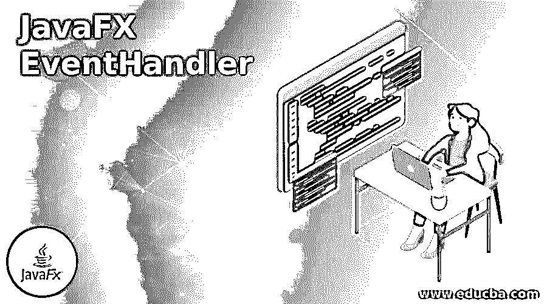
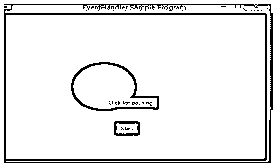
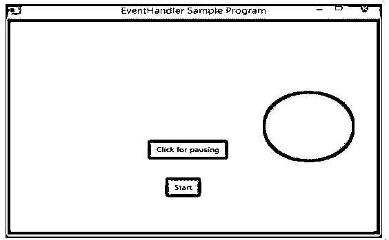
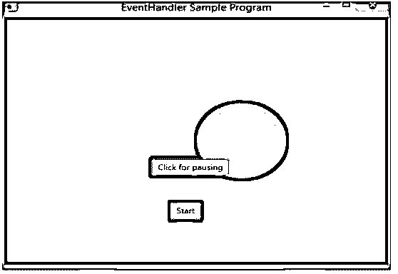
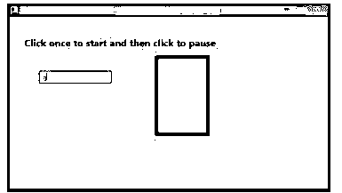

# JavaFX 事件处理程序

> 原文：<https://www.educba.com/javafx-eventhandler/>




## JavaFX EventHandler 简介

以下文章概述了 JavaFX EventHandler。在 JavaFX 中，事件处理是一个控制事件并决定事件发生时必须触发什么的过程。这将通过编写一个名为事件处理程序的代码来完成，该代码在事件发生时执行。对于单个节点，它可以有多个事件处理程序。此外，一个处理程序可以用于多个事件类型和节点。

### JavaFX EventHandler 是如何工作的？

必须注册事件过滤器才能将其添加到节点。这是使用类节点的 addEventFilter()方法完成的。

<small>网页开发、编程语言、软件测试&其他</small>

**代码:**

```
EventHandler<MouseEvent> hnd = new EventHandler<MouseEvent>() {
public void handle(MouseEvent ev) { . . .             }
}
```

首先，必须创建一个处理程序。

然后，使用如下所示的语法添加事件过滤器。

**语法:**

```
crc.addEventFilter(MouseEvent.MOUSE_CLICKED , eventHandler ) ;
```

同样，可以使用以下语法删除事件处理程序。

**语法:**

```
crc. removeEventFilter (MouseEvent.MOUSE_CLICKED , eventHandler ) ;
```

### JavaFX 事件处理程序的示例

以下是 JavaFX EventHandler 的示例:

#### 示例#1

JavaFX 程序，当点击一个按钮时，用一个事件处理程序制作一个圆形动画。

**代码:**

```
import javafx.animation.TranslateTransition;
import javafx.application.Application;
import javafx.event.EventHandler;
import javafx.scene.Group;
import javafx.scene.Scene;
import javafx.scene.control.Button;
import javafx.scene.input.MouseEvent;
import javafx.scene.paint.Color;
import javafx.scene.shape.Circle;
import javafx.stage.Stage;
import javafx.util.Duration;
//main class
public class EventHandlerSample extends Application
{
@Override
public void start(Stage st) throws Exception
{
//Create Circle
Circle crc = new Circle(200,200,60);
//fill the circle with yellow color and set stroke
crc.setFill(Color.YELLOW);
crc.setStroke(Color.RED);
//create a button and set the X and Y coordinates
Button butn1 = new Button("Start");
butn1.setTranslateX(225);
butn1.setTranslateY(300);
//create a button and set the X and Y coordinates
Button butn2 = new Button("Click for pausing");
butn2.setTranslateX(200);
butn2.setTranslateY(230);
//Instantiate the class for creating the animation
TranslateTransition tr = new TranslateTransition();
//set auto reverse
tr.setAutoReverse(true);
//set byx
tr.setByX(250);
//set the cycle count
tr.setCycleCount(110);
//set the duration
tr.setDuration(Duration.millis(600));
//set the node
tr.setNode(crc);
//Create the EventHandler
EventHandler<MouseEvent> hnd = new EventHandler<MouseEvent>() {
@Override
//handle method
public void handle(MouseEvent ev) {
//if the source is button 1, start animation
if(ev.getSource()==butn1)
{
tr.play();
}
//if the source is button 2, pause animation
if(ev.getSource()==butn2)
{
tr.pause();
}
ev.consume();
}
};
//Add the event handler for the button 1 and button 2
butn1.setOnMouseClicked(hnd);
butn2.setOnMouseClicked(hnd);
//Create the Group as well as scene
Group gp = new Group();
//add the children
gp.getChildren().addAll(crc , butn1 , butn2 ) ;
Scene sc = new Scene(gp , 520 , 400 ,Color.BLACK);
//set the scene
st.setScene(sc);
//set the title
st.setTitle("EventHandler Sample Program");
//display the results
st.show();
}
//main method
public static void main(String[] args)
{
//application starts here
launch(args);
}
}
```

**输出:**




首先，导入所有必需的包。然后，创建一个圆，用黄色填充圆，并设置圆的笔画。之后，创建一个按钮 butn1 来启动动画，并设置按钮的 X 和 Y 坐标。类似地，创建一个 butn2 按钮来暂停动画，并设置该按钮的 X 和 Y 坐标。然后，实例化用于创建动画的 TranslateTransition 类，并设置该类的属性。另外，设置自动反转、byX、周期计数、持续时间和节点。完成所有这些工作后，用 handle 方法创建 EventHandler。如果单击按钮 butn1，动画开始，如果单击按钮 butn2，动画暂停。创建组和场景，并添加孩子。设置场景、标题并显示结果。

在执行代码时，可以看到一个黄色圆圈显示了两个按钮，如上图所示。

如果点击开始按钮，圆圈开始移动，下面是当时的截图。




如果单击第二个按钮，它会暂停。




#### 实施例 2

JavaFX 程序使用事件处理程序旋转矩形。

**代码:**

```
import javafx.animation.RotateTransition;
import javafx.application.Application;
import javafx.event.EventHandler;
import javafx.scene.Group;
import javafx.scene.PerspectiveCamera;
import javafx.scene.Scene;
import javafx.scene.control.TextField;
import javafx.scene.input.KeyEvent;
import javafx.scene.paint.Color;
import javafx.scene.paint.PhongMaterial;
import javafx.scene.shape.Box;
import javafx.scene.text.Font;
import javafx.scene.text.FontWeight;
import javafx.scene.text.Text;
import javafx.scene.transform.Rotate;
import javafx.stage.Stage;
import javafx.util.Duration;
//main class
public class EventHandlerSample extends Application {
@Override
public void start(Stage st) {
//Draw a Box
Box b = new Box();
//set the width, height, depth
b.setWidth(160.0);
b.setHeight(160.0);
b.setDepth(110.0);
//x position
b.setTranslateX(360);
//y position
b.setTranslateY(160);
//z position
b.setTranslateZ(60);
//Set the text
Text txt = new Text("Click once to start and then click to pause");
//Set the text font, color and position
txt.setFont(Font.font(null, FontWeight.BOLD, 20));
txt.setFill(Color.RED);
//x value
txt.setX(30);
//y value
txt.setY(60);
//Set the box material
PhongMaterial mt = new PhongMaterial();
//set the diffuse color
mt.setDiffuseColor(Color.RED);
//Set the material OF diffuse color to box
b.setMaterial(mt);
//Set the box rotation animation to the box
RotateTransition rt = new RotateTransition();
//Set the transition duration
rt.setDuration(Duration.millis(2000));
//Set the transition node
rt.setNode(b);
//Set the rotation axis
rt.setAxis(Rotate.Y_AXIS);
//Set the rotation angle
rt.setByAngle(360);
//Set the transition cycle count
rt.setCycleCount(50);
//Set the value of auto reverse as false
rt.setAutoReverse(false);
//Create a text field
TextField txtt = new TextField();
//Setting the text field position
txtt.setLayoutX(60);
txtt.setLayoutY(110);
//event handler
EventHandler<KeyEvent> evnt = new EventHandler<KeyEvent>() {
@Override
//handle method
public void handle(KeyEvent event) {
//start animation
rt.play();
}
};
//Add event handler ev to the text feld txt
txtt.addEventHandler(KeyEvent.KEY_TYPED, evnt);
//mouse clicked event handler
EventHandler<javafx.scene.input.MouseEvent> evntt =
new EventHandler<javafx.scene.input.MouseEvent>() {
//handle method
@Override
public void handle(javafx.scene.input.MouseEvent e) {
//stop the animation
rt.stop();
}
};
// Event handler adding to the box
b.addEventHandler(javafx.scene.input.MouseEvent.MOUSE_CLICKED, evntt);
//Create a Group
Group gp = new Group(b, txtt, txt);
//Create a scene
Scene sc = new Scene(gp, 650, 350 );
//Set the cm
PerspectiveCamera cm = new PerspectiveCamera(false);
//set the x, y, z value for camera cm
cm.setTranslateX(0);
cm.setTranslateY(0);
cm.setTranslateZ(0);
sc.setCamera(cm);
//Set the title for the Stage and add scene
st.setTitle("Event Handlers Sample program");
st.setScene(sc);
//Display the result
st.show();
}
public static void main(String args[])
{
//launch the application
launch(args);
}
}
```

**输出:**




在这个程序中，矩形在输入一个字母时开始旋转，在输入另一个字母时停止旋转。

### 推荐文章

这是 JavaFX EventHandler 的指南。这里我们讨论一下简介，JavaFX EventHandler 是如何工作的？还有例子。您也可以看看以下文章，了解更多信息–

1.  [JavaFX 动画定时器](https://www.educba.com/javafx-animationtimer/)
2.  [JavaFX 后台](https://www.educba.com/javafx-background/)
3.  [JavaFX 对话框](https://www.educba.com/javafx-dialog/)
4.  [JavaFX 时间轴](https://www.educba.com/javafx-timeline/)


