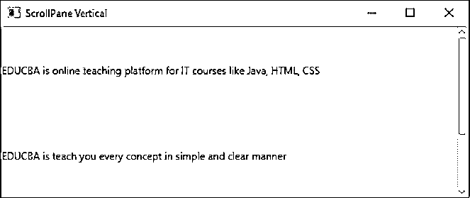
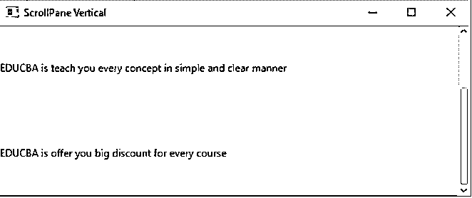
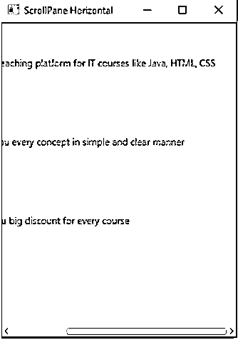
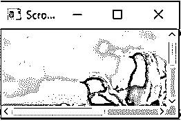

# Javafx Scrollpane

> 原文：<https://www.educba.com/javafx-scrollpane/>


## Javafx 滚动条简介

JavaFX Scroll Pane 控件是一个容器，它在水平和垂直方向上围绕 UI 组件有两个滚动条，如果组件大于滚动窗格区域的可见区域的话。这些滚动条使用户能够滚动显示在滚动窗格内的 UI 组件，因此我们可以看到组件的不同区域。JavaFX 包位于 Java FX . scene . control . scroll pane 包中。

**优势**

<small>网页开发、编程语言、软件测试&其他</small>

滚动窗格允许通过垂直和水平滚动来查看完整的元素。

**构造器**

**ScrollPane():** 这是一个默认的构造函数，用来创建一个滚动窗格实例。

**常用方法**

*   **setContent():**Java FX 中的 set content()方法与 ScrollPane 一起使用，用于将任何内容设置到 ScrollPane 实例中。

*   **setPannable(true):**Java FX 中的 setp annable(true)方法与 ScrollPane 一起使用，通过单击并移动光标来预览图像。默认情况下，setPannable()为 false。

*   **setPrefSize():**Java FX 中的 setPrefSize()方法与 ScrollPane 一起使用，用于设置滚动窗格的首选大小。

*   **setVbarPolicy():**Java FX 中的 setVbarPolicy()方法与 ScrollPane 一起使用，用于设置滚动窗格的垂直策略。

*   **setHbarPolicy():**Java FX 中的 setHbarPolicy()方法与 ScrollPane 一起使用，用于设置滚动窗格的水平策略。

### 如何在 JavaFX 中创建 ScrollPane？

*   访问 JavaFX 特性的用户定义类必须扩展应用程序类。在 JavaFX 中，创建 ScrollPane 是第一步。ScrollPane 可以通过使用 new 关键字进行实例化。

**语法:**

```
ScrollPane scrollPane=new ScrollPane();
```

*   第二步是向 scrollPane 添加内容或滚动条策略或 setPannable 属性。

**语法:**

```
scrollPane.setContent();
scrollPane.setVbarPolicy();
scrollPane.setHbarPolicy();
```

*   创建平铺窗格或任何其他显示(如 HBox 或 VBox 等。根据需求)类添加项目是第三步。

**语法:**

```
TilePane tPane=new TilePane (); **//**Gives horizontal box
```

*   创建一个场景意味着屏幕显示输出是第四步。

**语法:**

```
Scene screen = new Scene(tPane, length, width);
```

*   将场景参考屏幕添加到舞台对象参考是第五步。将输出屏幕添加到舞台。我们将从开始预定义的 JavaFX 方法中获取这个 stage 对象引用。

**语法:**

```
stage.setScene(screen);
```

*   最后通过 show()方法显示 stage 引用来显示输出屏幕。

**语法**:

```
stage.show();
```

### Javafx 滚动条示例

下面举几个例子

#### 示例#1

向 ScrollPane 和垂直滚动条添加标签内容示例

**JavaFX 代码:**

```
package com.scrollpane;
import javafx.application.Application;
import javafx.scene.Scene;
import javafx.scene.control.Label;
import javafx.scene.control.ScrollPane;
import javafx.scene.control.ScrollPane.ScrollBarPolicy;
import javafx.scene.layout.VBox;
import javafx.stage.Stage;
public class ScrollPaneVerticlaScrollBar extends Application {
@Override
public void start(Stage primaryStage) {
// setting the title of application
primaryStage.setTitle("ScrollPane Vertical");
// Create a ScrollPane
ScrollPane scrollPane = new ScrollPane();
//creating labels for adding content
Label labelContent = new Label(
"EDUCBA is online teaching platform for IT courses like Java, HTML, CSS");
//setting preferable size(height and width) for the label content
labelContent.setPrefSize(400, 100);
Label labelContent1 = new Label(
"EDUCBA is teach you every concept in simple and clear manner");
labelContent1.setPrefSize(400, 100);
Label labelContent2 = new Label(
"EDUCBA is offer you big discount for every course");
labelContent2.setPrefSize(400, 100);
//creating VBox for adding all labels
VBox vBox=new VBox();
vBox.getChildren().add(labelContent);
vBox.getChildren().add(labelContent1);
vBox.getChildren().add(labelContent2);
// Setting the content to the ScrollPane
scrollPane.setContent(vBox);
// Always show vertical scroll bar for scrolling
scrollPane.setVbarPolicy(ScrollBarPolicy.ALWAYS);
//adding scroll pane to the scene
Scene scene = new Scene(scrollPane, 551, 201);
primaryStage.setScene(scene);
//showing the output
primaryStage.show();
}
public static void main(String[] args) {
//invoking main method from JVM
launch(args);
}
}
```

**输出:**







**说明:**

*   我们已经向 VBox 和 ScrollPane 添加了标签内容。
*   我们可以在上面的输出中看到，由于 setVPolicy()，内容在垂直方向上滚动。

#### 实施例 2

向 ScrollPane 和水平滚动条添加标签内容示例

**JavaFX 代码:**

```
package com.scrollpane;
import javafx.application.Application;
import javafx.scene.Scene;
import javafx.scene.control.Label;
import javafx.scene.control.ScrollPane;
import javafx.scene.control.ScrollPane.ScrollBarPolicy;
import javafx.scene.layout.VBox;
import javafx.stage.Stage;
public class ScrollPaneHorizontalScrollBar extends Application {
@Override
public void start(Stage primaryStage) {
// setting the title of application
primaryStage.setTitle("ScrollPane Vertical");
// Create a ScrollPane
ScrollPane scrollPane = new ScrollPane();
//creating labels for adding content
Label labelContent = new Label(
"EDUCBA is online teaching platform for IT courses like Java, HTML, CSS");
//setting preferable size(height and width) for the label contentlabelContent.setPrefSize(400, 100);
Label labelContent1 = new Label(
"EDUCBA is teach you every concept in simple and clear manner");
labelContent1.setPrefSize(400, 100);
Label labelContent2 = new Label(
"EDUCBA is offer you big discount for every course");
labelContent2.setPrefSize(400, 100);
//creating VBox for adding all labels
VBox vBox=new VBox();
vBox.getChildren().add(labelContent);
vBox.getChildren().add(labelContent1);
vBox.getChildren().add(labelContent2);
// Setting the content to the ScrollPane
scrollPane.setContent(vBox);
// Always show vertical scroll bar for scrolling
scrollPane.setHbarPolicy(ScrollBarPolicy.ALWAYS);
//adding scroll pane to the scene
Scene scene = new Scene(scrollPane, 300, 400);
primaryStage.setScene(scene);
//showing the output
primaryStage.show();
}
public static void main(String[] args) {
//invoking main method from JVM
launch(args);
}
}
```

**输出:**





**说明:**

*   我们已经向 VBox 和 ScrollPane 添加了标签内容。
*   我们可以在上面的输出中看到，由于 setHPolicy()，内容在水平方向滚动。

#### 实施例 3

向 ScrollPane 以及水平和垂直滚动条添加图像示例

**JavaFX 代码:**

```
package com.scrollpane;
import javafx.application.Application;
import javafx.scene.Scene;
import javafx.scene.control.ScrollPane;
import javafx.scene.control.ScrollPane.ScrollBarPolicy;
import javafx.scene.image.Image;
import javafx.scene.image.ImageView;
import javafx.stage.Stage;
public class ScrollPaneImageVHScrollBar extends Application {
@Override
public void start(Stage primaryStage) {
// setting the title of application
primaryStage.setTitle("ScrollPane Image Horizontal and Vertical");
// Create a ScrollPane
ScrollPane scrollPane = new ScrollPane();
//creating image for adding image to scroll pane
Image roses = new Image(getClass().getResourceAsStream("2.jpg"));
scrollPane.setContent(new ImageView(roses));
// Always show horizontal scroll bar for scrolling
scrollPane.setHbarPolicy(ScrollBarPolicy.ALWAYS);
// Always show vertical scroll bar for scrolling
scrollPane.setVbarPolicy(ScrollBarPolicy.ALWAYS);
//adding scroll pane to the scene
Scene scene = new Scene(scrollPane, 200, 100);
primaryStage.setScene(scene);
//showing the output
primaryStage.show();
}
public static void main(String[] args) {
//invoking main method from JVM
launch(args);
}
}
```

**输出:**




**说明:**

*   我们已经将图像添加到 ScrollPane 中。
*   我们可以在上面的输出中看到，由于 setVPolicy()和 setHPolicy()，图像分别在垂直方向和水平方向上滚动。

### 结论

JavaFX ScrollPane 用于通过应用滚动条策略 setVPolicy()和 setHPolicy()使元素的内容变得可滚动。

### 推荐文章

这是 Javafx Scrollpane 的指南。这里我们讨论如何在 JavaFX 中创建 ScrollPane，并给出例子和输出。您也可以看看以下文章，了解更多信息–

1.  [JavaFX 控制器](https://www.educba.com/javafx-controller/)
2.  [JavaFX 矩形](https://www.educba.com/javafx-rectangle/)
3.  [JavaFX 库](https://www.educba.com/javafx-libraries/)
4.  [JavaFX 菜单](https://www.educba.com/javafx-menu/)


