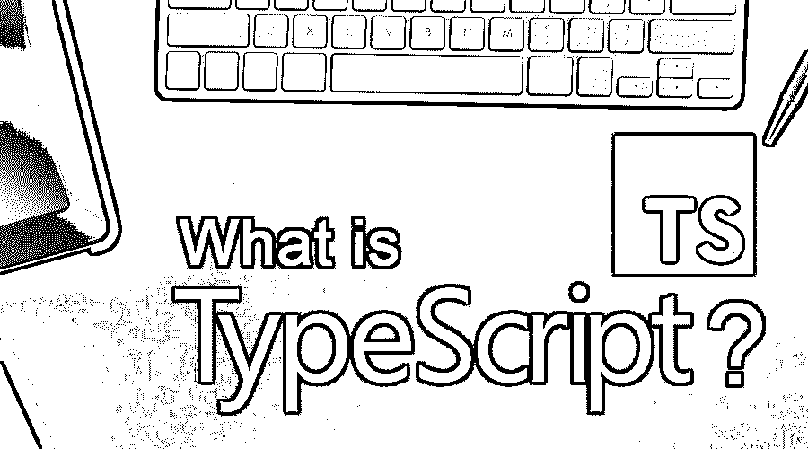
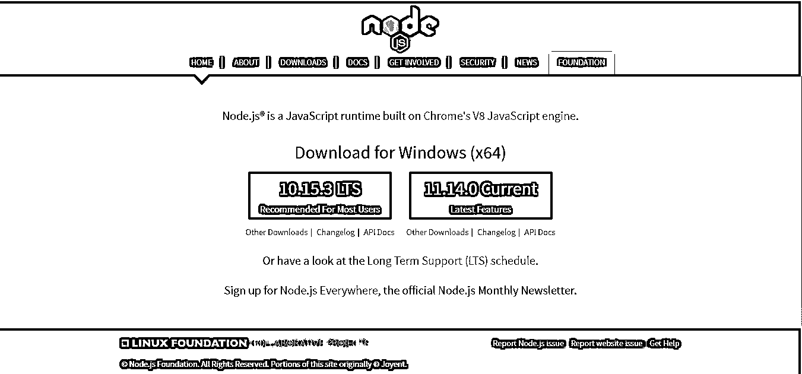
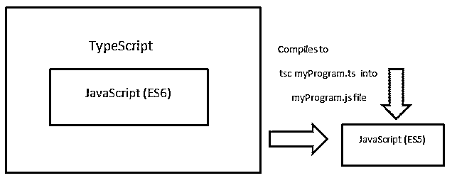
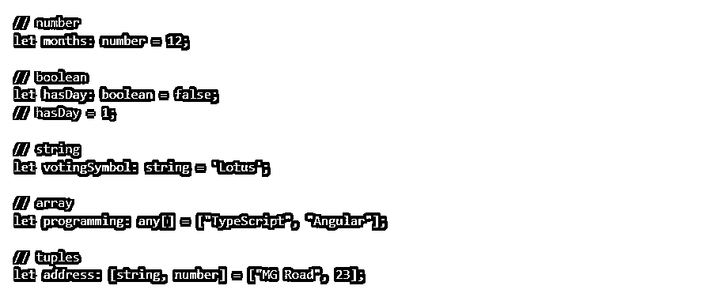
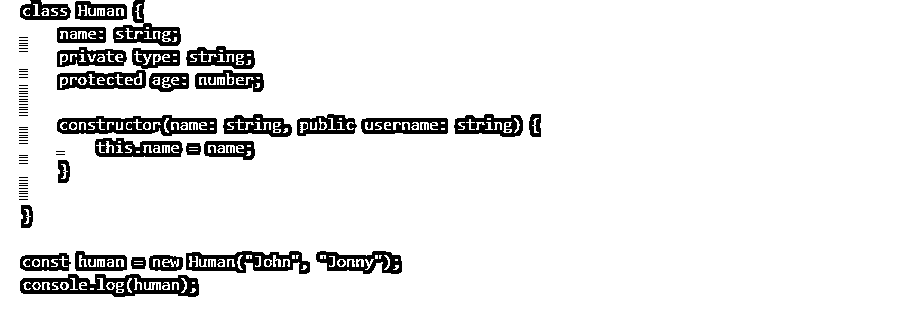

# 什么是 TypeScript？

> 原文：<https://www.educba.com/what-is-typescript/>

## TypeScript 简介

TypeScript 可以是微软公司创建和维护的[面向对象编程语言](https://www.educba.com/object-oriented-programming-in-java/)。这是 JavaScript 的超集，拥有它的所有组件，也知道它可以是具有类、可选类型、接口甚至更多的现代 JavaScript。它是一种强类型语言。web 浏览器无法运行 TypeScript。TypeScript 编译器编译代码并进入在网络浏览器上运行的 [JavaScript 代码](https://www.educba.com/javascript-string-functions/)。

### 安装过程

下面给出了安装过程:

<small>网页开发、编程语言、软件测试&其他</small>

1.首先，在您的机器上安装 Node js，因为它支持 NPM(节点包管理器)。

2.去 nodejs.org 网站下载。

3.安装节点 js，然后打开命令提示符或终端，使用 Node–v 类型检查节点的版本，并按 enter 键。

4.你现在可以安装 NPM 的打字稿了。再次通过命令提示符或终端，键入下一个命令来设置 Typescript。

5.该命令可以全局安装 Typescript，允许您在每个项目中使用它。设置完成后，您可以通过 tsc -v 检查版本。

6.现在可以使用 Typescript 了。用代码编辑器生成一个新文件，这个文件的扩展名也应该是. ts。

7.Web 浏览器不理解 Typescript 程序；因此，TypeScript 编译器编译代码并将其转换为 JavaScript。

8.这个命令立即生成一个 JavaScript 文件，并将 Typescript 程序转换成. js 扩展名。

例如，它将文件 myProgram.ts 创建为一个 myProgram.js JavaScript 文件。

**强力打字**

它支持 ES (ECMAScript) 6 或 ES 2015 JavaScript 版本，但由于 TypeScript 转换为 ES5 版本，ES 2015 并非在所有浏览器中都受支持。然而，ES5 支持并运行在所有浏览器中。

让我们继续使用 Typescript 的关键特性。不同于 JS；我们能够指定每个变量的类型，因为数字、字符串、布尔、数组、元组、枚举、任意等等。

在下面，您可以观察到一些强类型的例子:

### 类型脚本的面向对象特性

它可以是一种简单的面向对象的编程语言，提供这方面的可靠特性，包括类、接口、模块、继承等等。

例如，我们可以定义一个类:

我们现在已经创建了一个人类类，我们还可以用 new 关键字生成实例。

一旦分配了 Human()对象，我们就不必再次表达它们的类型。可以通过打字稿即时进行。

在面向对象编程中，我们有一个称为构造函数( )的基本方法。每个类本质上都提供了一个默认的构造函数方法，就好像我们创建了这个类的一个实例一样:

在面向对象编程中，访问修饰符用于限制或允许从外部访问类的变量。

您会发现 3 种不同的访问修饰符:

*   **Public:** 允许超出类的访问。
*   **私有** **:** 不允许超出类的访问。
*   **Protected :** 只允许在类和派生类中访问。

### 优势

下面是提到的优点:

*   它可以是一种简单的面向对象的编程语言；用 TypeScript 写程序很简单，很少理解。
*   这既可以用于客户端开发，也可以用于服务器端开发。
*   编译器可以转换成在所有网络浏览器上运行的 JavaScript 等效程序。
*   它对 IntelliSense 有极好的工具支持，例如，TypeScript 程序编译和 IntelliSense。就像可以添加代码一样，IntelliSense 会给出有效的提示。
*   用 TypeScript 编写的程序可读性更好。程序员还可以更快地添加或替换程序，因为这有助于他们记住每一位代码的描述。
*   这个程序既简单又简洁。就像开发人员编写程序一样，TypeScript 中的静态类型可以发现错误，允许他们创建更健壮的程序并保留它。

### 为什么要用 TypeScript？

*   动态语言中的代码重构更难开发，更难保持好的程序；它可以通过合适的软件帮助程序重构。
*   程序质量可以用主要使用静态类型程序的[静态分析软件](https://www.educba.com/top-10-free-statistical-analysis-software/)来进行。如果是这样，TypeScript 很棒。
*   网络浏览器不能很好地执行所有的功能。你需要支持旧的网络浏览器。它简化了特征，并且可以向下编译到较旧的 emit。

### 这项技术将如何帮助你的职业发展？

*   可能是《安古拉 2》到《安古拉 7》中使用的语言。与 JavaScript 相反，它可以被描述为一种非常简单的语言，可能更喜欢 C#。与 JavaScript 相比，它似乎是有机的。
*   与[反应相反。JS Angular](https://www.educba.com/reactjs-vs-angular2/) ，它基本上是一个完整的 MVC 平台，这对于任何一种适当规模的 web 应用程序都是很重要的。
*   这在前端环境中会越来越出名。目前，这些人中的许多人希望在他们未来的项目中使用或者学习 TypeScript。

这两个因素非常好，它们将帮助你预测未来五年的美好未来。

### 结论

它提高了您执行重构的速度。对于编译器来说，帮助你捕捉错误比拥有运行时不成功的点更重要。这将是你能拥有的最好的文件类型之一。函数签名是一个定理，函数体也是。它为你的效率和程序员知识提供了许多奖励。我们注意到，将它添加到当前的 JavaScript 项目中很简单，而且开销也很小。它绝对不仅仅是有角的不同；其他有效的前端框架，包括 React 和 Vue，开始与 TypeScript 结合，以允许程序员团队开发可靠、环保和可扩展的应用程序。JavaScript 和 TypeScript 虽然没有相互竞争，但仍在持续增长。它旨在增强和改进 JavaScript——当然不是取代它。在不久的将来，我们将会看到他们都有同样的好成绩。保持静态类型的替代。

### 推荐文章

这是一个什么是类型脚本的指南？这里我们讨论了 TypeScript 的用途、职业成长、功能和安装过程。您也可以浏览我们推荐的其他文章，了解更多信息——

1.  [什么是敞车？](https://www.educba.com/what-is-open-cart/)
2.  [什么是 OLTP？](https://www.educba.com/what-is-oltp/)
3.  [打字稿版本](https://www.educba.com/typescript-versions/)
4.  [打字稿功能](https://www.educba.com/typescript-functions/)

