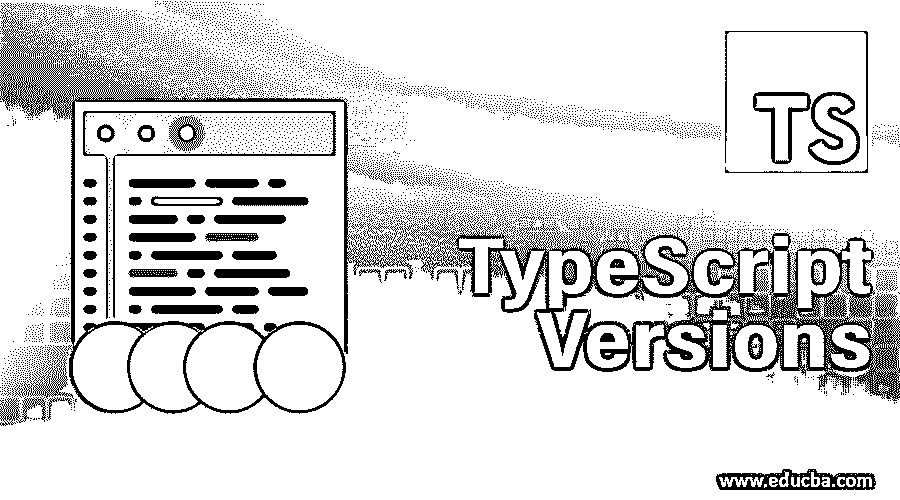

# 打字稿版本

> 原文：<https://www.educba.com/typescript-versions/>




## 类型脚本版本介绍

我们都知道打字现在很流行。它只不过是 JavaScript 的[超集。这仅仅意味着它只是一个具有严格类型功能的 javaScript。在 Angular 2+版本中，我们主要使用它来方便编码。因此，在本文中我们将看到不同的 typescript 版本。](https://www.educba.com/what-is-javascript/)

最初，它是由微软在 2012 年推出的。它的第一个版本是 0.8。此后，下一个版本出现了，即 0.9。哪个是 2013 年开发的？它有很多缺点，比如对其他操作系统和 IDE 的支持。后来的 1.0 版本在 2014 年推出了这些改进。2016 年进一步推出 2.0 版本。

<small>网页开发、编程语言、软件测试&其他</small>

### 类型脚本版本列表

下面是下面提到的类型脚本版本的列表:

*   **1.1 版本:**1.1 版本问世时，它的速度比旧版本快了近四倍。这对改进 Javascript 项目非常有用。
*   版本 1.3 :在这个版本中，它引入了一个访问修饰符，即 protected，就像你在 java 或其他语言中看到的那样。如果你不知道它是什么意思，那么让我告诉你，它只允许类及其子类使用被抗议类的成员。
*   **版本 1.4** : ES6 的特性正在被使用，就像用 let 和 const 关键字声明变量，而不是使用 var 关键字，后者倾向于创建提升场景。这里改进了泛型调用的严格性。
*   **版本 1.5:** 这个支持 ES6 中的模块。它增强了导入和导出不同模块的功能。
*   1.6 版本: 1.5 版本支持 JSX。这就是 javascript-XML。JSX 在最后只被编译成了 javascript。它提出了一个新的扩展。嵌入 jsx 的 tsx。它还引入了一个操作符来重命名导入。
*   **版本 1.7:** 这给了 Async-Await 和 Promises 对异步编程的支持，这对 ES6 中最新的编程[实践非常重要。](https://www.educba.com/what-is-es6/)
*   **版本 1.8:** 这允许来自同一参数表的引用类型参数。这解决了许多问题，
*   版本 2.0: 在这个版本中，使用空的和未定义的数据类型在特定的场景中分配值需要一些时间。以前很难识别空的和未定义的错误。
*   版本 2.1: 这给了我们一些可选键的能力。在此版本中，键和查找类型得到了增强。
*   版本 2.2: 这个版本给了我们使用 ES6 的 mixin 类和 mixin 构造器类型的能力。它还支持 JSX 表达式中的扩展运算符。
*   版本 2.3: 它支持 ES6 的特性，比如生成器和迭代器。以前，这些功能只受 ES6 和更高版本支持，但不是从这个版本，我们可以在这里使用。
*   版本 2.4: 在这个版本中，我们可以在需要的时候将程序中的任何库或模块导入到任何地方。这也称为动态导入表达式。这也引入了枚举的字符串初始化。
*   **版本 2.5:** 这引入了可选的 catch 语句和类型断言，语法为/** @type {…} */。此外，这个版本允许我们获得新的更新版本的包，而不需要通过将包重定向到新版本来复制它。
*   **2.6 版:**引入了–watch 标志来标记变更。它有一个严格的函数类型标志，用于严格检查函数的类型。它只忽略构造函数内部或任何方法中的方法。
*   版本 2.7: 这个版本允许我们用 const 关键字声明属性。例如:const Abc = "123 "。这也引入了一个名为–strictPropertyInitialization 的新标志。这用于初始化类的构造函数中的每个属性。它还有一个漂亮的标志，使错误消息更易读。
*   **2.8 版本:**引入了条件类型。你可以把它看作是一个[三元运算符](https://www.educba.com/python-ternary-operator/)。这就像如果..else 语句。语法:T 扩展 U？X : Y
*   版本 2.9: 在索引和映射类型中增加了对数字和符号命名属性的支持。以前它仅支持字符串。
*   **3.0 版:**这个版本允许我们在项目引用的帮助下将项目拆分成更小的项目。它提供了一个新的标志——构建。–构建标志为项目运行更快的构建。它还支持扩展表达式和 rests 参数中的元组。
*   **3.1 版本:**这用 package.json 文件中的新字段简化了版本争议。如下图所示:

```
{ "typesVersions": { ">=3.1": { "*": ["ts3.1/*"] }
```

*   **3.2 版本:**引入–strictBindCallApply 标志。这使我们能够访问像调用应用和绑定这样的方法。它还有–show config。这会刷新 tsconfig.json 文件。
*   **版本 3.3:** 它通过标记–构建和–观察减少了 50%到 70%的总构建时间。这有助于构建所需的文件。这也为调用联合类型引入了更好的行为。
*   **版本 3.4:** 这为我们提供了应用程序快速构建过程的–incremental 标志。它会跟上变化，并相应地进行构建。为此，我们需要 tsconfig.json 文件**中的字段 incremental 为 true。**
*   **3.5 版本:**到目前为止，这里发生了一些小变化，改进了–增量标志。通过构建和类型检查实现了良好的优化。这也引入了省略帮助器类型，它从原始定义中删除一个属性。
*   版本 3.6: 这个版本改进了生成器的类型检查。之前我们不知道这个值是由生成器返回的还是生成的。但是现在我们可以检查它的正确类型。这也极大地支持 Unicode 字符。它还有一个更智能的自动导入语法。
*   **3.7 版本:**这是最新发布的版本。这个版本引入了一些突破性的变化，如函数真实性检查，API 的变化。可选链接是一个问题。我们利用它了吗？这是接线员。?操作员使属性成为可选访问。它还有一个无效合并运算符(？?)喜欢可选链接。此外，资产功能的使用也得到了改进。

### 结论

早期的 Typescript 在使用时有许多问题。现在最新的版本已经修复了大部分的错误。如果你想深入了解，你可以一直关注它的官方网站的文档。

### 推荐文章

这是一个打字稿版本的指南。这里我们详细讨论 typescript 的基本概念和不同版本。您也可以阅读以下文章，了解更多信息——

1.  [计算机网络的类型](https://www.educba.com/types-of-computer-network/)
2.  [打字稿操作符](https://www.educba.com/typescript-operators/)
3.  [打字稿数组](https://www.educba.com/typescript-array/)
4.  [打字稿功能](https://www.educba.com/typescript-functions/)


