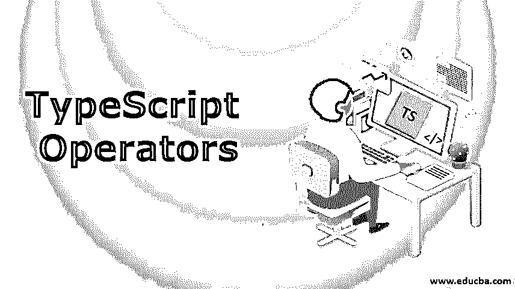
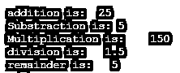
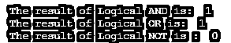
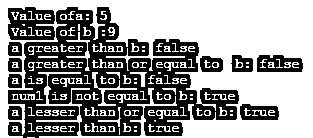
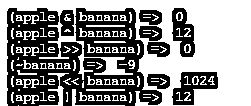

# 类型脚本运算符

> 原文：<https://www.educba.com/typescript-operators/>




## TypeScript 运算符简介

每种语言都有一些运算符。你可能知道其他编程语言中的运算符[。运算符是我们可以用来执行一些运算的运算符，类似于算术加法减法等，以便使用这些功能。当然很有帮助。我们可以说有一些函数是语言预先定义的。在这个主题中，我们将学习不同的类型脚本操作符。](https://www.educba.com/what-is-a-programming-language/)

### TypeScript 中的不同运算符

我们都知道 Typescript 是 JavaScript 的[超集。最终，JavaScript 中的任何代码都只能在 Javascript 中编译。让我们一个一个来看运营商。](https://www.educba.com/what-is-javascript/)

<small>网页开发、编程语言、软件测试&其他</small>

#### 1.赋值运算符

赋值运算符(=)等于算术中的符号。我们可以将这个运算符与其他运算符连接起来。这个[赋值运算符](https://www.educba.com/assignment-operators-in-java/)从左到右赋值。

**举例:**

a = 10

在上面的例子中，我们给变量 a 赋值 10，和代数中一样。以下是[赋值运算符](https://www.educba.com/assignment-operators-in-python/)与算术运算符的一些组合。假设我们有 x 和 y

x =10，y=20

x+=y = >这给出了 x 和 y 的相加

这是 x = x + y 的简写语法。

你可以，

console . log(x)；

对所有四个减法、乘法和除法都这样做。

x –= y；// x = x-y

x * = y；// x = x*y

x/= y；//x = x/y

一定要练习，因为对于许多程序员来说，赋值的速记语法有点令人困惑。

#### 2.算术运算符

*   现在，这是一个重要的问题。我们在学校认识算术运算符。数学中我们首先介绍的是算术运算符。
*   这些运算符是+(加号)、-(减号)、*(乘法)、/(除法)
*   在下面的例子中，我们简单地应用一些方法来实现与代数相同的功能。
*   我们有两个带有值的变量，在算术运算符的帮助下，我们正在执行不同的任务。

**举例:**

```
let a:number = 15;
let b:number = 10;
let result:number = 0;
result = a + b
console.log("addition is: "+result);
result = a - b;
console.log("Substraction is: "+result);
result = a*b
console.log("Multiplication is:"+result);
result = a/b
console.log("division is:"+result);
result = a%b
console.log("remainder is:"+result);
```

**输出:**




#### 3.逻辑运算符

*   [逻辑运算符的作用](https://www.educba.com/logical-operators-in-powershell/)顾名思义，这些运算符本质上是逻辑的。这些在 if 这样的条件语句中更有用..否则。
*   逻辑运算符有&& (and)、||(or)、！(不是)。
*   如果我们熟悉真值表，那么这些运算符的工作将会非常容易。如果没有，别担心，我们会看到的。
*   只要记住 AND 运算符，如果两个条件都为真，那么只有最终输出为真。
*   使用 OR ( ||)运算符，如果两个条件中的任何一个为真，则输出将为真。
*   NOT 运算符是最简单的一种。它会给出相反的值。如果它是真的，那么它将使它假。

**举例:**

```
let a:number = 100;
let b:number = 450;
var result:boolean = ((a>10)&&(b>50));
console.log("The result of Logical AND is: ",+result);
var result:boolean = ((a>10)||(b>300));
console.log("The result of Logical OR is: ",+result);
var result:boolean=!((a>10)&&(b>100));
console.log("The result of Logical NOT is : ",+result);
```

**输出:**




#### 4.关系运算符

这些运算符总是提供布尔值，如 true 和 false。关系运算符有>(大于)、 =(大于或等于)、< =(小于或等于)、==(等于)、！=(不相等)等。

**举例:**

```
let a:number = 5;
let b:number = 9;
console.log("Value ofa: "+a);
console.log("Value of b :"+b);
let result =a>b
console.log("a greater than b: "+result)
result =a>=b
console.log("a greater than or equal to b: "+result)
result =a==b
console.log("a is equal to b: "+result)
result =a!=b
console.log("num1 is not equal to b: "+result)
result =a<=b
console.log("a lesser than or equal to b: "+result)
result =a<b
console.log("a lesser than b: "+result)
```

**输出:**




#### 5.按位运算符

这是运算符对每一位的作用。我们有按位 AND (&)、or (|)、XOR( ^)、NOT( ~)、<< Left Shift (<>、带零右移(> > >)。

**举例:**

```
let apple:number = 4;
let banana:number = 8;
let value;
value = (apple & banana);
console.log("(apple & banana) => ",value)
value = (apple ^ banana);
console.log("(apple ^ banana) => ",value);
value = (apple >> banana);
console.log("(apple >> banana) => ",value);
value = (~banana);
console.log("(~banana) => ",value);
value = (apple << banana);
console.log("(apple << banana) => ",value);
value = (apple | banana);
console.log("(apple | banana) => ",value)
```

**输出:**




#### 6.字符串运算符

该运算符也称为串联。这由加号(+)定义。

**举例:**

```
let greet:string = "Welcome"+"Bob"
console.log(greet);
```

**输出:**


在上面的例子中，我们在加号运算符的帮助下连接了两个值。我们可以这样组合字符串类型。

#### 7.类型运算符

这对 typescript 非常有帮助，因为它显示了给定操作数的类型。

**举例:**

```
let num = 12
console.log(typeof num);
```

**输出:**


根据分配给特定变量类型的值，运算符显示结果。如果 t 值是一个字符串，那么它将显示字符串作为它的一种类型。

#### 8.三元/条件运算符

如果你熟悉 If..else 语句，那么你很快就会明白了。它的工作原理与编程中的条件语句相同。

这有三个目标首先是条件。第二个是条件为真时的表达式。第三个是条件为假时的表达式。

**举例:**

```
let toffies:number = 7
let count = toffies > 5 ?"TOffies are enough":"Need to buy more toffies"
console.log(count)
```

**输出:**


仔细看上面的例子。当你自己尝试的时候，你会了解一个想法。

### 结论

为了完全理解任何编程语言中的操作符，你需要用不同的例子来练习这些操作符。一旦你用一种语言讲述了它，它就适用于所有人。所以编程 id=s 中的一个基本部分已经介绍过了。所以尽量在学习任何编程语言的初始阶段就搞定。

### 推荐文章

这是 TypeScript 操作符的指南。这里我们讨论了 typescript 中的简介和各种操作符，包括赋值、算术、逻辑、关系操作符等。您也可以阅读以下文章，了解更多信息——

1.  [打字稿版本](https://www.educba.com/typescript-versions/)
2.  [安装打字稿](https://www.educba.com/install-typescript/)
3.  [什么是 TypeScript？](https://www.educba.com/what-is-typescript/)
4.  [打字稿功能](https://www.educba.com/typescript-functions/)


