# 网络包反应

> 原文：<https://www.educba.com/webpack-reactjs/>


## Webpack ReactJS 简介

Webpack ReactJS 是 NodeJS 之上的模块捆绑系统，是现代化 JavaScript 应用程序的捆绑器。Webpack ReactJS 的主要目的是捆绑 JS 文件，以便在浏览器中使用。ReactJS 中的 Webpack 在内部处理应用程序时，依赖图是从一个或多个入口点构建的，这些入口点组合了作为静态资产的每个模块。

### 什么是 Webpack ReactJS？

当我们编写代码时，JavaScript 代码和浏览器执行和理解的代码之间存在明显的差距。因此，为了理解这一差距，开发人员依赖于各种资源和现代浏览器不支持的其他功能，在这里，大多数 JavaScript bundlers 用于填补这一差距。和 React Webpack 中最好的模块捆绑器，用于交叉浏览，并为开发人员保留完全的控制权，并对定制开放。

<small>网页开发、编程语言、软件测试&其他</small>

还有其他的选择，比如 Browserify、Brunch 和 package，但是，Webpack 是被广泛接受和使用的模块，已经在全球 ReactJS 开发社区中证明了它的优点。

使用 Webpack ReactJS 的一些优点是:

*   增强 React 应用程序的稳定性。
*   利用名为“热模块更换”的特性优化开发时间。
*   拥有 React Build 系统的绝对控制权。

### 如何使用 Webpack ReactJS？

在 ReactJS 中开始使用 Webpack 之前，应该确保全局安装了最新版本的 NodeJS 和 npm。

与 React 应用程序的创建类似，Webpack React 是一个命令行工具，用于创建一组资产，即代码和文件。这不会在服务器或浏览器上运行。Webpack 接收所有 JavaScript 文件和其他资源，同时将它们转换成一个大文件，因此该文件可以发送到服务器或浏览器，这取决于为网站设置的呈现样式。

通常，Webpack ReactJS 是用一个标记为 webpack.config.js 的文件配置的，因为所有需要的配置都写在这里。

### 如何在 ReactJS 中创建 Webpack？

下面给出了如何在 ReactJS 中创建 webpack:

**第一步:**安装 NodeJS，VSCode(任何支持 Webpack 文件的编辑器，很可能都支持脚本代码)。

**第二步:**打开命令提示符，用下面的命令创建一个目录或文件夹。

**命令:**

```
mkdir <directory/ file name> will create a directory inside C: Drive as shown
cd <directory/ file name> will open the file, required to perform further operations.
```

**输出:**

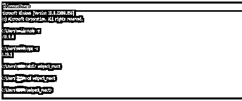


**步骤 3:** 然后，需要用下面的命令初始化 npm。

**代码:**

```
npm init -y
```

**输出:**

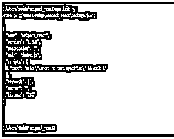


它将使用上述脚本生成一个 package.json 文件。我们可以手动打开该文件夹，检查 package.json 是否已创建。

**步骤 4:** 现在需要使用下面的命令添加依赖项。向代码添加依赖项取决于用户需求或功能需求。

**安装依赖项的命令:**

```
npm i <dependency_name>
```

**输出:**

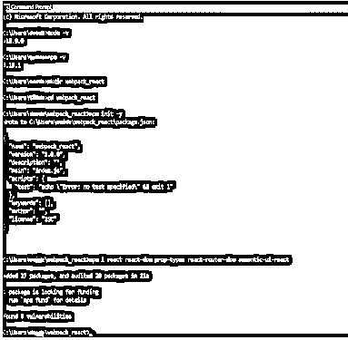


同样，再添加几个依赖项。

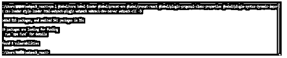


现在让我们检查 package.json 中的依赖项，这里的屏幕截图显示了 Visual Studio 代码编辑器。所有已安装的依赖项和相关依赖项的脚本如下。

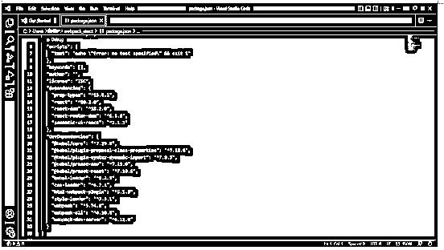


步骤 5: 现在我们需要为 Babel 配置设置 Babel RC 文件，如下所示。点击添加文件，并将其命名为。babelrc 并在其中输入脚本。

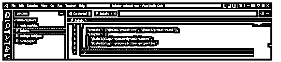


这意味着告诉 Babel 使用已安装的插件或依赖项。在稍后阶段，当用户从 Webpack React 调用 babel-loader 时，程序将知道在哪里寻找依赖项。

**步骤 6:** 现在创建 webpack.config.js 文件，并编写如下所示的脚本。

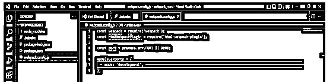


端口号可能因可用性而异。它是 webpack 的基本 shell 脚本。在第 7 行中，“模式”将 webpack 配置定义为“开发”或“生产”。开发模式针对开发人员的体验和速度进行了优化，而生产模式提供了在部署应用程序时有用的默认值。

**第 7 步:**要让这个 webpack 运行，我们需要提供一个入口点，React 应用程序捆绑过程从这里开始。

Webpack 有各种版本，在 Webpack 4 中，如果没有包含入口点，它将认为入口点位于。/src 目录。

还可以列出输出和文件名，因为它告诉 webpack 将编译后的文件写入何处，文件名将由 webpack 不时生成的哈希替换，然后应用程序会更改并重新编译。

此外，devtool 创建了帮助调试应用程序的源映射。尽管有各种类型源映射，内联源映射只能用于开发模式。

**步骤 8:** 同样，模块是模块应用的类型，包括诸如 Babel 和 CSS 模块。并且这些规则适用于用户如何处理每个模块。

第 9 步:我们有两条规则，第一条规则是用。js 扩展通过 babel loader 使用 Babel 来帮助查找 JavaScript 文件。

第十步:下一个规则是用。css 扩展。可以使用两个加载器，css 加载器和样式加载器来处理 css 文件。用户指示 css loader 使用带有骆驼大小写的 css 模块，并创建源地图。

**步骤 11:** 我们还使用 html webpack 插件，它接受具有不同选项的对象。在这里，让我们指定正在使用的 HTML 插件以及 bundler analyzer 的其他依赖项。

**步骤 12:** 然后通过指定 localhost 和端口来配置开发服务器。如果要自动启动应用程序，需要将 historyApiFallback 设置为 true，open 设置为 true。

下面是第 7 步截图中的完整脚本，这是 ReactJS 中 webpack 文件的创建方式。

**Webpack.config.js 文件脚本示例:**

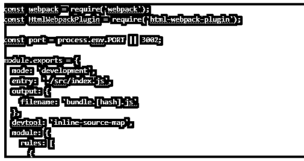


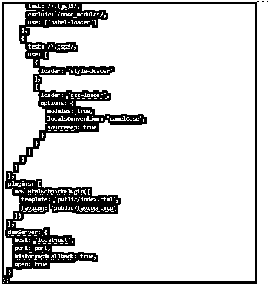


### Webpack ReactJS 示例

我们已经在上面的上下文中配置了 Webpack，现在我们将创建一个 Webpack React 示例以获得实际经验。如果需要对 webpack.config.js 进行任何修改，可以根据示例进行修改。

**第一步:**在项目目录下创建一个源文件夹，同时在源文件夹下创建如下所示的几个文件。

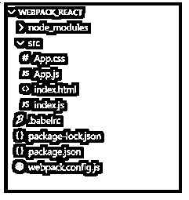


**第二步:**在 App.js 文件中，我们来点脚本。

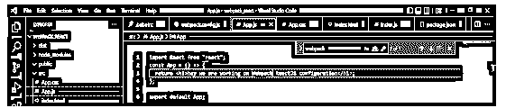


**第三步:**添加几个 css 相关代码。

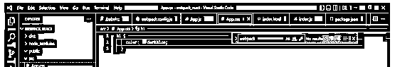


第四步:为 index.html 编写如下代码。在第 12 行，脚本指向 bundle.js 文件。

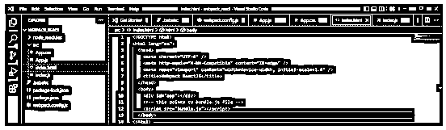


**第五步:**为 index.js 文件编写代码，渲染 App.js 文件。

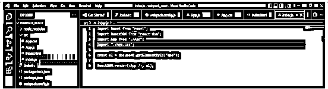


**第 6 步:**需要创建启动和构建脚本如下。

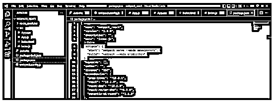


**步骤 7:** 现在运行应用程序，并根据需要进行修改。相应地对 webpack.config.js 进行必要的修改。

**运行应用程序的命令:**

```
npm run start
```

**输出:**

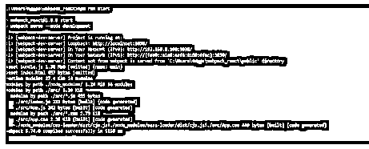


**步骤 8:** 要构建应用程序，使用命令 npm run build。

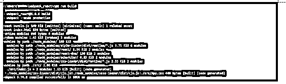


**第九步:**您可以检查本地主机上运行的代码，端口为给定的 3030。http://localhost:3030/这是 ReactJS 应用程序与依赖项一起运行的 webpack 配置的输出和实例。


### 结论

至此，我们结束了主题“Webpack ReactJS”。我们已经了解了什么是 webpack，以及如何在 ReactJS 中使用、配置或创建它。我们还看到了如何创建 webpack 文件并根据用户需求配置它的一步一步的过程。还展示了一个 ReactJS 应用程序的简单示例，该应用程序已经用 webpack.config.js 文件配置了依赖项、条目和输出路径文件等。

### 推荐文章

这是 Webpack ReactJS 的指南。这里我们分别讨论入门，以及如何在 ReactJS 和 examples 中创建 webpack。您也可以看看以下文章，了解更多信息–

1.  [反应原生道具](https://www.educba.com/react-native-props/)
2.  [反应原生尺寸](https://www.educba.com/react-native-dimensions/)
3.  [反作用力渲染](https://www.educba.com/react-force-render/)
4.  [反应如果](https://www.educba.com/react-if/)


