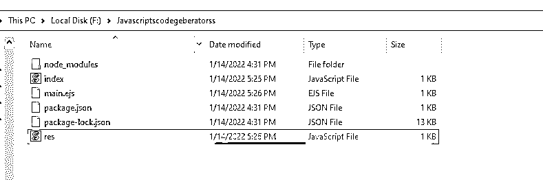
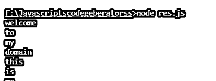
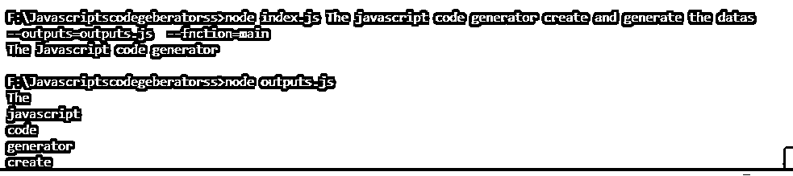

# 代码生成器 JavaScript

> 原文：<https://www.educba.com/code-generator-javascript/>


## 代码生成器 JavaScript 简介

生成器函数主要用于创建和构建新的生成器，调用它们的主体一般不会立即执行。但是，它们可以在代码生成执行过程中暂停，如果继续执行，yield 语句将停止代码生成器操作。此外，当类似 npm 的 node.js 版本支持 ES6 和 javascript 函数时，它会返回一个新值。

### 创建代码生成器 javascript

NPM 和其他节点相关的项目需要通常的嫌疑人。它们与 Nodejs 版本一起使用，可以支持 ES6，如 ECMA 脚本 6 版本及其要点，如析构箭头函数。在我们工作过的任何地方的工作场所，如建议与很多人讨论模板的用法。其中一个主要的优势是，我们可以使用更多的脚手架和基础，而无需任何手工操作。我们更多地考虑用 routes、SCSSfiles、html 文件、apps.js、ejs 文件等搭建新组件。它可能会更加过度和不灵活，但是我们发现，随着越来越多的大型代码库的出现，已经存在了几年的特定模板已经成为事实的奇妙来源。它用于强制执行特定的编码风格，并且是让新开发人员进入指定代码库的一个极好的方法。主要是我们可以使用模板与我们的数据库中的编码模式相匹配的模式值。这是一种投资，就像拿起发电机，与更大的团队一起制作新模板一样。这可能有利于代码的一致性和开发速度的提高。我们可以使用 npm install js-code-generator 这样的命令来安装 javascript 代码生成器。这个命令可以安装代码生成器来处理代码缩进，以允许空格和制表符的数量。它提供了唯一性，并帮助生成迭代堆栈元素的变量。

<small>网页开发、编程语言、软件测试&其他</small>

声明这些元素和变量，并使用模板创建代码片段，这样可以更容易地用一些有用的模式声明代码。它将用于通过使用代码编辑器来检查循环和条件语句。在 web 浏览器中，代码片段主要用于共享团队，并通过可用插件轻松设置选项。一致函数参数返回带有指定参数和默认函数参数的值。

生成器还返回指定变量声明和实例的对象，以使用 Iterable 和 Iterator 协议控制迭代。从 ES2015 和 ES6 开始，我们可以使用循环等功能，传播使用类声明和创建的对象，以及数组、映射、集合、哈希集等集合。对于其他类型，如 String、Integer、double 和 char 类型，它也是指定的和可接受的。编辑器将指定代码，这些代码可用于调用默认的类和方法。每个 DOM 元素都被调用并引用 javascript 中的变量，以帮助生成指定名称的文件。

### 代码生成器 JavaScript 的示例

下面提到了不同的例子:

#### 示例#1

**Index.js**

```
const a = require("fs-extra")
const b = require("ejs")
const c = require("yargs-parser")(process.argv.slice(2))
const d = require("path")
const main = () => {
console.log("Welcome To My Domain its the first example for the Javascript code generator")
try {
const { _: leftovers, res, func } = c
const dt = {
func,
leftovers,
}
const optns = {}
if (!res || !func) {
console.error("--res and --func flag required")
process.exit(1)
}
const fNames = d.join(__dirname, "./main.ejs")
b.renderFile(fNames, dt, optns, function(ex, s1) {
if (ex) {
console.error(ex)
}
const outp = d.join(process.cwd(), res)
a.ensureFileSync(outp)
a.outputFileSync(outp, s1)
})
} catch (ex) {
console.error(ex)
}
}
main()
```

**main.ejs:**

`const <%= func %> = () => {
<% for (const arg of leftovers) { %>
console.log('<%= arg %>')
<% } %>
}
<%= func %>()`

**样本输出:**








在上面的例子中，我们使用 javascript 代码创建了代码生成器。这里，我在 visual studio 代码编辑器上创建 index.js 文件，并使用节点包声明 fs-extra、ejs 和 yargs-parser 的 const 和 require。在此之前，我们应该在执行之前将这三个必需的包安装在指定的文件夹中。

#### 实施例 2

**代码:**

```
const p = require("fs-extra")
const q = require("ejs")
const r = require("yargs-parser")(process.argv.slice(2))
const s = require("path")
const main = () => {
console.log("The Javascript code generator")
try {
const { _: tests, outputs, fnction } = r
const varss = {
fnction,
tests,
}
const optns = {}
if (!outputs || !fnction) {
console.error("--outputs and --fnction flag required")
process.exit(1)
}
const fnals = s.join(__dirname, "./main.ejs")
q.renderFile(fnals, varss, optns, function(excepts, varswe) {
if (excepts) {
console.error(excepts)
}
const outp = s.join(process.cwd(), outputs)
p.ensureFileSync(outp)
p.outputFileSync(outp, varswe)
})
} catch (excepts) {
console.error(excepts)
}
}
main()
const <%= fnction %> = () => {
<% for (const arg of tests) { %>
console.log('<%= arg %>')
<% } %>
}
<%= fnction %>()
```

**样本输出:**




我们使用相同的示例来创建代码生成器，使用上面示例的默认参数、方法和标志。在调用和利用参数值的 javascript 中，标志是最重要的；它只不过是定义了满足条件的单一值的变量；这就像是一种判断真假的布尔格式。它还控制函数流或语句来检查条件。

### 结论

代码生成器是 javascript 特性之一，从长远来看，它可以用更高的代码标准创造良好的开发体验。基于项目需求，我们可以利用这个框架来开发用例以及它与定制的和预定义的生成器相结合的其他特性增强。

### 推荐文章

这是一个代码生成器 JavaScript 的指南。在这里，我们讨论创建代码生成器 javascript 和示例，以及代码和输出。您也可以阅读以下文章，了解更多信息——

1.  [JavaScript 流](https://www.educba.com/javascript-stream/)
2.  [ES6 JavaScript](https://www.educba.com/es6-javascript/)
3.  [JavaScript 请求](https://www.educba.com/javascript-request/)
4.  [selenium JavaScript executor](https://www.educba.com/selenium-javascriptexecutor/)


