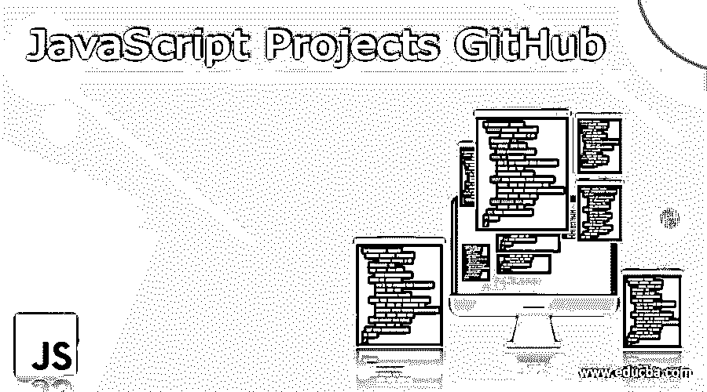

# JavaScript 项目 GitHub

> 原文：<https://www.educba.com/javascript-projects-github/>

## JavaScript 项目 GitHub 简介

javascript 项目 GitHub 是一个开源框架，帮助在单页面、多页面和动态应用程序中创建基于 web 的应用程序。开发人员和研究人员被广泛使用，他们追求在市场中成长的起步职业。git 是最重要的无工具开源库，它有许多不同的项目可以用于各种现代趋势。

### 热门 JavaScript 项目 GitHub

在目前的趋势下，任何类型的 web 应用都是 JS 的核心。JavaScript 技能可能会带来各种艰难而令人兴奋的就业机会，例如设计移动和桌面应用程序，使用 UI/UX 设计器和全栈开发人员创建和执行动态 web 应用程序。如果我们知道 JavaScript 的基本原理，项目将进入下一个逻辑步骤，提高性能。如果没有事先的编程知识，我们可以用一些基础知识来报名，然后它就会回到那个原来的项目。大多数 Javascript 项目维护下面列出的源代码，并理解 HTML 和 CSS 项目。

<small>网页开发、编程语言、软件测试&其他</small>

这里是一些主要的 javascript 项目，如突破游戏、视频播放器、货币汇率、存储卡、音乐播放器、打字游戏、搜索引擎。Github 是共享代码的主要部分，它有项目的开源，可以用来为 web 应用程序中的前端开发人员创建脚本语言。它随着一个几乎无处不在的开发行业而成长。作为一种输出，javascript 是大多数软件创建和共享平台中 Github 用户最广泛使用的。

### Javascript 的风格指南

JavaScript 语言的风格指南可以在 git 存储库中的每个基于 web 的项目中找到。它包含一些代码片段与一些逻辑代码分析，以及解释和参考将有助于更可靠和验证代码，如果包含任何错误或异常。该风格指南将包括 Javascript、React、CSS、SaSS 和 Ruby 语言，以在托管环境中实现应用程序。

### 节点的最佳实践

这个 git 代码库用于对当前趋势中最流行的 Node.js 进行更多的编译和管理。它拥有最广泛的收藏，根据 It 市场趋势，这些收藏每天和每月都在增长。目前，它有 n 个最佳实践、风格指南和架构建议来实现满足用户需求的项目。

### JavaScript 中的算法

我们可以使用任意数量的流行算法和数据结构，这些算法和数据结构在 git 存储库中使用 JavaScript 进行了演示。每种方法和数据结构都有自己的自述文件，其中包含解释和链接，用于进一步的步骤，如根据逻辑和要求读取和修改行。从 SDLC 流程(如需求、分析)开始，一步一步的过程就像一个整体项目，在这两个过程之后，它将进入设计步骤，根据需求设计应用程序。实施团队将根据他们的需求来实施应用程序。

### 关于 JavaScript 的问题

这个库经常更新，提供了大量高级 JavaScript 问题及其解释。根据项目存储库的具体情况，它可能会有所不同。

### JS 概念

这个存储库集合包含大量文章和 javascript 概念，其中包括 javascript 开发人员。它应该熟悉指定的顺序，以便全面掌握在 Javascript 框架上工作的应用程序的编程语言知识。

### 代码简洁的 JavaScript

软件工程的思想将被使用，并创建干净的代码，该代码已经被用于存储库中的 JavaScript 语言。主要是关于如何编写可读、可重用和可重构的 JavaScript 代码。

### 没听说过 JS

这是 JavaScript 语言内部工作的第一系列网络出版物。这一系列的版本仅在作品中显示，这些作品将在先前版本的在线 JS 项目中使用。

### 奇妙的 JavaScript

实体浏览器使用的 JavaScript 库和资源的集合。这个代码库将提供一个必须设置为模板引擎、文章和其他帖子文档的框架集合，就像反应式和函数式编程语言一样。它有更多的，所有这些都可以用于促进足智多谋，它更有可能帮助选择正确的技术栈的代码项目。

### JavaScript 项目 GitHub 指南

这个代码库主要包含 JavaScript 项目中的一组最佳实践，它们可以是任何类型的，并且有助于提高能力。这对于开发者来说是一个非常有价值和关键的能力，这无疑会让他们在竞争中脱颖而出。JavaScript 项目中的最佳实践几乎肯定会增加获得工作的机会。代码库将提供各种各样的 javascript 代码，片段将使用这些代码来提高生产力和对 javascript 项目的理解。

它提供了大量各种各样的小 JavaScript 代码片段，可以用来提高生产力和理解 JavaScript 项目的工作。Git 规则可能因工作流而异，原因是功能-分支-工作流和使用 Gitflow 的一些元素的交互式基础命名将在开发分支中表示。我们还可以使用算法范型通用方法和使用抽象概念为更高级的概念设计算法类的方法来实现更高级的计算机编程语言。

### 结论–JavaScript 项目 GitHub

Javascript 被大多数开发人员广泛用于运行动态代码生成，并在预期增长的某个时间点使用。JS 需要准备好 Javascript 编程思想的实践和理论要点，以便在未来的趋势下开发真实世界的项目。

### 推荐文章

这是一个 JavaScript 项目 GitHub 的指南。这里我们还讨论了定义和一些主要的 javascript 项目，并给出了详细的解释。您也可以看看以下文章，了解更多信息–

1.  [JavaScript 克隆对象](https://www.educba.com/javascript-clone-object/)
2.  [JavaScript 混淆器](https://www.educba.com/javascript-obfuscator/)
3.  [JavaScript 中的排序算法](https://www.educba.com/sorting-algorithms-in-javascript/)
4.  [JavaScript 验证器](https://www.educba.com/javascript-validator/)

