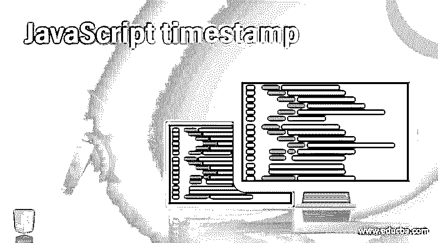
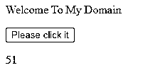
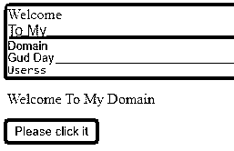
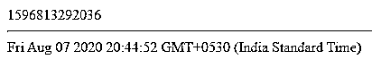
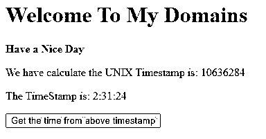

# JavaScript 时间戳

> 原文：<https://www.educba.com/javascript-timestamp/>




## JavaScript 时间戳简介

在 javascript 中， 时间戳是借助一些默认方法(如 date()实例)可以实现的格式之一。通过使用此 date 对象，它可以检索日期，并以可读格式保存时间。我们可以使用 Date()方法创建新对象。它还包含时间戳。当我们调用 getTime()等方法时，它在 Unix 时间系统中显示默认值 它显示了时间在另一个操作系统，如 windows 可能时间是动态变化的，每当用户刷新页面或应用程序的时间将被改变，日期不能改变。

**语法和参数**

<small>网页开发、编程语言、软件测试&其他</small>

时间戳通常具有用于日期和时间的默认方法。例如，如果我们使用 Date()和 getTime()方法，它将从数据库或任何其他存储设备中检索日期和当前时间戳。

```
<html>
<body>
<script>
function name()
{
var d=new Date(); //create instance of the date method
var t=d.getTime(); // using getTime() method retrieve date and time
---some javascript logics—
}
</script>
</body></html>
```

在上面的代码中，我们使用了基本的方法，如创建 date()实例，并使用 getTime()方法获取时间间隔。无论何时在脚本中使用 currenttimestamp，日期都不能更改。

### Javascript 中时间戳是如何工作的？

当我们使用 date()和 getTime()方法时，这两个是内置方法，它们将管理日期和时间，这是 javascript 编程语言的关键部分。它可能需要创建动态部分，如版权日期、时间表、事件列表及其时间，这将涉及使用日期/时间格式来扩展代码级脚本。我们可以用剧本来写时代周刊。我们将使用日期对象及其方法；无论什么与脚本相关，它都可以用来链接日期和时间对象。date 对象可用于在 web 应用程序或独立应用程序中存储日期和时间。

如果假设我们已经在 date 方法中传递了参数，那么它就不能在运行时环境中得到反映，但是如果没有任何参数，那么 date 对象将在当前日期和时间的帮助下被创建为单独的对象。如果纬度和经度不同，时间将显示为当前时间戳；这取决于将在用户预期中指定的区域。当用户在不同地区访问应用程序时，日期和时间将以不同的格式显示。反子午线(am)和后子午线(pm)因位置而异。然而，当我们使用 date 对象时，它返回这个值，javascript 通过 Unix 操作系统时间理解关于日期和时间的信息。到目前为止，我们还看到了新的日期和时间对象；我们将基于当前时间创建日期实例；同样，我们还基于脚本中现有的时间戳类型创建了 date 对象。如果已经将变量作为日期值，但希望使用 JS date 实例来操作它，则可以将它作为一个值。我们可能希望在 Unix 中使用时间戳，我们希望在时间的长期表单版本中显示时间，即一天，时间可以计算为时区和其他信息，如纬度和经度。

我们已经使用这个现有的日期实例创建了日期对象；此外，时间戳是以不同的方式创建的；在现有时间戳的帮助下，我们将在脚本中创建新的 date 对象。同时在数据库或其他存储设备中现有时间戳的帮助下检索日期。

### JavaScript 时间戳的示例

下面提到了不同的例子:

#### 示例#1

**代码:**

```
<html>
<body>
<p>Welcome To My Domain</p>
<button onclick="demo()">Please click it</button>
<p id="example"></p>
<script>
function demo() {
var m = 1000 * 60;
var h = m * 60;
var d = h * 24;
var y = d * 365;
var dat = new Date();
var t= dat.getTime();
var result = Math.round(t / y);
document.getElementById("example").innerHTML = result;
}
</script>
</body>
</html>
```

**输出:**




#### 实施例 2

**代码:**

```
<html>
<head>
<script src =
"https://cdnjs.cloudflare.com/ajax/libs/underscore.js/1.9.1/underscore-min.js" >
</script>
<style>
div.second {
background-color:green;
font-family: "Times New Roman", Times, serif;
}
div.third {
background-color:red;
font-family: Arial, Helvetica, sans-serif;
}
div.four {
background-color:pink;
font: 80% sans-serif;
}
div.five {
background-color:yellow;
font: 13px/11px sans-serif;
}
div.six {
background-color:orange;
font-weight: 500;
font: 1rem monospace;
white-space: nowrap;
}
</style>
</head>
<body bgcolor="blue">
<div class="second">Welcome</div>
<div class="third">To My</div>
<div class="four">Domain</div>
<div class="five"><u>Gud</u> Day</div>
<div class="six"><u>Userss</u></div>
<p>Welcome To My Domain</p>
<button onclick="demo()">Please click it</button>
<p id="example"></p>
<script>
function demo() {
var m = 1000 * 60;
var h = m * 60;
var d = h * 24;
var y = d * 365;
var dat = new Date();
var t= dat.getTime();
var result = Math.round(t / y);
document.getElementById("example").innerHTML = result;
var time= Date.now();
document.write(time + "<hr>");
var date = new Date(time);
document.write(date);
}
</script>
</body>
</html>
```

**输出:**







#### 实施例 3

**代码:**

```
<!DOCTYPE html>
<html>
<body>
<h1 style="color: green">
Welcome To My Domains
</h1>
<b>
Have a Nice Day
</b>
<p>
We have calculate the UNIX Timestamp is: 10636284
</p>
<p>The TimeStamp is: 

</p>
<button onclick="demo()">
Get the time from above timestamp
</button>
<script type="text/javascript">
function demo() {
unix = 10636284;
d = new Date(unix * 1000);
u = d.toUTCString();
t = u.slice(-11, -4);
document.querySelector(
'.first').textContent = t;
}
</script>
</body>
</html>
```

**输出:**




在上面的三个例子中，我们使用了不同类别的时间戳；为了计算纬度和经度间隔，我们必须使用 GMT 时间来计算时间间隔。日期是不能改变的，只有时间会随着屏幕上的分秒而改变。

### 结论

一般来说，时间是编程语言的重要组成部分，就像 web 和独立应用程序一样。我们用于为特定时间间隔创建日期字符串的日期和时间间隔的上述概念将探索用于检索和操作时间戳的内置日期函数。

### 推荐文章

这是一个 JavaScript 时间戳指南。在这里，我们讨论了时间戳在 Javascript 中是如何工作的，并给出了代码和输出的例子。您也可以看看以下文章，了解更多信息–

1.  [JavaScript elseIf](https://www.educba.com/javascript-elseif/)
2.  [JavaScript 动画](https://www.educba.com/javascript-animation/)
3.  [卸载 JavaScript](https://www.educba.com/unshift-javascript/)
4.  [JavaScript onsubmit](https://www.educba.com/javascript-onsubmit/)


