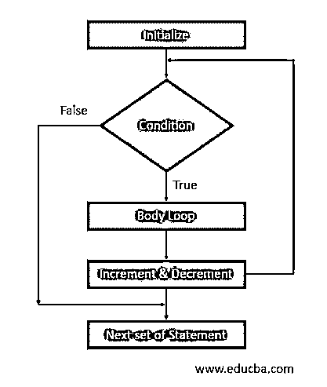
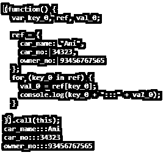
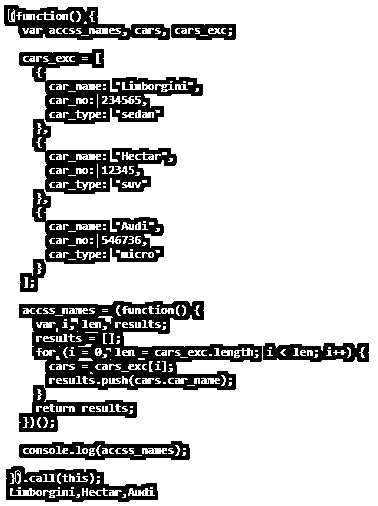

# CoffeeScript for 循环

> 原文：<https://www.educba.com/coffeescript-for-loop/>

## CoffeeScript for loop 简介

CoffeeScript for loop 在编码方面被用作理解的替代品。CoffeeScript 支持许多循环，但它处理的是在 for 循环中外部添加了一些可选子句的理解。它有助于将理解移入一个数组，用对象和表达式进行迭代。在循环中对数组执行的迭代可以通过对数组中存在的对象进行操作来操作，这些对象可以返回函数或变量。For in 和 for of comprehensions 是 CoffeeScript 中的一些基本形式。

**语法**

<small>网页开发、编程语言、软件测试&其他</small>

CoffeScript 中 for 循环的语法表示循环的情况，其中它用迭代表示，如下所示:

K for k in [1…5] //这代表 for..循环中声明的值范围为 1 到 5。

k 为 k 在[1…..8]乘 2 //这表示对于 k，计数器然后应用循环。

k * k for k in[1…5]//平方用于在元素中执行循环。

**流程图**

*   for 循环的流程图基本上以与上述类似的方式运行，但是当它涉及 coffee-script 时，在这种情况下，我们有两个场景，其中一个是 for..另一个是为了..两者都被视为 CoffeeScript 的理解。
*   在存储和作为对象的其他键值对之间的差异方面，迭代行为保持不变。
*   根据需求，可以再次使用这两种理解中的任何一种来迭代其中的所有元素。
*   元素被初始化，然后条件被评估，如果评估的条件为真，那么光标将进入程序的主循环；否则，如果计算出的值为假，那么它将退出循环，并指向下一组要执行的语句。
*   如果在给出结果之后，被评估的主体结果为真，那么它将进入主体循环之后的下一组语句，并且将在进入基本循环之前执行递增或递减操作。

### CoffeeScript 中的 for 循环是如何工作的？

*   CoffeeScript 中的 For 循环被认为是在访问和操作对象或其中的值时有其自身意义的理解。
*   整个 for 循环的工作方式是，根据需求存在许多复杂的循环；一旦它们被简化，实现就变得容易了。
*   CoffeeScript 只需要 json、yaml 或 xml 格式的数据作为输入；它将在内部以对象的形式转换整个 json，该对象可以被定义为函数 javaScript 的一部分。
*   它基本上试图通过允许数组或结构内的迭代来抽象重要和相关的细节。
*   For…in the loop 通过提供初始化和增量函数的细节来帮助整个结构工作，CoffeeScript 会自动按照前面提到的控制流将它转换成 JavaScript。
*   CoffeeScript 中的 for…循环执行了类似的操作，稍有不同的是，它允许以键和值对的形式进行输入和遍历。
*   List in comprehensions 也可以工作，但是有一点不同，它允许一次转换成 object。

### 例子

下面举几个例子

#### 示例#1

这个例子演示了 coffee 脚本循环中的 for…语句，其中 cars_ex 集合由一组轿车、suv 和 micros post 的输入给出，这给出了如下所示的现成 javascript 函数。

`for cars_ex in ['sedans', 'suv', 'micro'] console.log cars_ex`

**输出:**

**解释:**在上面的例子中，一个 exp_car 被当作一个对象中的一组输入，然后这个对象试图被打印。CoffeeScript 在内部负责创建一个基于 javascript 的对象来迭代它，如上面的输出所示，使用它可以调用值，因为它是函数的一部分，函数中定义了许多对象。最后显示的值是使用 CoffeeScript 调用的相关代码的输出部分。

#### 实施例 2

此程序演示了的..CoffeeScript 中的 of 循环，其中汽车名称以键和值的形式给出，并作为要打印的对象传递。javascript 形式的输出或实际输出如下所示。

`for key_0,val_0 of { car_name: "Ani", car_no: 34323, owner_no: 93456767565}
console.log key_0+":::"+val_0`

**输出:**

**解释:**上面的代码由汽车详细信息组成，用于检索定义的一组值并将其作为数组的输入，然后进一步获取 javaScript 格式的函数，将所有的键和值对定义为一个对象，然后 CoffeeScript 将在内部处理它，给出一个完整的汽车详细信息输出，分别包含名称 car_no 和 owner_no。

#### 实施例 3

这个程序以理解的方式演示了这个列表，其中可以给 for 循环提供多个键和值对，这些键和值对最终将获取 javascript 函数，其输出如下所示。

`cars_exc = [
car_name: "Limborgini"
car_no: 234565
car_type: "sedan"
,
car_name: "Hectar"
car_no: 12345
car_type: "suv"
,
car_name: "Audi"
car_no: 546736
car_type: "micro"
] accss_names = (cars.car_name for cars in cars_exc)
console.log accss_names`

**输出:**

**解释:**for 循环的完整理解列表将作为函数的一部分给出，其中多组键和值将是 CoffeeScript 的一部分；它将整个列表作为一个对象传递，并返回下面的 javascript，有三个主要输出，如下所示。

### 结论

CoffeeScript for loop 的使用有多种原因，尤其是在排序和将所有元素整合成一个表单时。此外，它为开发人员提供了简化整个对象的优势，以一种或另一种格式登记实体来访问 javascript 的所有相关细节。

### 推荐文章

这是一个循环的 CoffeeScript 指南。这里我们讨论一下。CoffeeScript 中的 for 循环如何工作，以及示例和输出。您也可以看看以下文章，了解更多信息–

1.  [jQuery 数组循环](https://www.educba.com/jquery-array-loop/)
2.  [为 Ruby 中的循环](https://www.educba.com/for-loop-in-ruby/)
3.  [月球环](https://www.educba.com/lua-loop/)
4.  [循环的打字稿](https://www.educba.com/typescript-for-loop/)

