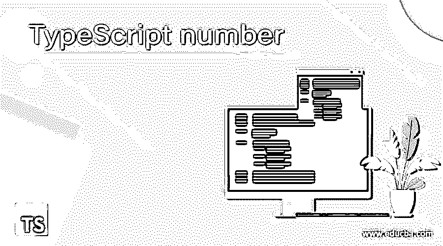
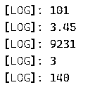
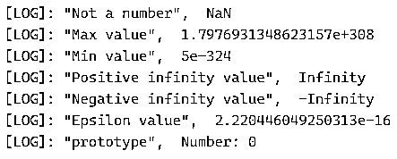
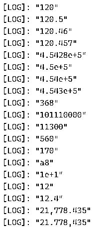
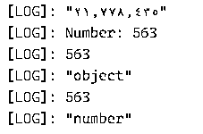

# 打字稿号码

> 原文：<https://www.educba.com/typescript-number/>

## 打字稿号码简介

TypeScript number 是一种类似于 JavaScript 的数据类型，支持数值作为 number 对象。所有数字都存储为浮点值，浮点值被视为数字数据类型。它用于表示整数和浮点值。这种数字类型将数字文字转换为数字类的实例，该实例充当包装器，并将数字文字作为对象来操作。Number 数据类型将数字存储为双精度 64 位数字，有两种类型的 number 数据类型，一种是原始 number 数据类型，另一种是 BigInt，这是 TypeScript 的新特性。让我们看看数字数据类型是如何使用的，并解决几个例子。

**语法:**

<small>网页开发、编程语言、软件测试&其他</small>

下面是数字数据类型的语法，

`let indetifier_name: number = < value >`

上面的语法没有传递任何参数，它只是将 number 类型初始化为一个标识符。

例如

`let empID: number = 101;
let age: number = 25;
let price: number = 150.75`

使用文字语法:

`let identifier_name = < value >;`

使用数字全局功能:

`let identifier_name = Number(101);`

在 TypeScript 中，number 数据类型支持十进制、十六进制和浮点数。除此之外，它还支持 ECMAScript 2015 中引入的二进制和八进制值。

例如

`let code: number = 0x42A;
let vaCode: number = 0t455;
let bCode: number = 100101;`

上述语法可以被解码为，

`[Keyword] [Variable name]: [number] = [value]`

*   **【关键字】:**是变量的关键字，像 let、var、const 一样定义了变量的作用域和用法。
*   **【变量名】:**也可以是任何标识符，变量名用来保存值。
*   **【number】:**变量持有的数据类型的个数。
*   **【值】:**分配给变量的值

### 打字稿号码的例子

让我们通过几个例子来看看数字数据类型是如何工作的:

#### 示例#1

**打印数字数据类型**

`let empID1: number = 101;
let empsalary: number = 3.45;
let empVC: number = 0x240F;
let empCouID: number = 0b0011;
let empEncrypt: number = 0o214;
console.log(empID1);
console.log(empsalary);
console.log(empVC);
console.log(empCouID);
console.log(empEncrypt);`

**输出:**

这里我们显示了各种数字数据，八进制、十进制、十六进制和浮点数都是以数字为数据类型的。

**打字稿号有一些属性，列举如下:**

*   **MAX_VALUE:** 将返回 JavaScript 中该数字的最大可能值，1.797693134862317E+308
*   **MIN_VALUE:** 将返回 JavaScript 中数字的最小可能值，5E-324
*   **正无穷大:**将返回一个大于最大值的值
*   **负无穷大:**将返回一个小于最小值的值
*   **NaN:** 当某个数字计算不是用有效数字表示时，会返回 NaN，它等于一个非数字的值。
*   **EPSILON:** 将返回 1 和大于 1 的最小值之间的差值
*   **prototype:** 用于给 Number 类型对象分配更新的属性和方法
*   **parseInt:** 用于将字符串转换为整数
*   **parseFloat:** 用于将字符串转换为浮点整数。

#### 实施例 2

**打字稿号码属性**

`let empid = 0;
if (empid <= 0) {
console.log('Not a number', Number.NaN);
}
else {
console.log('number', empid);
}
console.log('Max value', Number.MAX_VALUE);
console.log('Min value', Number.MIN_VALUE);
console.log('Positive infinity value', Number.POSITIVE_INFINITY);
console.log('Negative infinity value', Number.NEGATIVE_INFINITY);
console.log('Epsilon value', Number.EPSILON);
console.log('prototype', Number.prototype);`

**输出:**

在这里，我们已经寻找了所有的数字属性。

**打字编号方式:**

**toFixed():** 返回字符串格式的定点符号

`number.toFixed([digits])`

**toExponential():** 以字符串格式返回指数符号

`number.toExponential([count of fraction digits])`

**toString():** 返回指定基值中给定数字的字符串表示形式

`number.toString([radix/base])`

**top precision():**返回指定精度的定点或指数形式的字符串表示。

`number.toPrecision([precision])`

**toLocaleString():** 将数字转换为数字的本地指定表示形式。

`number.toLocaleString([locales, [, optionl]])`

**valueOf():** 返回数字的原始值

`number.valueOf()`

#### 实施例 3

**打字编号法**

`let price: number = 120.457;
console.log(price.toFixed());
console.log(price.toFixed(1));
console.log(price.toFixed(2));
console.log(price.toFixed(3));
let exp: number = 454280;
console.log(exp.toExponential());
console.log(exp.toExponential(1));
console.log(exp.toExponential(2));
console.log(exp.toExponential(3));
let nameID: number = 368;
console.log(nameID.toString());
console.log(nameID.toString(2));
console.log(nameID.toString(4));
console.log(nameID.toString(8));
console.log(nameID.toString(16));
console.log(nameID.toString(36));
let precID: number = 12.432;
console.log(precID.toPrecision(1));
console.log(precID.toPrecision(2));
console.log(precID.toPrecision(3));
let localeId: number = 21778.435;
console.log(localeId.toLocaleString());
console.log(localeId.toLocaleString('de-DE'));
console.log(localeId.toLocaleString('ar-EG'));
let valId = new Number(563);
console.log(valId)
console.log(valId.valueOf())
console.log(typeof valId)
let valIdx = valId.valueOf()
console.log(valIdx)
console.log(typeof valIdx)`

**输出:**

这里我们已经执行了所有的数值方法。

**大整数:**表示大于 253–1 的整数。大整数在整数文字的末尾有 n 个字符，

`bigint = 90403900382042442342n;`

**号 vs 号:**

数字是原始数据类型，而数字是数字类型的包装对象。用户可以给 number 对象分配一个基元数，但反之则不行。

### 结论

到此，我们结束这个话题。我们已经了解了什么是数字数据类型以及如何使用它。研究了数字标识符或变量的初始化，以及它们的方法和属性。我们还研究了一些描述数值方法和属性的例子。所有数字要么是采用 bigint 类型的大整数，要么是采用 number 数据类型的浮点数。不要在 TypeScript 中使用“Number ”,因为它是非基元对象。谢谢！快乐学习！!

### 推荐文章

这是打字稿号码指南。在这里，我们将讨论 TypeScript number 数据类型如何工作，并给出一些例子和输出。您也可以看看以下文章，了解更多信息–

1.  [打字稿设置](https://www.educba.com/typescript-set/)
2.  [打字稿字母](https://www.educba.com/typescript-let/)
3.  [打字稿操作符](https://www.educba.com/typescript-operators/)
4.  [打字稿通用](https://www.educba.com/typescript-generic/)

