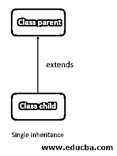
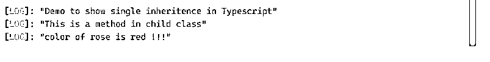
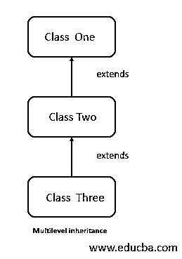
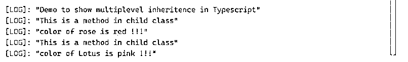

# 类型脚本继承

> 原文：<https://www.educba.com/typescript-inheritance/>

## 类型脚本继承简介

继承是来自面向对象编程语言的基本概念。TypeScript 中的继承与任何其他编程语言的工作方式相同，因为 TypeScript 也是一种面向对象的语言。在继承中，我们有两个概念，即父类和子类。在继承中，我们继承父类的属性，称为父类，继承父类的称为子类；这是任何编程语言中继承的基本概念。

### TypeScript 中的继承类型

TypeScript 中的继承有两种不同的类型，但是在其他编程语言中，我们有许多不同类型的继承可以根据需要来使用。但是 TypeScript 基本上支持两种类型，即单级继承和多级继承。我们有不同的类型，如 hybrid、multiple，typescript 不支持这些类型。

<small>网页开发、编程语言、软件测试&其他</small>

在 TypeScript 中我们基本上有两种类型的继承，如下所示:

*   单一遗传
*   多级遗传

#### 1.单一遗传

在这种类型的继承中，我们只能扩展一个类或单个类。这就是为什么它被称为单一继承。这种继承也是通过使用我们已经有的“extends”关键字来实现的。我们将看到一个图像来演示 TypeScript 中的单一继承的流程，以便更好地了解它。

**流程图:**

在上图中，我们有两个可用的类，称为父类和子类。这里我们试图使用子类来扩展父类。在这之后，我们可以使用子对象中的所有方法和文件来执行我们的逻辑。因此，通过这种方式，它也为我们提供了代码的可用性。我们还将看到 TypeScript 中单一继承的一个实践示例。

下面是一个如何在编程中使用它的示例。

**举例:**

**代码:**

`class Flower {
color():void {
console.log("This is a method in parent class");
}
}
class Rose extends Flower {
color():void {
console.log("This is a method in child class");
console.log("color of rose is red !!!");
}
}
console.log("Demo to show single inheritence in Typescript");
let myobject = new Rose();
myobject.color();`

**输出:**

#### 2.多级遗传

在这种类型的继承中，我们可以派生一个已经被另一个父类派生的新类；这种父子关系在 TypeScript 中称为多级继承。这种继承是在一级、二级、三级等等中进行。下面我们可以看到它的流程图，它实际上是什么样子，以及它的内部工作，以获得更多的想法。

**流程图:**

在上面的图片或流程图中，我们在 typescript 中创建了三个遵循多级继承的类。在这里，我们把班级命名为一、二、三。类“one”是类“two”的父类，这意味着它可以在自己的类中使用其属性和行为。但是如你所见，我们还有一个名为“三”的类，它再次扩展了“二”类。这意味着现在这个类可以访问两个类的方法和字段。这样，我们就可以在 TypeScript 中实现多级继承。它也很容易使用，因此提供了代码的可用性。

现在我们将看到一个在 TypeScript 中实现这一点的示例。

**举例:**

**代码:**

`class Flower {
color():void {
console.log("This is a method in parent class");
}
}
class Rose extends Flower {
color():void {
console.log("This is a method in child class");
console.log("color of rose is red !!!");
}
}
class Lotus extends Flower {
color():void {
console.log("This is a method in child class");
console.log("color of Lotus is pink !!!");
}
}
console.log("Demo to show multiplevel inheritence in Typescript");
let myobject1 = new Rose();
myobject1.color();
let myobject2 = new Lotus();
myobject2.color();`

**输出:**

正如我们已经看到的，TypeScript 或它支持的继承类型。在上面几行代码中，你可以看到，我们正在创建一个类调用作为父类‘Flower’。我们有不同种类的花，不同的颜色等等。在这个例子中，我们创建 flower 作为基类，其中包含了所有的常用方法。在创建了父类之后，我们在上面的示例中确定了不同类型的花卉类，分别命名为‘rose’和‘lotus’。之后，我们可以使用名为“color”的父类方法来定义每朵花的颜色。因此，我们在这里提供了子类上的方法实现；此外，它允许我们从应用程序中删除重复的代码。如果我们没有继承，那么没有必要，我们必须在每个类中创建这个方法。这样，它也有这么多好处可以利用。这是面向对象编程语言最基本的概念。

### 继承中可用的基本细节和组件

继承提出了两个在所有类型中非常普遍的东西。它支持任何编程语言中的父子关系。

我们来详细看看父子关系:

#### 1.父类/超类/基类

父类也称为基类，即 TypeScript 继承中的超类。用于获取属性和行为的类称为父类。父类的所有方法、变量和其他东西都将被子类使用。

#### 2.子类/子类/派生类

子类也称为子类，继承中的派生类。当一个类继承了父类的属性和行为时，它在 TypeScript 继承中被称为子类或派生类。这个类现在可以使用这个类的方法、构造函数和其他东西了。

现在我们将详细了解如何在编程中实现继承:

*   **extends:** 我们可以像任何其他编程语言一样使用‘extends’关键字；我们也在 typescript 中实现了继承。编程时，我们必须在两个类名之间使用这个关键字。此后，只有我们能够访问子类中父类的属性。让我们看一个示例语法来理解如何在编程时使用它。

**举例:**

**代码:**

`class one 'extends' class second`

### 结论

TypeScript 不支持所有类型的继承；它只支持两种类型。继承在 TypeScript 中非常容易使用和实现。正如我们上面提到的，我们只需要在父类和子类的前后使用 extends 关键字。从而提供代码的可重用性，使其可读性更强，更容易理解。

### 推荐文章

这是一个关于类型继承的指南。在这里，我们讨论介绍，继承的类型，继承中可用的基本细节和组件。您也可以看看以下文章，了解更多信息–

1.  [打字稿功能](https://www.educba.com/typescript-functions/)
2.  [打字稿操作符](https://www.educba.com/typescript-operators/)
3.  [打字稿版本](https://www.educba.com/typescript-versions/)
4.  [什么是 TypeScript？](https://www.educba.com/what-is-typescript/)

