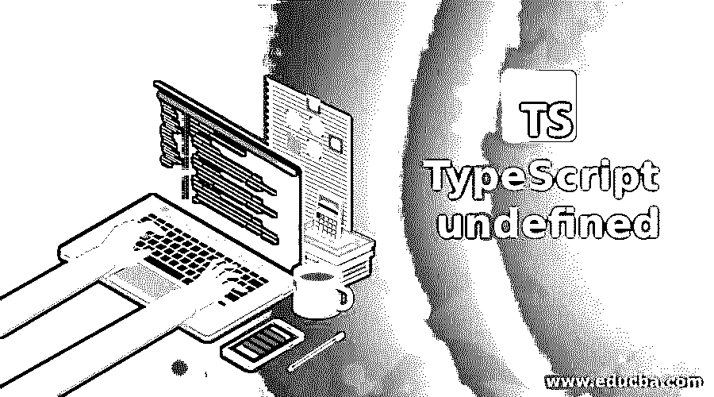
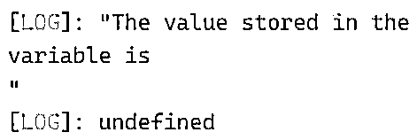
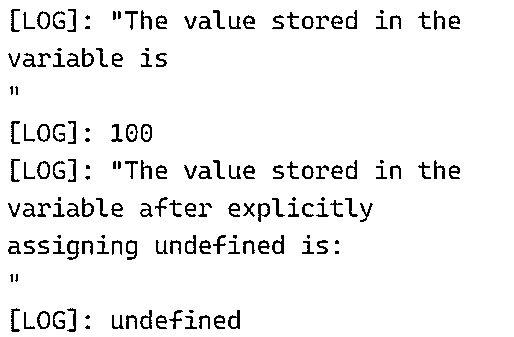
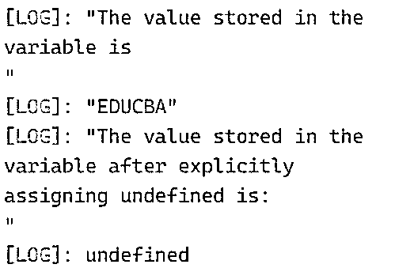
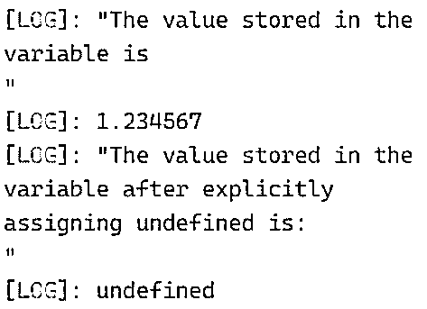
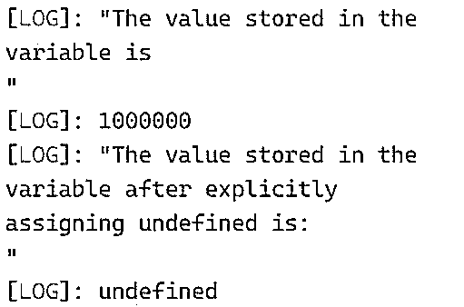

# TypeScript 未定义

> 原文：<https://www.educba.com/typescript-undefined/>

## TypeScript 介绍未定义

每当在 TypeScript 中声明一个变量而没有给它赋值时，该变量就被称为 undefined，所以声明时没有给它初始化值的变量被初始化为 undefined，这个 undefined 可以赋给任何数据类型的变量，但是 undefined 变量并不那么有用，因为它只能被赋给一个 undefined 的值，而不能被赋给其他值，它们只有在使用联合类型时才有用；因此，不可能有很多情况下，变量被声明和未初始化，使他们成为未定义的变量。

**在 TypeScript 中声明未定义的语法:**

<small>网页开发、编程语言、软件测试&其他</small>

`var variable_name;`

其中，变量名称是已声明但未初始化的变量的名称，因此它是一个未定义的变量。

### 在 TypeScript 中处理未定义的

*   变量已声明，但未初始化；那么这样的变量在 TypeScript 中称为未定义变量。
*   undefined 适用于任何数据类型的变量。
*   未定义的变量只能在使用联合类型时使用；否则，它们是无用的，因为它们只能被赋予一个未定义的值。
*   因此，不可能有很多情况下，变量被声明和未初始化，使他们成为未定义的变量。

### 未定义的类型脚本示例

下面给出了未定义的类型脚本的示例:

#### 示例#1

TypeScript 程序来演示声明变量而不初始化变量是如何导致变量未定义的。

**代码:**

`//declaring a variable of type num without initializing value to it
let value:number;
//Displaying the value of the variable which is undefined
console.log("The value stored in the variable is\n");
console.log(value);`

**输出:**

在上面的程序中，我们声明了一个 number 类型的变量，但没有给它赋值。然后我们显示变量的值，它是未定义的。输出显示在上面的快照中。

#### 实施例 2

TypeScript 程序，演示如何声明变量、初始化变量、将变量的值显示为屏幕上的输出，以及显式地将 undefined 赋值给变量，从而使变量未定义。

**代码:**

`//declaring a variable of type num and assigning the value 100 to it
let value:number;
value = 100;
//Displaying the value of the variable as the output on the screen
console.log("The value stored in the variable is\n");
console.log(value);
//explicitly assigning undefined to the variable
value = undefined;
//Displaying the value of the variable as the output on the screen
console.log("The value stored in the variable after explicitly assigning undefined is:\n");
console.log(value);`

**输出:**

在上面的程序中，我们声明了一个 number 类型的变量，并给它赋值 100。然后，变量的值作为输出显示在屏幕上。然后，我们显式地给变量赋值 undefined。然后我们显示变量的值，它是未定义的。输出显示在上面的快照中。

#### 实施例 3

TypeScript 程序，演示如何声明变量、初始化变量、将变量的值显示为屏幕上的输出，以及显式地将 undefined 赋值给变量，从而使变量未定义。

**代码:**

`//declaring a variable of type string and assigning the value EDUCBA to it
let value:string;
value = “EDUCBA”;
//Displaying the value of the variable as the output on the screen
console.log("The value stored in the variable is\n");
console.log(value);
//explicitly assigning undefined to the variable
value = undefined;
//Displaying the value of the variable as the output on the screen
console.log("The value stored in the variable after explicitly assigning undefined is:\n");
console.log(value);`

**输出:**

在上面的程序中，我们声明了一个 string 类型的变量，并给它赋值 EDUCBA。然后，变量的值作为输出显示在屏幕上。然后，我们显式地给变量赋值 undefined。然后我们显示变量的值，它是未定义的。输出显示在上面的快照中。

#### 实施例 4

TypeScript 程序，演示如何声明变量、初始化变量、将变量的值显示为屏幕上的输出，以及显式地将 undefined 赋值给变量，从而使变量未定义。

**代码:**

`//declaring a variable of type float and assigning the value 1.234567 to it
let value:Float32Array;
value = 1.234567;
//Displaying the value of the variable as the output on the screen
console.log("The value stored in the variable is\n");
console.log(value);
//explicitly assigning undefined to the variable
value = undefined;
//Displaying the value of the variable as the output on the screen
console.log("The value stored in the variable after explicitly assigning undefined is:\n");
console.log(value);`

**输出:**

在上面的程序中，我们声明了一个 float 类型的变量，并给它赋值 1.234567。然后，变量的值作为输出显示在屏幕上。然后，我们显式地给变量赋值 undefined。然后我们显示变量的值，它是未定义的。输出显示在上面的快照中。

#### 实施例 5

TypeScript 程序，演示如何声明变量、初始化变量、将变量的值显示为屏幕上的输出，以及显式地将 undefined 赋值给变量，从而使变量未定义。

**代码:**

`//declaring a variable of type double and assigning the value 1.0e6 to it
let value:DoubleRange;
value = 1.0e6;
//Displaying the value of the variable as the output on the screen
console.log("The value stored in the variable is\n");
console.log(value);
//explicitly assigning undefined to the variable
value = undefined;
//Displaying the value of the variable as the output on the screen
console.log("The value stored in the variable after explicitly assigning undefined is:\n");
console.log(value);`

**输出:**

在上面的程序中，我们声明了一个 double 类型的变量，并给它赋了值 1.0e6。然后，变量的值作为输出显示在屏幕上。然后，我们显式地给变量赋值 undefined。然后我们显示变量的值，它是未定义的。输出显示在上面的快照中。

### 推荐文章

这是一个未定义的类型脚本指南。在这里，我们分别用例子来讨论对 TypeScript undefined 的介绍。您也可以看看以下文章，了解更多信息–

1.  [打字稿](https://www.educba.com/course/typescript/)
2.  [什么是 TypeScript？](https://www.educba.com/what-is-typescript/)
3.  [打字稿操作符](https://www.educba.com/typescript-operators/)
4.  [打字稿功能](https://www.educba.com/typescript-functions/)

