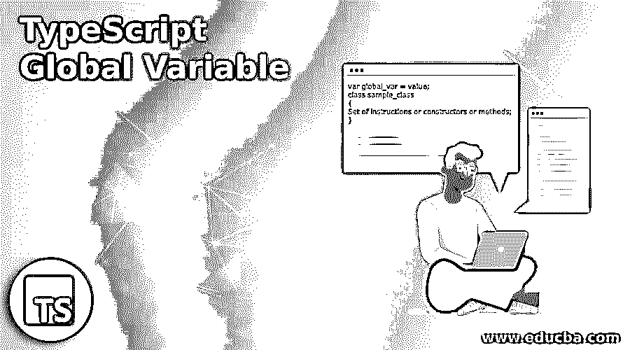
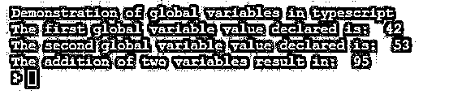
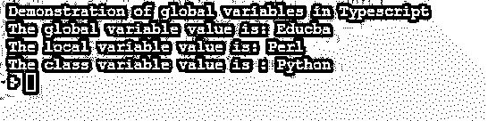

# TypeScript 全局变量

> 原文：<https://www.educba.com/typescript-global-variable/>

## TypeScript 全局变量简介

在 TypeScript 中，全局变量被定义为在 TypeScript 程序中声明变量的变量范围之一，其中这些全局变量是在所有程序构造(如方法、构造函数等)之外声明的变量。在程序开始时定义和声明，整个程序可以使用这个全局变量，直到程序结束，因此这种对整个程序可用和可访问的变量称为全局变量。一般来说，全局变量是全局声明的变量，这意味着它们是在程序的开始声明的，这样程序的所有构造都可以访问它们，而不用一次又一次地声明变量。

### 用示例处理 TypeScript 中的全局变量

在本文中，我们将看到 TypeScript 中的全局变量，这些变量被定义为在函数或代码块或类之外全局定义的具有全局作用域的变量，这些变量可以在程序的任何部分使用，从程序开始到程序结束。因此，全局变量是定义为全局可用变量的变量，并且可以被程序的每个部分访问，包括任何代码块、函数或类，并且这样的变量被定义在变量的全局范围内。

<small>网页开发、编程语言、软件测试&其他</small>

在 TypeScript 中，变量有三种不同的范围，如局部范围、全局范围和类范围。这里，全局变量是在全局作用域中声明的，可以在程序中的任何地方访问，称为全局变量。在 TypeScript 中，没有用于声明全局变量的关键字，如其他编程语言中的“global”关键字。有时在 TypeScript 中，他们使用关键字“declare”来声明变量，例如“declare var ”,如果变量是只读变量，如果变量是基于块范围的，那么我们使用“declare let ”,它有时用于声明全局范围内的全局变量。但是即使是“声明 var”也适用于声明全局变量。

没有这样的语法可以遵循，因为这些变量总是在程序开始时声明。

让我们看看声明全局变量的视图示例语法。

**语法:**

`var global_var = value;
class sample_class
{
Set of instructions or constructors or methods;
}`

在上面的语法中，我们可以看到名为“global_var”的变量是一个在类声明之外声明的全局变量，它可以在程序中的任何地方使用，甚至可以在与全局变量在同一程序中的类或构造函数或方法中使用，也可以在程序中的任何地方访问。

### TypeScript 全局变量示例

下面提到不同例子:

#### 示例#1

**代码:**

`var a =42;
var b=53;
class add
{
addNum():void {
var res = a+b;
console.log("The addition of two variables result in: ",+res);
}
}
console.log("Demonstration of global variables in typescript");
console.log("The first global variable value declared is: ",+a);
console.log("The second global variable value declared is: ",b);
var obj = new add();
obj.addNum();`

**输出:**

在上面的程序中，我们首先声明了变量“a”和“b”，它们是全局变量。然后我们创建了一个类“add ”,我们在这个类中定义并声明了函数“addNum”。我们正在计算上述两个变量值的相加，这些值是可访问的，因为声明的变量在全局范围内，因此我们可以使用相同的变量来计算结果，然后我们甚至可以打印每个变量的值，我们在程序的结尾打印这些值。如果这些变量是在类内声明的，那么这些变量的值也是可访问的，并在它们被全局声明时打印。如果我们试图打印给定变量的值，它会给我们一个错误；否则，我们必须创建一个类对象，然后引用这些变量的值。所以在上面的程序中，我们可以看到上面截图中的输出，显示了全局变量的使用方式和位置。

我们将看到另一个例子，我们将看到所有其他变量范围，如全局变量，局部变量，类变量等。

#### 实施例 2

**代码:**

`var global_var = "Educba"
class strclass {
c_val = "Python";
func():void {
var l_var = "Perl";
console.log("The local variable value is: "+l_var)
}
}
console.log("Demonstration of global variables in Typescript")
console.log("The global variable value is: "+global_var)
var obj = new strclass();
obj.func()
console.log("The class variable value is : "+obj.c_val)`

**输出:**

在上面的程序中，我们可以看到我们首先在类“strclass”之外声明了一个变量，这个变量“global_var”是一个全局变量，然后我们在类中声明了一个类变量，如“c_val”，它在类范围内，然后我们在方法“func()”中声明了一个局部变量，如“l_var”，这个变量在函数中声明，因此它在局部范围内。因此，在上面的程序中，我们可以观察到，当我们打印一个全局变量时，我们不需要使用任何句点操作符来访问，因为它在全局范围内，稍后当我们试图打印一个局部变量时，它在该类的函数内，因此我们首先需要将该类的对象实例化为“obj ”,然后要访问该局部变量，我们需要使用句点操作符调用该函数。)与“obj”一起访问局部变量的值，然后类似地访问类变量，我们必须再次使用句点运算符(。)引用或指向使用“obj”变量创建对象的类变量。上面的截图可以看到上面程序的输出。

### 推荐文章

这是一个关于 TypeScript 全局变量的指南。这里我们用例子来讨论 TypeScript 中全局变量的引入和使用。您也可以看看以下文章，了解更多信息–

1.  [打字稿功能](https://www.educba.com/typescript-functions/)
2.  [打字稿版本](https://www.educba.com/typescript-versions/)
3.  [如何安装 Typescript](https://www.educba.com/install-typescript/)
4.  [打字稿 2.x](https://www.educba.com/course/typescript-2-x-tutorials/)

