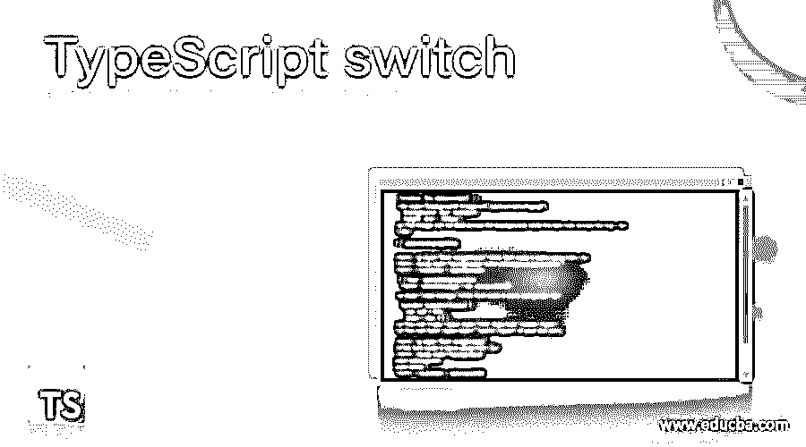
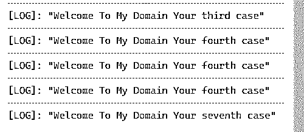
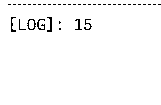
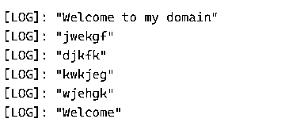

# 打字开关

> 原文：<https://www.educba.com/typescript-switch/>

## TypeScript 开关简介

Typescript 开关是其中一个特性，它是一个用来检查多个值的语句，它会执行相同的多组语句；switch 是对应于每个值的单级块代码，它执行值匹配的第一个 case 子句。如果值不匹配，则找到 case 子句。switch 语句查找可选的 case 默认子句。在 break 语句的帮助下，我们将控制 switch case 语句。如果没有使用 break 关键字，代码将在下一个语句继续执行，直到 switch 循环终止。

**语法**

<small>网页开发、编程语言、软件测试&其他</small>

通常，如果用户输入语句和变量值与执行的特定代码块的大小写匹配，则用于计算表达式并匹配表达式值的 switch case 语句。如果没有 case 表达式与变量表达式的值匹配，则脚本代码与 typescript switch 语句中的默认块相关联。

`variable Data type variable name : datatype = value;
switch(variable name)
{
case casename:{
---some logics depends upon the user requirement---
break
}
default:
{
---some logics based on the user requirement---
break;
}
}`

以上代码是创建和利用 switch 语句的基本语法；我们使用 break 语句来控制案例执行，它将数据打印到输出控制台的下一行。

### switch 语句在 TypeScript 中如何工作？

switch 语句根据用户定义和定制的方法测试所有变量、表达式和其他方法。它评估并验证将在交换块上声明的所有语句。基本上，switch 语句有一些应用于 switch case 语句的规则集。第一个规则可以是 switch 块中任意数量的 case 语句，因为它接受所有的数据类型，如 var、let 等。主要我们使用 var 作为数据类型，它将接受数字和非数字数据类型，并且它将全局调用外部作用域；当我们使用 var 类型的变量时，它会调用。

在 switch 语句中，第二条规则是它只包含常量；它不接受来自块外部的任何变量和表达式。switch 的第三个规则是当我们使用任何变量 with expression，即.)variable_expression，而 constant_expression 应该与 switch 块中两个操作的数据类型相匹配。我们还可以将一个语句中的情况与另一个语句中的情况进行比较；缺省块是可选的，case 表达式应该是唯一的；它不能接受副本。

### TypeScript 开关的示例

下面举几个例子

#### 示例#1

**代码:**

`var vars:string = "demo2";
var vars:string = "demo3";
var vars:string = "demo4";
var vars:string = "demo5";
var vars:string = "demo6";
switch(vars) {
case "demo": {
console.log("Welcome To My Domain Your first case");
break;
}
case "demo1": {
console.log("Welcome To My Domain Your second case");
break;
}
case "demo2": {
console.log("Welcome To My Domain Your third case");
break;
}
case "demo3": {
console.log("Welcome To My Domain Your fourth case");
break;
}
case "demo4": {
console.log("Welcome To My Domain Your fiveth case");
break;
}
case "demo5": {
console.log("Welcome To My Domain Your sixth case");
break;
}
case "demo6": {
console.log("Welcome To My Domain Your seventh case");
break;
}
case "demo7": {
console.log("Welcome To My Domain Your Eighth case");
break;
}
case "demo8": {
console.log("Welcome To My Domain Your Nineth case");
break;
}
case "demo9": {
console.log("Welcome To My Domain Your tenth case");
break;
}
case "demo10": {
console.log("Welcome To My Domain Your eleventh case");
break;
}
case "demo11": {
console.log("Welcome To My Domain Your twelth case");
break;
}
case "demo12": {
console.log("Welcome To My Domain Your thirtheen case");
break;
}
default: {
console.log("Thanks users your choice is invalid please try again");
break;
}
}`

**输出:**

在上面的例子中，我们使用了基本级别的开关案例。我们还可以使用第一条语句中的变量来选择 switch 块中的选项。default 关键字将是 switch 语句的可选关键字，每当 switch case 终止或用户输入的选择无效时，就会执行该关键字。我们在所有情况下都使用字符串数据类型值，它们将通过使用 var 关键字进行初始化。假设如果变量中的值与任何常量都不匹配，它会自动执行默认块。

#### 实施例 2

**代码:**

`let vars = 11,
vars1 = 12;
let vars2 = 13;
switch (vars) {
case 1:console.log("Welcome");
case 2:console.log("Welcome");
case 3:console.log("Welcome");
case 4:console.log("Welcome");
case 5:console.log("Welcome");
case 6:console.log("Welcome");
case 7:{
vars2 = 14;
console.log(vars2);
break;
}
case 8:{
console.log("Welcome");
}
case 9:console.log("Welcome");
case 10:console.log("Welcome");
case 11:{
vars2 = 15;
console.log(vars2);
break;
}
case 12:
{
if (((vars % 2 == 11) &&
!(vars % 3 == 0))
|| (vars % 5 == 0))
vars2 = 16;
else
vars2 = 17;
break;
}
default:
throw Error('Thanks Users your input is invalid');
}
console.log(`${vars}  ${vars1}  ${vars2} ${vars3} ${vars4} ${vars5}`);`

**输出:**

在第二个例子中，我们使用了带有缺省块的 switch 语句，并且在某些情况下，我们没有使用开括号{}和闭括号{ }，甚至 break 语句也没有使用它在一个情况结束后自动执行另一个情况。这里，我们在一个案例中使用了 if 条件，它将验证这些数字，并在控制台中打印输出。

#### 实施例 3

**代码:**

`let vars= "Sivaraman";
switch (vars) {
case "Sivaraman":console.log("Welcome to my domain");
case "fjhd":console.log("jwekgf");
case "3":console.log("djkfk");
case "4":console.log("kwkjeg");
case "jhkdj":console.log("wjehgk");
case "6":console.log("Welcome");
}`

**输出:**

在最后一个示例中，我们使用了相同的 switch 语句，但是这里我们不能使用 default 和 break 语句。所以它会在控制台中打印所有的 cases 语句。如果我们使用了 break 语句，它将执行我们已经在用户输入中声明的特定情况。

### 结论

在 typescript 中，我们使用不同的特性来创建基于 web 的应用程序。也有一些默认的关键字、变量和方法来利用和实现应用程序。我们使用了一些默认的条件语句来验证基于客户需求的用户输入，比如 switch 是块级语句之一，它将使用 cases 和默认语句来执行。

### 推荐文章

这是 TypeScript 开关的指南。这里我们讨论如何在 TypeScript 和示例中切换语句工作以及代码和输出。您也可以看看以下文章，了解更多信息–

1.  [打字稿操作符](https://www.educba.com/typescript-operators/)
2.  [打字稿版本](https://www.educba.com/typescript-versions/)
3.  [如何安装 Typescript](https://www.educba.com/install-typescript/)
4.  [打字稿数组](https://www.educba.com/typescript-array/)

