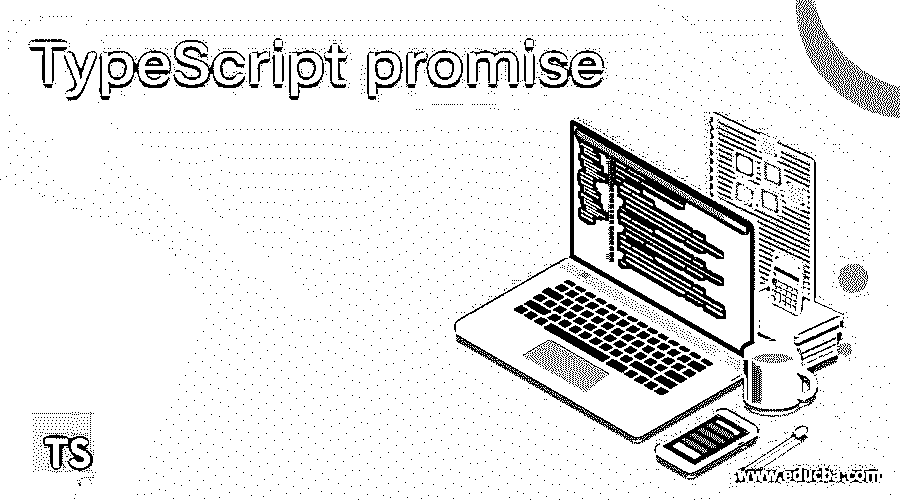
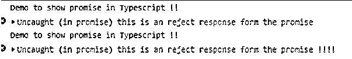

# 打字稿承诺

> 原文：<https://www.educba.com/typescript-promise/>

## 打字稿承诺简介

TypeScript 中的承诺是用来做异步编程的。当我们想同时处理多项任务时，可以使用 promise。通过使用 TypeScript promise，我们可以跳过当前操作，转到下一行代码。Promise 提供了异步编程或并行编程的特性，允许同时执行多个任务。在下一节中，我们将更详细地讨论这个承诺，以便更好地理解。

**语法**

<small>网页开发、编程语言、软件测试&其他</small>

正如我们所讨论的，promise 用于并行编程。它是 TypeScript 编程中可用的对象。为了更好地理解，让我们详细地看看它的语法。

`new Promise(function(resolve, reject){
// our logic goes here ..
});`

正如你在上面几行语法中看到的，我们使用了一个新的关键字来创建 promise 对象。该函数有两个名为 reject 和 resolve 的参数。它还调用回调函数。我们将在下一节更详细地了解它的内部工作原理，并在编程时使用它。

### 如何在 TypeScript 中实现 promise？

我们知道 TypeScript 中的 promise 是用来支持并行编程的。当我们想要同时执行一组任务时，就使用并行编程。promise 用于处理多个并行调用。使用 promise 的主要好处是，我们可以移到下一行代码，而不用执行上面的代码行。这也有助于我们提高应用程序的性能。

在几个州也承诺支持。在这一节中，我们将详细研究签名以及返回类型，以及它支持的几种状态，以便更好地理解。见下文；

1.新承诺(功能(解决，拒绝){

//这里是逻辑..

});

在上面的代码行中，我们使用“new”关键字来创建承诺的实例。我们已经知道这是一个在 TypeScript 中可用的对象。此外，它还有一个内部函数，该函数有两个名为“拒绝”和“解决”的参数。在这个函数内部，我们可以传递一个回调函数。

2.返回类型:它在内部函数中有两个参数。如果函数的响应是成功的，那么它将返回‘resolve’；如果函数的响应不成功，它将返回“拒绝”。

3.在 promise of Typescript 中可用的状态:promise 支持几种状态。这些状态用于获取函数的状态。在承诺中我们有三种不同的状态。

*   **reject** :如果 promise 函数的响应失败，则状态为‘reject’。
*   **pending** :如果响应没有出现，我们正在等待结果，那么状态将是‘pending’。
*   **已履行**:如果响应形式为成功接收到 TypeScript 中的承诺，则状态将为‘full feed’。

我们还可以分别执行和处理成功和错误响应。为此，我们只能使用 promise 函数中的“拒绝”和“解决”。在这一节中，我们将介绍如何处理 promise 中的成功和错误，见下文；

**1。处理承诺中的错误:**我们可以很容易地处理来自承诺的错误响应，因为我们必须拒绝在回调函数中传递的参数。这个 rejects 参数将处理错误；它将使用可用的 catch()块来处理错误。我们可以看到一个练习语法，以便更好地理解它的用法，见下文；

**举例:**

`function demo() {
var promise = new Promise((resolve, reject) => {
// our logic goes here ..
reject();
}
demo().then(function(success) {
// success logic will go here  ..
})
.catch(function(error) {
// logic goes here  //
});`

正如你在上面几行代码中看到的，我们调用了 reject。这将使用下面一行代码中的 catch 块来处理错误和异常。

**2。在 promise 中处理成功:**我们还可以处理 promise 函数的成功响应。为此，我们可以使用 resolve 和成功回调。让我们看一个示例语法，以便初学者更好地理解代码，见下文；

**举例:**

`function demo() {
var promise = new Promise((resolve, reject) => {
// logic will go here ..
resolve();
}
demo().then(
() => // logic goes here ..
);`

在上面几行代码中，我们在这里调用了 resolve 函数；它将处理来自 TypeScript 中 promise 函数的成功响应。

### 例子

以下是下面提到的例子

#### 示例#1

在这个例子中，我们试图调用 promise 的 resolve 函数，它将处理 promise 的成功响应。这是一个简单的例子，便于初学者理解它的用法。

**代码:**

`// PROMISE-1
var mypromise = new Promise((resolve, reject) => {
console.log("Demo to show promise in Typescript !!");
resolve(100);
});
mypromise.then((val) => val + 200)
.then((val) => console.log("Value form the promse function is " + val)
.catch((err) => console.log("inside error block " + err)));`

**输出:**

#### 实施例 2

在这个例子中，我们在 Typescript 中处理来自 promise 的错误响应，这是一个适合初学者的示例。

**代码:**

`// PROMISE-1
var mypromise = new Promise((resolve, reject) => {
console.log("Demo to show promise in Typescript !!");
reject("this is an reject response form the promise !!!!");
});
mypromise.then((val) => val)
.then((val) => console.log("Value form the promse function is " + val)
.catch((err) => console.log("inside error block " + err)));`

**输出:**

### 承诺的规则和规定

1.这用于进行异步调用。

2.请记住，只有互不依赖的任务才能从调用。否则，将会出现数据不一致的问题。

3.使用时需要传递内部函数；否则，将会出现错误。

### 结论

通过在 TypeScript 中使用 promise，我们可以很容易地实现并行编程，非常容易阅读和理解。同样，通过使用它，我们可以同时执行多项任务；这也可以提高应用程序的性能。唯一不相互依赖的任务就是异步。

### 推荐文章

这是一个打字稿承诺指南。这里我们讨论如何在 TypeScript 和示例中实现 promise，以及代码和输出。您也可以看看以下文章，了解更多信息–

1.  [打字稿版本](https://www.educba.com/typescript-versions/)
2.  [打字稿数组](https://www.educba.com/typescript-array/)
3.  [打字稿功能](https://www.educba.com/typescript-functions/)
4.  [什么是 TypeScript？](https://www.educba.com/what-is-typescript/)

