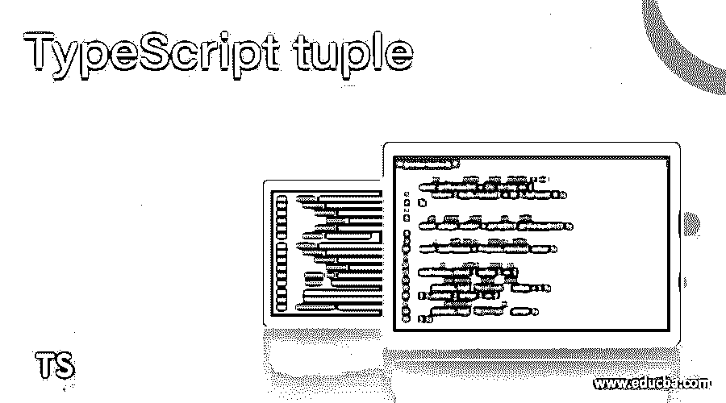
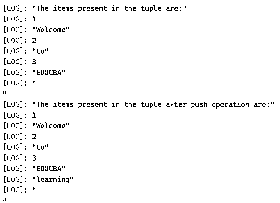
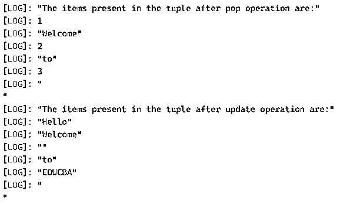
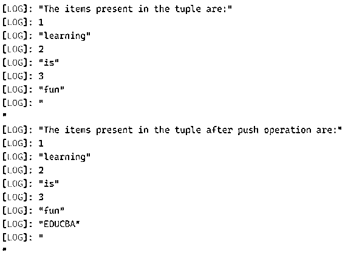
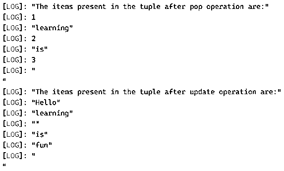

# 类型脚本元组

> 原文：<https://www.educba.com/typescript-tuple/>

## TypeScript 元组介绍

每当需要存储属于各种数据类型的值的集合时(使用数组是不可能的)，我们就利用 TypeScript 中称为 tuple 的数据类型，它也可以作为参数传递给函数，并且 tuple 中的每个值都单独称为 item， 并且元组中的每一项都基于索引，即可以使用它们各自的数字索引来访问它们，并且元组中的第一个索引从零开始，并且可以上升到 n-1，其中 n 是元组中的项数。

**在 TypeScript 中声明元组的语法如下:**

<small>网页开发、编程语言、软件测试&其他</small>

`var name_of_the_tuple = [value1, value2…, valuen];`

其中元组名称是元组名称，并且

value1、value2、valuen 是存储在元组中的不同数据类型的值。

### 在 TypeScript 中使用元组

*   属于相同数据类型的值的集合可以存储在数组中，而属于不同数据类型的值的集合不能存储在数组中。
*   用于存储属于不同数据类型的值的集合的数据类型在 TypeScript 中称为 tuple。
*   元组可以作为参数传递给 TypeScript 中的[函数。](https://www.educba.com/typescript-functions/)
*   存储在元组中的每个值称为一个项目，每个项目都基于一个索引，每个项目都可以使用各自的数字索引进行访问。
*   存储在元组中的项的索引从零开始，可以扩展到 n-1，其中 n 是存储在元组中的项数。
*   可以通过使用称为 push function 的函数将项目添加到元组中。
*   可以通过使用一个称为 pop function 的函数从元组中删除项目。从元组的末尾移除项目。
*   元组是可变的，这意味着允许对元组进行更改。

### 类型脚本元组的示例

下面举几个例子

#### 示例#1

创建元组的 TypeScript 程序，并演示将项添加到元组的 push 操作和从元组中移除项并更新元组以对元组中的现有项进行更改并在每次操作后显示元组的项的 pop 操作:

**代码:**

`//creating a tuple called firstuple to store a collection of values of different data types
var firsttuple = [1, 'Welcome', 2, 'to', 3, 'EDUCBA'] //displaying the items present in the tuple
console.log('The items present in the tuple are:');
console.log(firsttuple[0]);
console.log(firsttuple[1]);
console.log(firsttuple[2]);
console.log(firsttuple[3]);
console.log(firsttuple[4]);
console.log(firsttuple[5]);
console.log('\n')
//adding items to the tuple and displaying the items of updated tuple as the output on the screen
firsttuple.push('learning');
console.log('The items present in the tuple after push operation are:');
console.log(firsttuple[0]);
console.log(firsttuple[1]);
console.log(firsttuple[2]);
console.log(firsttuple[3]);
console.log(firsttuple[4]);
console.log(firsttuple[5]);
console.log(firsttuple[6]);
console.log('\n')
//removing items from the tuple and displaying the items of the updated tuple as the output on the screen
firsttuple.pop();
firsttuple.pop();
console.log('The items present in the tuple after pop operation are:');
console.log(firsttuple[0]);
console.log(firsttuple[1]);
console.log(firsttuple[2]);
console.log(firsttuple[3]);
console.log(firsttuple[4]);
console.log('\n')
//updating the existing items in the tuple and displaying the items of the updated tuple as the output on the screen
firsttuple[0] = 'Hello';
firsttuple[2] = '';
firsttuple[4] = 'EDUCBA';
console.log('The items present in the tuple after update operation are:');
console.log(firsttuple[0]);
console.log(firsttuple[1]);
console.log(firsttuple[2]);
console.log(firsttuple[3]);
console.log(firsttuple[4]);
console.log('\n')`

**输出:**

在上面的程序中，我们创建了一个名为 firsttuple 的元组来存储不同数据类型的值的集合。然后，我们将元组中的项目显示为屏幕上的输出。然后，我们使用 push 操作将条目添加到元组中，并将更新后的元组中的条目显示为屏幕上的输出。然后，我们通过使用 pop 操作从 tuple 中删除条目，并将更新后的 tuple 中的条目显示为屏幕上的输出。然后，我们更新元组中的现有项，并将更新后的元组中的项显示为屏幕上的输出。

#### 实施例 2

创建元组的 TypeScript 程序，并演示将项添加到元组的 push 操作和从元组中移除项并更新元组以对元组中的现有项进行更改并在每次操作后显示元组的项的 pop 操作:

**代码:**

`//creating a tuple called firstuple to store a collection of values of different data types
var firsttuple = [1, 'learning', 2, 'is', 3, 'fun'] //displaying the items present in the tuple
console.log('The items present in the tuple are:');
console.log(firsttuple[0]);
console.log(firsttuple[1]);
console.log(firsttuple[2]);
console.log(firsttuple[3]);
console.log(firsttuple[4]);
console.log(firsttuple[5]);
console.log('\n')
//adding items to the tuple and displaying the items of updated tuple as the output on the screen
firsttuple.push('EDUCBA');
console.log('The items present in the tuple after push operation are:');
console.log(firsttuple[0]);
console.log(firsttuple[1]);
console.log(firsttuple[2]);
console.log(firsttuple[3]);
console.log(firsttuple[4]);
console.log(firsttuple[5]);
console.log(firsttuple[6]);
console.log('\n')
//removing items from the tuple and displaying the items of the updated tuple as the output on the screen
firsttuple.pop();
firsttuple.pop();
console.log('The items present in the tuple after pop operation are:');
console.log(firsttuple[0]);
console.log(firsttuple[1]);
console.log(firsttuple[2]);
console.log(firsttuple[3]);
console.log(firsttuple[4]);
console.log('\n')
//updating the existing items in the tuple and displaying the items of the updated tuple as the output on the screen
firsttuple[0] = 'Hello';
firsttuple[2] = '';
firsttuple[4] = 'fun';
console.log('The items present in the tuple after update operation are:');
console.log(firsttuple[0]);
console.log(firsttuple[1]);
console.log(firsttuple[2]);
console.log(firsttuple[3]);
console.log(firsttuple[4]);
console.log('\n')`

**输出:**

在上面的程序中，我们创建了一个名为 firsttuple 的元组来存储不同数据类型的值的集合。然后，我们将元组中的项目显示为屏幕上的输出。然后，我们使用 push 操作将条目添加到元组中，并将更新后的元组中的条目显示为屏幕上的输出。然后，我们通过使用 pop 操作从 tuple 中删除条目，并将更新后的 tuple 中的条目显示为屏幕上的输出。然后，我们更新元组中的现有项，并将更新后的元组中的项显示为屏幕上的输出。

### 推荐文章

这是 TypeScript 元组的指南。在这里，我们通过编程示例及其输出，通过元组的定义、语法和实现来讨论 TypeScript 中元组的概念。您也可以看看以下文章，了解更多信息–

1.  [打字稿操作符](https://www.educba.com/typescript-operators/)
2.  [打字稿类型](https://www.educba.com/typescript-types/)
3.  [打字稿数组](https://www.educba.com/typescript-array/)
4.  [打印面试问题](https://www.educba.com/typescript-interview-questions/)

