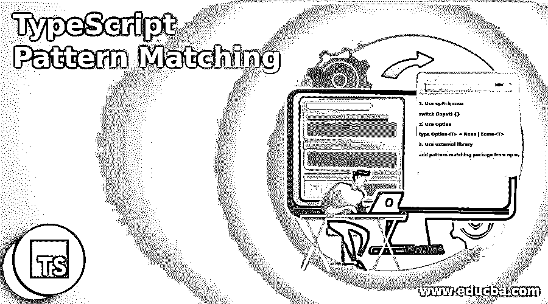
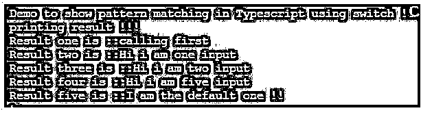

# 打字稿模式匹配

> 原文：<https://www.educba.com/typescript-pattern-matching/>

## 类型脚本模式匹配简介

TypeScript 中的模式匹配与其他编程语言中的模式匹配行为相同，没有特定的方法，但是我们有一些替代方法可以实现模式匹配。此外，我们有一些可用于 TypeScript 的库，通过它们我们可以进行模式匹配，因为在 TypeScript 中，没有用于模式匹配的内置机制。模式匹配是一种机制，通过这种机制，我们可以检查我们传递的值，无论它是否是模式给定的正确值。

**语法:**

<small>网页开发、编程语言、软件测试&其他</small>

正如我们已经知道的那样，没有具体的方法可以做到这一点，但我们仍然有一些可供选择的方法。

1.使用开关盒

`switch (input) {}`

2.使用选项

`type Option<T> = None | Some<T>`

3.使用外部库

`add pattern matching package from npm.`

以上所有这些都将去掉我们编写的 if/else，使代码更容易理解和阅读。

### 如何在 TypeScript 中进行模式匹配？

正如我们已经看到的，我们在 TypeScript 中没有任何内置的机制来执行模式匹配，但是我们有几个替代方案。我们可以用 TypeScript 进行函数式编程，它支持 Option，可以用来进行模式匹配。它支持“无”和“一些”两个值。我们有一些可用的外部库，可以通过使用 npm 用于项目，并且我们必须包含相应的包，以便在用 TypeScript 编码时使用它们。

在这里，我们将通过 TypeScript 中的一个示例来更详细地了解这一点，看看它在内部是如何工作的。

#### 1.使用外部包

我们可以按照下面的命令将包添加到应用程序中。

`npm install --save pattern-matching-ts`

上面的命令将通过在。json 文件。

`pattern-matching-ts/lib/match`

在将它们直接用于程序之前，我们已经将上面的包包含在我们的文件中。如果我们不包含上面的包，它将给出一个编译时错误，因为我们知道 typescript 执行严格的检查。

#### 2.使用开关盒

这和其他编程语言一样简单易用。我们只需要在这里提供输入，并根据匹配给定模式的条件编写一些案例，然后返回正确的结果。

**举例:**

**代码:**

`function demoMatchFunction(input: any): any {
switch (input) {
case 1:
return 'Hi ! I am matched !!';
case 2:
return 'Matched !!';
case 3:
return 'Matched !!!';
case 4:
return 'Matched !!!';
default:
return `${input}`;
}
}`

在上面的代码行中，我们创建了一个函数，它接受任何类型的参数作为输入参数。在函数内部，我们编写了一个 switch 语句来检查传递的值是否与任何语句匹配。如果它与上面的任何一条语句匹配，它将返回 else 值；它会出来的。

但是这有一些缺点；另见下文:

*   我们必须写这么多的 case 语句，但是我们只有 4 个，但是在将来，事情发生了变化，我们必须再添加一个 case，那么它就会失败。
*   它不像正则表达式，可以处理任何类型的输入参数并处理它。

#### 3.使用选项

我们可以使用 TypeScript 中的 Option，它根据我们传递的参数返回两个内容:“Some”和“None”。

**举例:**

**代码:**

`type Option<T> = None | Some<T>`

在 TypeScript 中使用模式匹配时要记住的几点:

*   TypeScript 不支持任何内置函数或库。
*   如果我们想实现它，我们可以使用可用的替代方案。
*   如果它们效率不高，那么我们可以在应用程序中添加一个外部库。
*   我们也可以使用函数编程选项进行模式匹配。

### 类型脚本模式匹配的示例

下面是提到的例子:

在本例中，我们尝试使用 switch 语句在 TypeScript 中实现模式匹配。我们正在尝试匹配这里的字符串。

**代码:**

`class DemoPattern {
demomatchfunction(input: string): string {
switch (input) {
case 'hi':
return 'Hi i am one input ';
case 'hello':
return 'Hi i am two input ';
case 'bye':
return 'Hi i am three input ';
case 'not matched':
return 'Hi i am four input ';
case 'matched':
return 'Hi i am five input ';
default:
return `${input}`;
}
}
}
console.log("Demo to show pattern matching in Typescript using switch !!");
let obj = new DemoPattern();
let result1  = obj.demomatchfunction('calling first');
let result2  = obj.demomatchfunction('hi');
let result3  = obj.demomatchfunction('hello');
let result4  = obj.demomatchfunction('matched');
let result5  = obj.demomatchfunction('I am the default one !!');
console.log("printing result !!!");
console.log("Result one is ::" + result1);
console.log("Result two is ::" + result2);
console.log("Result three is ::" + result3);
console.log("Result four is ::" + result4);
console.log("Result five is ::" + result5);`

**输出:**

### 结论

模式匹配在 TypeScript 中并不容易，因为我们没有任何简单的方法来定义它，在 TypeScript 中也没有任何内置的函数或库。我们必须使用替代方案，或者安装并保存一些外部库，以使它按照我们想要的方式工作。此外，我们可以通过 TypeScript 使用函数式编程，这为我们提供了在 TypeScript 中实现这一点的“选项”。

### 推荐文章

这是一个关于类型匹配的指南。这里我们讨论一下入门，如何进行模式匹配？还有例子。您也可以看看以下文章，了解更多信息–

1.  [打字稿功能](https://www.educba.com/typescript-functions/)
2.  [打字稿数组](https://www.educba.com/typescript-array/)
3.  [打字稿版本](https://www.educba.com/typescript-versions/)
4.  [什么是 TypeScript？](https://www.educba.com/what-is-typescript/)

