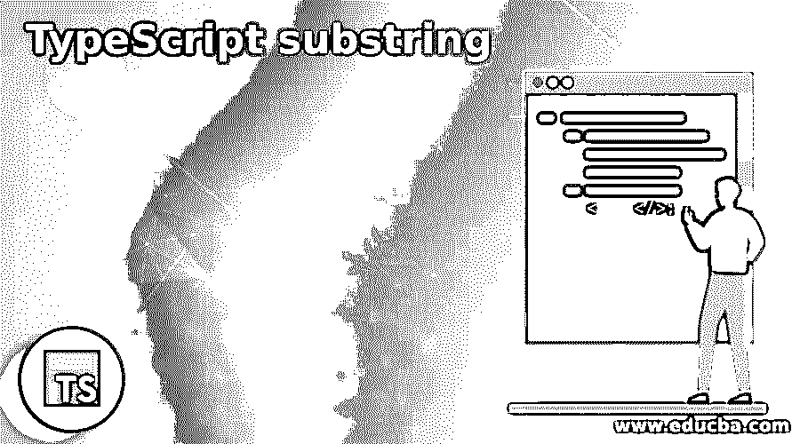
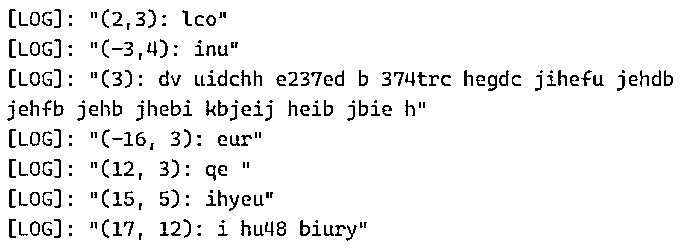
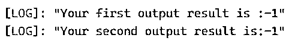
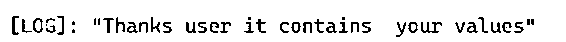

# 类型脚本子字符串

> 原文：<https://www.educba.com/typescript-substring/>

## TypeScript 子字符串介绍

Typescript 子字符串被定义为字符串类中的默认方法之一。它将用于返回字符串对象的子集，并且，它也将被其他数据类型接受，如整数，其数字范围从 0 到 1。它将小于 split()方法所遵循的字符串字符的长度。它用于返回字符串中的特定字符，主要是通过指定数量的字符关注特定位置，特殊字符带有操作符，字符的长度和起始位置是 substr()方法的参数。

**语法:**

<small>网页开发、编程语言、软件测试&其他</small>

TypeScript substring()方法主要关注字符串字符，它将用于指定索引，并返回 TypeScript 中新的子字符串字符。它可以用来传递两组参数，一个是起始字符，第二个参数是字符串字符的长度。

`var variable name=””;  // variable values should be of the string characters.
console.log(“starting position of the character and end position of the character” + variable name.substr(starting position of the character and end position of the character));
----some typescript codes based on the user requirements-----`

上述代码是在基于 TypeScript 的应用程序中使用 substr()方法的基本语法。

### 子串在 TypeScript 中是如何工作的？

*   TypeScript string 是在应用程序中创建和使用字符串字符的类之一。我们使用 substring 作为拆分字符串字符的默认方法之一，并且它将使用长度进行串接。该方法将接受脚本中的数字和非数字字符。字符串字符从特定位置的起始位置开始，通过字符查找每个字符；它会计算长度。
*   通过使用 length 方法，我们可以计算字符的长度，在 for 循环的帮助下，我们可以迭代这些值，计算字符的长度，并根据编码器的建议验证条件。基本上，substring()方法是预定义的，它也是一个内置函数，用户可以使用它返回字符串对象的子集。substring()方法的变元和参数，表示可用于标识字符的开始和结束索引；substring()方法，如果 indexStart 大于 indexEnd 位置，则交换两组变元 string 仍然是函数中变量的返回位置。
*   当我们在 indexOf 方法的帮助下使用 string characters index 时，substring 方法并没有被用作真正的用途，它的主要工作是返回给定子串上的索引。

### TypeScript 子字符串的示例

下面给出了 TypeScript 子字符串的示例:

#### 示例#1

**代码:**

`var vars = "Welcome to My Domain Have a Nice Day iehf oiefb woeqiurfb iweofbc2iwe bic b newoinu";
var vars1 = "wugdv uidchh e237ed b 374trc hegdc jihefu jehdb jehfb jehb jhebi kbjeij heib jbie h";
var vars2 = "oehqf eub jbqe ijbj jb3e obe bou jbe joj3buier jorub jbj jboui e1r jobeur b ijoe iojef";
var vars3 = "dguy i eebc b eihyeuib f c uiycei ubc3  iurf eurv eub irfub o iobr ibr iu ior iou iub";
var vars4 = "oyed uery euir rui hu48 biury848 buy84 bui fj rhuj hrf hu iho4hi or4ui roh4ih rouiro h";
console.log("(2,3): "    + vars.substr(2,3));
console.log("(-3,4): "   + vars.substr(-3,4));
console.log("(3): "      + vars1.substr(3));
console.log("(-16, 3): " + vars2.substr(-16,3));
console.log("(12, 3): "  + vars2.substr(12,3));
console.log("(15, 5): "  + vars3.substr(15,5));
console.log("(17, 12): "  + vars4.substr(17,12));`

**输出:**

在上面的例子中，我们在不同的序列中使用了 substr()方法。我们使用了一组数字字符，也就是说，我们只能获取和识别使用正数和负数的整数。在 console.log()方法的帮助下，我们可以使用 var 关键字打印输出控制台中的值；我们可以通过使用字符串引号来声明变量值。通常，var 数据类型在这里包括数字和非数字字符；我们可以用每个步骤的指定索引位置覆盖数值，并在用户输入端声明变量值。

#### 实施例 2

**代码:**

`var vars = "Welcome to My Domain Have a Nice Day iehf okjwdkg kewgk jdgkiwye iugeigu buir br";
var vars1 = "wuhsgf jdghj 326875 38 3846 86347484 8634r 39846 468 48465 386 34798 94865 946";
var vars2 = "f wqd qw qwuef3287 j6487 jg857 kjg85 jy4587 ng875 gr8 jgweuf 478 jgeru 74";
var vars3 = " hjqwdf jhgds ieyw jhgu jhger 457 jgevr u5 jbi5t78 njerv 5u jngu5 biu5yn bnn uy5 r";
var vars4 = "wf jhqgwf37 jhg u4t jhuy bvu5y4 bv5n bv457b u45t7 bu54tg biu45y buy55y jhgu b ut bu";
var vars5 = new String( "Have a Nice Day" );
var ind = vars.indexOf( "jg jdsvh jsjv bj b kjbd sdbsksd bs dbs db bd" );
console.log("Your first output result is :" + ind );
var ind1 = vars1.indexOf( "ksadsfs jgkvc kgdv kjgdk kdsjv kjdg" );
console.log("Your second output result is:" + ind1 );`

**输出:**

在第二个例子中，我们使用的 indexOf()是 substring()方法中默认的子方法之一；借助于这种方法，我们可以获取和检索索引值和字符串字符的位置。此外，我们使用 var5 变量值；我们可以创建字符串对象，并将其存储为单独的内存地址及其引用。

#### 实施例 3

**代码:**

`var vars = "Welcome to My Domain Have a Nice Day iehf okjwdkg kewgk jdgkiwye iugeigu buir br";
var output = /My/gi;
if (vars.search(output) == -1 ) {
console.log("Sorry user it does not contain your values" );
} else {
console.log("Thanks user it contains  your values" );
}`

**输出:**

在最后一个例子中，我们使用 search()方法搜索字符，这是在用户输入变量中声明的。我们还可以使用具有相同数据类型(var)的另一个变量来搜索和存储输入字符。search()方法是 string 类的 substring()函数中的一个子方法。

### 结论

substring()方法是默认的方法之一，经常用作 TypeScript 中的字符串类。借助于它的子方法，如 search()、indexOf()、substr()方法，我们可以实现这样的功能，如计算字符串字符的起始和索引位置，以及使用循环/条件语句来计算值。

### 推荐文章

这是一个关于类型脚本子串的指南。这里我们讨论一下入门，子串在 TypeScript 中是如何工作的？还有例子。您也可以看看以下文章，了解更多信息–

1.  [打字稿功能](https://www.educba.com/typescript-functions/)
2.  [打字稿版本](https://www.educba.com/typescript-versions/)
3.  [打字稿操作符](https://www.educba.com/typescript-operators/)
4.  [打字稿数组](https://www.educba.com/typescript-array/)

