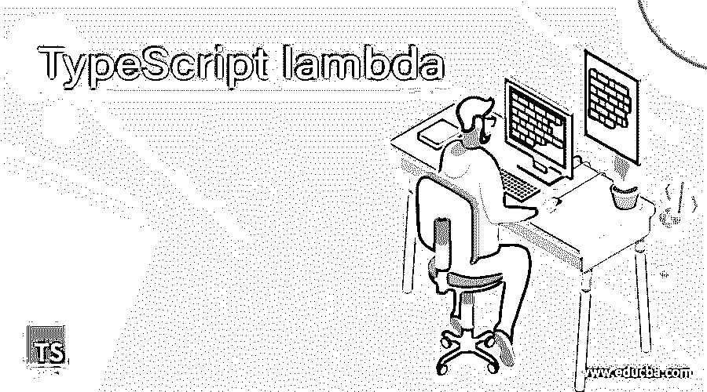
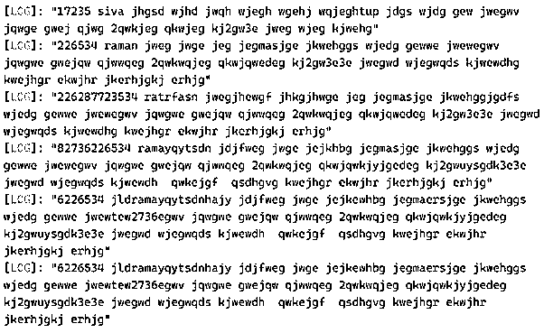
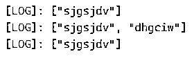
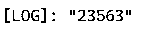

# 类型脚本 lambda

> 原文：<https://www.educba.com/typescript-lambda/>

## TypeScript lambda 简介

lambda 是 Typescript 中的一个函数，也称为匿名函数；它通过使用这个箭头函数来部署 lambda 表达式它具有词法类型的作用域主要是 typescript 通过使用一些外部服务如 AWS(Amazon Web Services)在 sdks(软件开发工具包)的帮助下部署 lambda 表达式 typescript 的 lambda 函数主要使用尖括号<>并且该函数将使用花括号{}打开和关闭函数来初始化和实现箭头函数(= >)将实现代码，虽然我们在函数中使用了尖括号，但是它可以用于在脚本中传递参数。

**语法:**

<small>网页开发、编程语言、软件测试&其他</small>

Typescript lambda 函数主要用于减少脚本代码行，并植入到 Typescript 中。借助(= >)箭头符号，lambda 函数在 typescript 中实现。

`class classname{
constructor()
{
--some codes—
}
functionname = () => ---some typescript logic codes---
}
var variablename = new classname();
variablename.functionname();`

上述代码是借助箭头符号或运算符创建和利用 lambda 函数的基本语法。我们在 typescript 中使用函数的不同方式也适用于 [javascript 技术](https://www.educba.com/what-is-javascript/)。

### lambda 函数在 TypeScript 中是如何工作的？

lambda 函数用于减少应用程序中的代码行数；此外，与其他预定义函数相比，时间复杂度更低。它还有另一个名字叫做匿名函数，它可以接受标准输入，并返回所需的输出结果，这取决于编译和运行时代码上的用户输入。有时，typescript 也接受命名和未命名(匿名)函数；它有默认的类、模块、预定义的函数和名称空间。当我们在脚本中使用该函数时，它已经根据用户需求接受了实参和非实参类型的参数；参数值将为空，未定义类型的值正在使用代码一段时间，然后默认编译器将验证由特定用户声明的参数值。编译器假定这些特定参数是将传递给特定函数的唯一参数。函数中提到的参数数量将与参数数量相匹配，然后函数预期应用程序的行为。

基本上，该参数在一种脚本语言中是可选的。我们使用了额外的默认 api，比如在节点包中使用的 Rest api，用于执行基于 web 的应用程序，这是在 typescript 代码上实现的；npm 包必须安装在服务器上，然后它执行基于 API Rest 的服务体系结构。如果函数被调用，那么 lambda 会使用处理程序机制自动运行。如果特定的处理程序存在或返回特定处理程序的某些责任，它将调用另一个处理程序。

### TypeScript lambda 的示例

下面举几个例子

#### 示例#1

**代码:**

`class demo {
id: number;
names: string;
city: string;
constructor(id: number, names: string, city:string) {
this.names = names;
this.id = id;
this.city=city;
}
show = () => console.log(this.id +' ' + this.names + '' + this.city);
}
let vars = new demo(17235, 'siva jhgsd wjhd jwqh wjegh wgehj wqjegh', 'tup jdgs wjdg gew jwegwv jqwge gwej qjwg 2qwkjeg qkwjeg kj2gw3e jweg wjeg kjwehg');
vars.show();
let vars1 = new demo(226534, 'raman jweg jwge jeg jeg', 'masjge jkwehggs wjedg gewwe jwewegwv jqwgwe gwejqw qjwwqeg 2qwkwqjeg qkwjqwedeg kj2gw3e3e jwegwd wjegwqds kjwewdhg kwejhgr ekwjhr jkerhjgkj erhjg');
vars1.show();
let vars2 = new demo(226287723534, 'ratrfasn jwegjhewgf jhkgjhwge jeg jeg', 'masjge jkwehggjgdfs wjedg gewwe jwewegwv jqwgwe gwejqw qjwwqeg 2qwkwqjeg qkwjqwedeg kj2gw3e3e jwegwd wjegwqds kjwewdhg kwejhgr ekwjhr jkerhjgkj erhjg');
vars2.show();
let vars3 = new demo(82736226534, 'ramayqytsdn jdjfweg jwge jejkhbg jeg', 'masjge jkwehggs wjedg gewwe jwewegwv jqwgwe gwejqw qjwwqeg 2qwkwqjeg qkwjqwkjyjgedeg kj2gwuysgdk3e3e jwegwd wjegwqds kjwewdh  qwkejgf  qsdhgvg kwejhgr ekwjhr jkerhjgkj erhjg');
vars3.show();
var vars4 = new demo(6226534, 'jldramayqytsdnhajy jdjfweg jwge jejkewhbg jeg', 'maersjge jkwehggs wjedg gewwe jwewtew2736egwv jqwgwe gwejqw qjwwqeg 2qwkwqjeg qkwjqwkjyjgedeg kj2gwuysgdk3e3e jwegwd wjegwqds kjwewdh  qwkejgf  qsdhgvg kwejhgr ekwjhr jkerhjgkj erhjg');
vars4.show();
var vars5 = new demo(736226534, 'ghdskramayqytsdn jdjfweg jwge jejkhbg jeg', 'm34reasjge jkwehggs wjedg gewwe jwewegwv jq864rgfhwgwe gwejqw qjwwqeg 2qwkwqjeg qkwjqwkjyjgedeg kj2gwuysgdk3e3e jwegwd784t wjegwqds kjwewdh  qwkejgf  qsdhgvg kwejhgr ekwjhr jkerhjgkj erhjg');
vars4.show();`

**输出:**

在上面的例子中，我们用 lambda 表达式(= >)运算符来实现匿名函数，即没有名字的函数；它可以根据需要执行一些操作。将通过使用此处的类实例来调用该函数；我们使用了带有构造函数的类，它在脚本中接受参数和非参数。匿名函数将在用户输出控制台屏幕上打印这些值。

#### 实施例 2

**代码:**

`let  vars = ['sjgsjdv', 'limjhgdvit jhwgd', 'exjhdbvuberant', 'destdsructuiwhiown','eouyewgulitwde', 'dspwdresqwent', 'dhgciw'] const first = vars.filter( (vars1, vars2, vars3 ) => {
vars3[vars2+1] +=' jhkug'
return vars1.length < 9
})
console.log(first)
vars = ['sjgsjdv', 'limjhgdvit jhwgd', 'exjhdbvuberant', 'destdsructuiwhiown','eouyewgulitwde', 'dspwdresqwent', 'dhgciw'] const seconds = vars.filter( (vars1, vars2, vars3) => {
vars3.push('sgdv')
return vars1.length < 9
})
console.log(seconds)
vars = ['sjgsjdv', 'limjhgdvit jhwgd', 'exjhdbvuberant', 'destdsructuiwhiown','eouyewgulitwde', 'dspwdresqwent', 'dhgciw'] const outputs = vars.filter( (vars1, vars2, vars3) => {
vars3.pop()
return vars1.length < 9
})
console.log(outputs)`

**输出:**

在第二个例子中，我们使用 lambda 表达式和其他方法，如 filter 和 arrays push 和 pop 方法；这些方法都是执行数据操作来添加和删除内存中的值。

#### 实施例 3

**代码:**

`var inputs = function(first:number,second:string) {
return first + second;
};
console.log(inputs(2356,"3"))`

**输出:**

在最后一个例子中，我们使用了带有参数的基本匿名函数；我们没有使用箭头符号。输入是变量引用，它还充当这个连接操作的匿名函数。我们可以使用这个函数组合数字和字符串值，并在输出控制台上打印出来。

### 结论

Typescript lambda 是根据特定要求执行用户任务的特性和功能之一。通过使用这个特性，与其他内置函数相比，我们可以减少脚本代码行和执行时间。它将在编译时检查和验证代码，降低程序员的复杂性。

### 推荐文章

这是一个 lambda 类型脚本的指南。这里我们讨论 lambda 函数如何在 TypeScript 和示例中工作，以及代码和输出。您也可以看看以下文章，了解更多信息–

1.  [打字稿功能](https://www.educba.com/typescript-functions/)
2.  [如何安装 Typescript](https://www.educba.com/install-typescript/)
3.  [打字词典](https://www.educba.com/typescript-dictionary/)
4.  [打字稿版本](https://www.educba.com/typescript-versions/)

