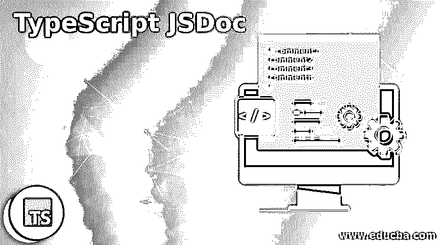
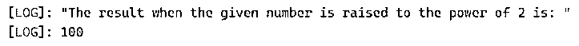
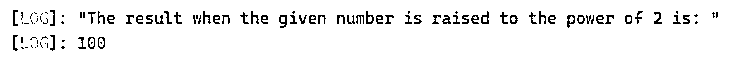
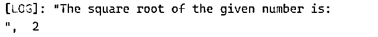
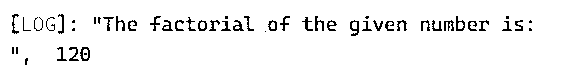

# TypeScript JSDoc

> 原文：<https://www.educba.com/typescript-jsdoc/>

## TypeScript JSDoc 简介

TypeScript 的应用程序编程接口文档生成器是 JSDoc。其中文档注释被直接添加到代码本身右侧的源代码中，并且有一个 JSDoc 工具来扫描源代码并生成 HTML 文档，JSDoc 的目的是通过使用 JSDoc 模块、类、名称空间、方法、方法参数等来记录类型脚本库。JSDoc 中的每个注释都应该以/**开头，以*/结尾，否则 JSDoc 解析器不会识别注释，解析器会忽略以/*或/***开头的注释。

**在 TypeScript 类中声明注释的语法:**

<small>网页开发、编程语言、软件测试&其他</small>

`** comment1
*comment2
*comment3
*commentn
*/`

其中 comment1、comment2、comment3、commentn 是要包含在 TypeScript 程序中的注释。

### 在 TypeScript 中处理 JSDoc 或注释

*   TypeScript 的应用程序编程接口文档生成器是 JSDoc，其中文档注释直接添加到代码本身右侧的源代码中。
*   有一个 JSDoc 工具可以扫描源代码并生成 HTML 文档。
*   JSDoc 的目的是通过使用 JSDoc 模块、类、名称空间、方法、方法参数等来记录类型脚本库。可以记录在案。
*   JSDoc 中的每个注释都应该以/**开头，以*/结尾，否则 JSDoc 解析器不会识别注释，解析器会忽略以/*或/***开头的注释。

### TypeScript JSDoc 的示例

下面给出了 TypeScript JSDoc 的示例:

#### 示例#1

演示 JSDoc 的 TypeScript 程序或描述程序功能的注释部分，以及我们用来计算给定数字的幂并在屏幕上显示输出的参数。

**代码:**

`/** defining an anonymous function using arrow function to compute the power of a number and display the result as the output on the screen
*/
let power = (firstnum:number, secondnum:number) : number => {
return Math.pow(firstnum, secondnum);
}
console.log('The result when the given number is raised to the power of 2 is: ');
console.log(power(10,2));`

**输出:**

在上面的程序中，注释部分是在符号/**和*/之间描述的。然后，我们使用 arrow 函数定义一个匿名函数来计算给定数字的幂，并将结果作为输出显示在屏幕上。

#### 实施例 2

演示 JSDoc 的 TypeScript 程序或描述程序功能的注释部分，以及我们用来计算给定数字的幂并在屏幕上显示输出的参数。

**代码:**

`/**
*Computes the power of a given number
*@constructor
*@param {number} firstnum – The number whose power raised to 2 must be found
*@param {number} secondtnum – The number 2 to which the given number must be raised to.
*/
function power(firstnum:number, secondnum:number)
{
let result = Math.pow(firstnum, secondnum);
return result;
}
console.log('The result when the given number is raised to the power of 2 is: ');
console.log(power(10,2));`

**输出:**

在上面的程序中，在符号/**和*/之间描述了注释部分，其中我们已经定义了一个使用@constructor 的函数，并且使用@param 定义了参数及其数据类型。然后，我们定义一个函数，用于计算给定数字的幂，并在屏幕上显示输出结果。

#### 实施例 3

演示 JSDoc 的 TypeScript 程序或描述程序功能的注释部分，以及我们用来计算给定数字的平方根并在屏幕上显示输出的参数。

**代码:**

`/**
*Computes the square root of a given number
*@constructor
*@param {number} firstnum – The number whose square root must be found
*/
function squareroot(firstnum:number)
{
let result = Math.sqrt(firstnum);
return result;
}
console.log("The square root of the given number is:\n", squareroot(4);`

**输出:**

在上面的程序中，在符号/**和*/之间描述了注释部分，其中我们已经定义了一个使用@constructor 的函数，并且使用@param 定义了参数及其数据类型。然后，我们定义一个函数来计算一个给定数字的平方根，并将结果作为输出显示在屏幕上。

#### 实施例 4

演示 JSDoc 的 TypeScript 程序或描述程序功能的注释部分，以及我们用来计算给定数字的阶乘并在屏幕上显示输出的参数。

**代码:**

`/**
*Computes the factorial of a given number
*@constructor
*@param {number} firstnum – The number whose factorial must be found
*/
var fact:number = 1;
function factorial(firstnum:number)
{
for(let u =firstnum; u>=1; u--)
{
fact = fact * u;
}
return fact;
}
console.log("The factorial of the given number is:\n", factorial(5);`

**输出:**

在上面的程序中，在符号/**和*/之间描述了注释部分，其中我们已经定义了一个使用@constructor 的函数，并且使用@param 定义了参数及其数据类型。然后，我们定义一个函数来计算一个给定数字的阶乘，并将结果作为输出显示在屏幕上。

### JSDoc 或注释的规则和规定

下面给出了 JSDoc 或 TypeScript 中注释的规则和规定:

*   TypeScript 中的注释应以符号/**开头。
*   TypeScript 中的注释应以符号*/结束。
*   JSDoc 解析器不识别以其他符号开头或结尾的注释。
*   必须使用@constructor 在注释部分中表示函数。
*   在注释部分中，参数必须与它们的数据类型一起表示，方法是使用@param，后面是花括号中的数据类型。

### 推荐文章

这是一个 JSDoc 类型脚本的指南。在这里，我们讨论了 JSDoc 的介绍、工作方式或 TypeScript 中的注释，并给出了一些例子。您也可以看看以下文章，了解更多信息–

1.  [打字稿字母](https://www.educba.com/typescript-let/)
2.  [打字稿类型](https://www.educba.com/typescript-typeof/)
3.  [打字稿通用](https://www.educba.com/typescript-generic/)
4.  [打字稿版本](https://www.educba.com/typescript-versions/)

