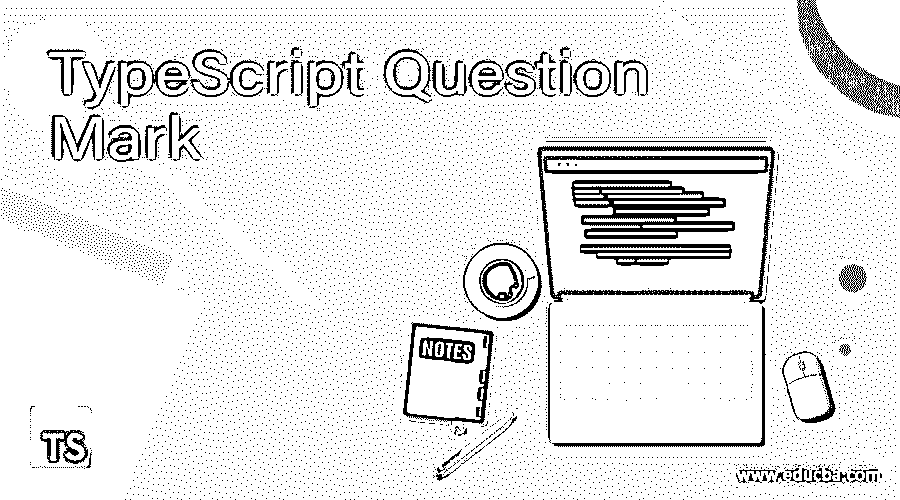
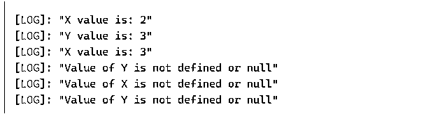
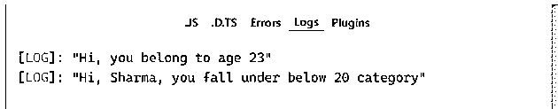
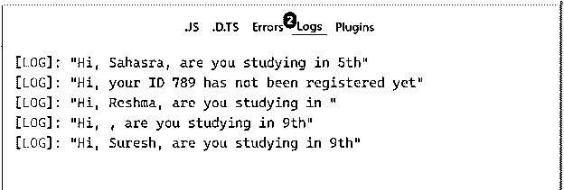

# 打字稿问号

> 原文：<https://www.educba.com/typescript-question-mark/>

## 打字稿问号简介

在变量上使用 TypeScript 问号，将其标记为可选参数。声明 TypeScript 变量时，声明的变量成为可选参数。如果不使用，这个可选参数将没有定义。在 TypeScript 3.7 版本中，我们有一个可选链接的概念，它允许用户编写代码，在那里 TypeScript 可以停止运行返回 null 或 undefined 的表达式。这就是“打字稿问号”的由来进入画面。因为问号将变量标记为可选的，但是任何可选参数都应该跟在必需参数后面。

**语法:**

<small>网页开发、编程语言、软件测试&其他</small>

`function sample_A(x ?: string) {
// function’s logic here
}`

此处的函数需要任何参数来测试是否为空或未定义。

TypeScript 3.7 版本解决的最重要的一点是不断检查变量或表达式是否为空或未定义

### 例子

让我们考虑下面的几个例子，以便更好地了解 TypeScript 问号的实现和使用。

#### 示例 1:简单的类型脚本表达式检查

`class addition{
constructor( private x?: number, private y?: number){
if(x)
console.log('X value is: ' + x);
else
console.log('Value of X is not defined or null');
if(y)
console.log('Y value is: ' + y);
else
console.log('Value of Y is not defined or null');
}
}
// object creation for addition1
let addition1 = new addition(2, 3);
// object creation for addition2
let addition2 = new addition(3, );
// object creation for addition3
let addition3 = new addition( , );`

**输出:**

这里，我们将 2 个字符串值作为可选值。对于第一个对象，给定两个值。对于第二个对象，只提供了 x 值，因此返回的 Y 值为 null。对于对象 3，两个值都没有定义或为空

#### 示例 2:用字符串表达式检查

`class Employee{
constructor(private age: number, private name?: string)
{
this.age = age;
this.name = name;
if (name)
console.log('Hi, ' + this.name + ', you fall under below ' + this.age + ' category');
else
console.log('Hi, you belong to age ' + this.age);
}
}
// object creation for emp1
let emp1 = new Employee(23);
// object creation for emp2
let emp2 = new Employee(20, 'Sharma');`

**输出:**

所以在这里，我们使用 TypeScript 问号来检查' name '类型，如果它是一个字符串并且有一个值，否则将返回 undefined 或 null。将在下一个示例中查看。

#### 示例 3: TypeScript 问号表达式检查返回 null 或 undefined。

`class Student{
constructor(private name?: string, private stndrd?: string, private id: number)
{
this.name = name;
this.stndrd = stndrd;
this.id = id;
if (name || stndrd)
console.log('Hi, ' + this.name + ', are you studying in ' + this.stndrd);
else
console.log('Hi, your ID ' + this.id + ' has not been registered yet');
}
}
// object creation for student1
let student1 = new Student('Sahasra', '5th', 456);
// object creation for student2
let student2 = new Student('', '', 789);
// object creation for student3
let student3 = new Student('Reshma', '', 123);
// object creation for student4
let student4 = new Student('', '9th', 567);
// object creation for student5
let student5 = new Student('Suresh', '9th', );`

**输出:**

因此，这里我们试图展示如何检查表达式并返回 null，如上面的输出所示。

在 log 3 中，我们看到 stndrd 值没有被定义，因此它在这里是 null。

在 log 4 中，我们看到 name 值没有被定义，因此它在这里是空的

在 log 5 中，没有定义 id 值，但是根据 TypeScript 问号，我们不检查 id 值。

我们的代码中甚至有两个错误，这两个被认为是打字稿问号的主要**规则**

1.  我们将必需参数放在可选参数之后，即 ID 放在必需参数“name”和“stndrd”之后。
2.  在上次创建对象时，我们只给了 2 个参数，但对象需要 3 个参数，因为 ID 是必需的参数。

如果用户将任何变量声明为可选参数，那么右边的所有其他变量都应该是可选参数，否则将会出现上述错误。简而言之，必需参数不能跟在可选参数后面。

它也被称为“猫王运营商”，或者我们可以说，它被命名为“猫王”的一个微软代表。因为它受 TypeScript 3.7 版本支持，称为可选链接。这个变体，存在算子？.'用于吸收所有的空引用。

至此，我们将结束“打字稿问号”这一主题。我们已经看到了什么是 TypeScript 问号及其语法。必需的参数以及如何使用问号标记可选和必需的参数。我们已经练习了上面的几个例子，这些例子足以让我们进一步了解这个概念。此外，我们已经看到了我们面临的错误，这些错误是要注意的打字稿问号的实际规则。

### 推荐文章

这是一个打字稿问号的指南。这里我们讨论介绍、语法和代码实现的例子。您也可以浏览我们推荐的其他文章，了解更多信息——

1.  [打字稿数组](https://www.educba.com/typescript-array/)
2.  [打字稿版本](https://www.educba.com/typescript-versions/)
3.  [什么是 TypeScript？](https://www.educba.com/what-is-typescript/)
4.  [打字稿类型](https://www.educba.com/typescript-types/)

